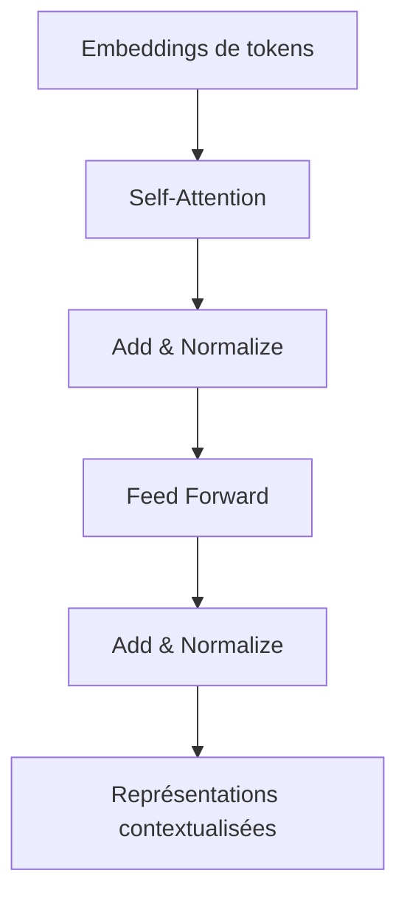

# Chapitre — Transformer et Attention

## 1. Pourquoi ?

Avant les Transformers, beaucoup de modèles de langage utilisaient des architectures séquentielles. Elles lisaient les tokens dans l'ordre et transportaient l'information dans un état caché. Cette approche fonctionne, mais elle présente trois limites importantes pour l'AI Engineering :

- la parallélisation est difficile ;
- les dépendances longues sont difficiles à conserver ;
- l'entraînement devient coûteux quand les séquences augmentent.

L'attention apporte une idée simple : au lieu de compresser tout le passé dans un seul état, chaque position peut regarder directement les autres positions utiles.

Dans une phrase comme :

> Le modèle traite la séquence parce qu'elle contient du contexte.

Le mot `elle` doit pouvoir se relier à `séquence`. L'attention fournit un mécanisme différentiable pour pondérer les relations entre positions.

## 2. Comment ?

### 2.1 Self-attention

La self-attention prend une séquence de vecteurs et produit une nouvelle séquence de vecteurs contextualisés. Chaque vecteur de sortie dépend des autres vecteurs de la séquence.

Pour chaque token, le modèle construit trois représentations :

- `Query` : ce que ce token cherche ;
- `Key` : ce que chaque token propose comme information indexable ;
- `Value` : le contenu réellement agrégé.

Ces représentations sont obtenues par projections linéaires apprises.

### 2.2 Scores d'attention

Le score entre une query et une key est souvent calculé par produit scalaire :

```text
score(i, j) = Q[i] · K[j]
```

Plus le score est élevé, plus le token `i` accorde d'importance au token `j`.

### 2.3 Mise à l'échelle

Les scores sont divisés par la racine carrée de la dimension des keys :

```text
scaled_score(i, j) = (Q[i] · K[j]) / sqrt(d_k)
```

Cette mise à l'échelle évite que les valeurs deviennent trop grandes quand la dimension augmente, ce qui rendrait le softmax trop saturé.

### 2.4 Softmax

Le softmax transforme les scores en probabilités :

```text
attention_weights = softmax(scaled_scores)
```

Chaque ligne de la matrice d'attention somme à 1. Elle indique comment une position distribue son attention sur les autres positions.

### 2.5 Agrégation des values

La sortie est une moyenne pondérée des values :

```text
output = attention_weights @ V
```

Le modèle ne copie pas simplement un token. Il construit une représentation contextualisée.

## 3. Vue globale d'un bloc Transformer

Un bloc Transformer typique contient :

1. self-attention multi-head ;
2. connexion résiduelle ;
3. normalisation ;
4. feed-forward network ;
5. nouvelle connexion résiduelle ;
6. nouvelle normalisation.

Dans ce bootcamp, on ne cherche pas encore à reproduire un modèle industriel. On veut comprendre les briques qui rendent un LLM possible.



## 4. Multi-head attention

Une seule tête d'attention apprend un type de relation. Plusieurs têtes permettent au modèle de regarder la séquence sous plusieurs angles.

Exemples de relations possibles :

- dépendance grammaticale ;
- référence à un nom précédent ;
- structure de code ;
- ponctuation ;
- alignement question/réponse.

Chaque tête calcule sa propre attention, puis les résultats sont concaténés et projetés.

## 5. Quand utiliser ?

On utilise des Transformers quand :

- les données sont séquentielles ou structurées ;
- les dépendances longues sont importantes ;
- on veut entraîner efficacement sur beaucoup de données ;
- on veut utiliser des modèles pré-entraînés ;
- on construit des systèmes NLP, agents, RAG ou assistants.

En AI Engineering, le Transformer n'est pas seulement un concept de recherche. C'est la base opérationnelle des LLM, des modèles d'embeddings modernes et de nombreux systèmes multimodaux.

## 6. Quand ne pas utiliser ?

Un Transformer n'est pas toujours le bon choix.

Éviter ou questionner son usage quand :

- le dataset est minuscule ;
- la latence doit être extrêmement faible ;
- une règle simple suffit ;
- le problème peut être résolu par recherche exacte ;
- les coûts d'inférence sont incompatibles avec le produit ;
- l'explicabilité stricte est obligatoire.

Un bon AI Engineer ne choisit pas un Transformer parce que c'est moderne. Il choisit l'architecture qui satisfait les contraintes métier, techniques et économiques.

## 7. Coûts et limites

L'attention complète compare chaque token avec chaque autre token. Pour une séquence de longueur `n`, la matrice d'attention contient `n × n` scores.

Cela implique un coût quadratique :

```text
O(n²)
```

Quand la fenêtre de contexte augmente, la mémoire et le temps de calcul augmentent rapidement. Cette limite prépare directement le Jour 4 sur les tokens, BPE et fenêtre de contexte.

## 8. Exemple concret AI Engineering

Supposons une API de support client utilisant un LLM.

L'utilisateur envoie :

> Mon paiement a été débité deux fois, mais la facture ne montre qu'une ligne.

Le modèle doit relier :

- `paiement` à `débité deux fois` ;
- `facture` à `une ligne` ;
- le contraste entre transaction bancaire et document de facturation.

L'attention permet au modèle de pondérer ces relations au lieu de traiter la phrase comme une simple suite de mots indépendants.

## 9. Erreurs fréquentes

### Confondre attention et compréhension

L'attention n'est pas une garantie de compréhension humaine. C'est un mécanisme de pondération différentiable.

### Croire qu'une attention élevée explique toujours la décision

Une matrice d'attention peut aider à inspecter un modèle, mais elle ne constitue pas toujours une explication causale complète.

### Oublier le coût quadratique

Dans un système de production, le coût de l'attention influence directement la latence, la mémoire GPU et le prix d'inférence.

## 10. Synthèse

Le Transformer repose sur une idée centrale : chaque position d'une séquence peut construire sa représentation en consultant les autres positions pertinentes. Cette approche améliore la parallélisation, la gestion du contexte et la capacité des modèles de langage modernes.

Pour l'AI Engineer, comprendre l'attention permet de mieux raisonner sur :

- la fenêtre de contexte ;
- les coûts d'inférence ;
- la conception de prompts ;
- les limites des LLM ;
- les choix d'architecture en production.
