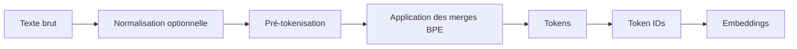
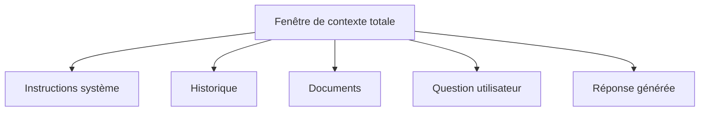
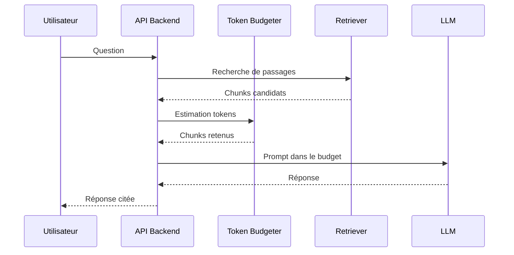

# Chapitre — Tokens, BPE et fenêtre de contexte

## 1. Pourquoi la tokenisation existe

Un modèle de langage ne manipule pas directement des phrases humaines. Il manipule des nombres.

La chaîne :

```text
Les modèles de langage prédisent le prochain token.
```

doit être convertie en une séquence d’identifiants :

```text
[2184, 912, 4091, 37, 8421, 391, 1882, ...]
```

Ces identifiants sont ensuite projetés en vecteurs d’embedding, puis traités par le Transformer.

### Pourquoi ?

La tokenisation répond à quatre contraintes :

1. **Représentation numérique** : un réseau neuronal attend des tenseurs, pas du texte brut.
2. **Vocabulaire fini** : le modèle doit associer chaque unité de texte à un identifiant connu.
3. **Compression linguistique** : les morceaux fréquents doivent être représentés efficacement.
4. **Généralisation** : le modèle doit pouvoir traiter des mots jamais vus grâce aux sous-mots.

Sans tokenisation, un modèle devrait soit traiter chaque caractère isolément, ce qui allonge les séquences, soit chaque mot complet, ce qui rend le vocabulaire gigantesque et fragile.

## 2. Caractères, mots, sous-mots et tokens

Un token n’est pas toujours un mot.

Exemples conceptuels :

| Texte | Découpage possible |
|---|---|
| `chat` | `chat` |
| `chats` | `chat`, `s` |
| `tokenization` | `token`, `ization` |
| `AI Engineering` | `AI`, ` Engineering` |
| `😊` | un ou plusieurs tokens selon l’encodeur |

Les espaces peuvent faire partie des tokens. C’est une source fréquente de confusion : `chat` et ` chat` peuvent être deux tokens différents selon le tokenizer.

### Comment ?

Un pipeline simplifié ressemble à ceci :



Le modèle ne voit généralement que les IDs, puis les embeddings associés.

## 3. Byte Pair Encoding

Byte Pair Encoding est une méthode de compression adaptée à la tokenisation.

### Idée centrale

BPE commence avec de petites unités, souvent des caractères ou des bytes. Il cherche ensuite les paires adjacentes les plus fréquentes et les fusionne progressivement.

Corpus simplifié :

```text
low lower newest widest
```

Découpage initial :

```text
l o w
l o w e r
n e w e s t
w i d e s t
```

Si la paire `l o` apparaît souvent, BPE peut créer `lo`. Si `lo w` apparaît souvent, BPE peut créer `low`.

### Pourquoi ?

BPE offre un compromis utile :

- il évite un vocabulaire uniquement basé sur des mots complets ;
- il évite des séquences trop longues basées sur les caractères ;
- il garde une capacité de généralisation aux mots rares ;
- il permet une compression efficace des séquences fréquentes.

## 4. Comment apprendre un vocabulaire BPE

### Étape 1 — corpus

On part d’un corpus d’entraînement.

```text
ai engineering
ai engineer
engineering systems
```

### Étape 2 — unités initiales

On découpe en caractères, en ajoutant parfois un marqueur de fin de mot.

```text
a i _
e n g i n e e r i n g _
```

### Étape 3 — statistiques de paires

On compte les paires adjacentes :

```text
('e', 'n') -> 3
('i', 'n') -> 2
('n', 'g') -> 2
```

### Étape 4 — fusion

On fusionne la paire la plus fréquente.

```text
('e', 'n') -> 'en'
```

### Étape 5 — répétition

On répète jusqu’à atteindre une taille de vocabulaire ou un nombre de merges.

## 5. Quand utiliser BPE

BPE est pertinent quand :

- le vocabulaire doit rester borné ;
- le corpus contient beaucoup de mots composés ou dérivés ;
- le modèle doit gérer des mots inconnus ;
- la longueur des séquences doit rester raisonnable ;
- on construit un tokenizer pédagogique ou un modèle de langage.

En AI Engineering, on ne réentraîne généralement pas le tokenizer d’un LLM existant. On utilise le tokenizer fourni par le modèle. En revanche, comprendre BPE est indispensable pour estimer les coûts, interpréter les limites de contexte et concevoir des prompts robustes.

## 6. Quand ne pas utiliser BPE

BPE n’est pas toujours le bon outil.

Éviter BPE quand :

- on utilise un modèle existant avec son propre tokenizer obligatoire ;
- le texte est déjà structuré en symboles atomiques métier ;
- on traite des identifiants où une découpe en sous-mots détruit le sens ;
- la priorité est la lisibilité humaine plutôt que l’efficacité modèle ;
- une autre stratégie, comme SentencePiece ou Unigram, est imposée par l’écosystème.

## 7. Fenêtre de contexte

La fenêtre de contexte est le nombre maximal de tokens qu’un modèle peut prendre en compte dans une interaction.

Elle inclut généralement :

- les instructions système ;
- les messages utilisateur ;
- l’historique conversationnel ;
- les documents injectés ;
- les appels outils et leurs résultats ;
- la réponse attendue.

### Exemple

Si un modèle dispose d’une fenêtre de 8 000 tokens et que le prompt complet contient 7 500 tokens, il ne reste que 500 tokens pour la réponse.



## 8. Pourquoi la fenêtre de contexte est une contrainte d’architecture

La fenêtre de contexte influence :

- le coût ;
- la latence ;
- le choix des documents ;
- la qualité de réponse ;
- les stratégies de mémoire ;
- la conception d’agents ;
- les architectures RAG.

Un système naïf injecte tout. Un système robuste sélectionne, compresse, résume et hiérarchise.

### Anti-pattern

```text
Prendre tous les documents disponibles et les coller dans le prompt.
```

Conséquences :

- dépassement de limite ;
- coût élevé ;
- latence ;
- bruit contextuel ;
- hallucinations liées à des passages non pertinents.

### Pattern recommandé

```text
Question -> sélection -> réduction -> budget -> appel modèle -> validation
```

## 9. Budget de contexte

Un budget de contexte est une estimation contrôlée de la place disponible.

Formule simple :

```text
budget_total = fenêtre_modèle
budget_prompt = instructions + historique + documents + question
budget_sortie = marge réservée pour la réponse
budget_restant = budget_total - budget_prompt - budget_sortie
```

Si `budget_restant < 0`, il faut réduire le contexte avant d’appeler le modèle.

## 10. Stratégies de réduction

### Sélection

Ne garder que les passages pertinents.

### Résumé

Compresser l’historique ou les documents longs.

### Fenêtrage

Garder seulement les derniers échanges utiles.

### Chunking

Découper les documents en morceaux indexables.

### Reranking

Réordonner les morceaux par pertinence.

### Contraintes de sortie

Limiter explicitement la taille de réponse.

## 11. Exemple AI Engineering

Supposons un assistant interne qui répond sur une documentation technique.

Pipeline robuste :



La tokenisation devient ici un composant d’architecture. Elle protège contre les dépassements, réduit les coûts et améliore la fiabilité.

## 12. Points clés

- Un LLM prédit des tokens, pas des mots.
- BPE construit des sous-mots par fusions fréquentes.
- Un même texte peut produire un nombre très différent de tokens selon le tokenizer.
- La fenêtre de contexte est une limite de conception, pas seulement une limite technique.
- En production, il faut budgéter le contexte avant l’appel modèle.
- Comprendre les tokens prépare directement le Prompt Engineering et les API modernes.
