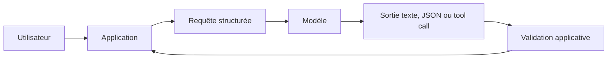
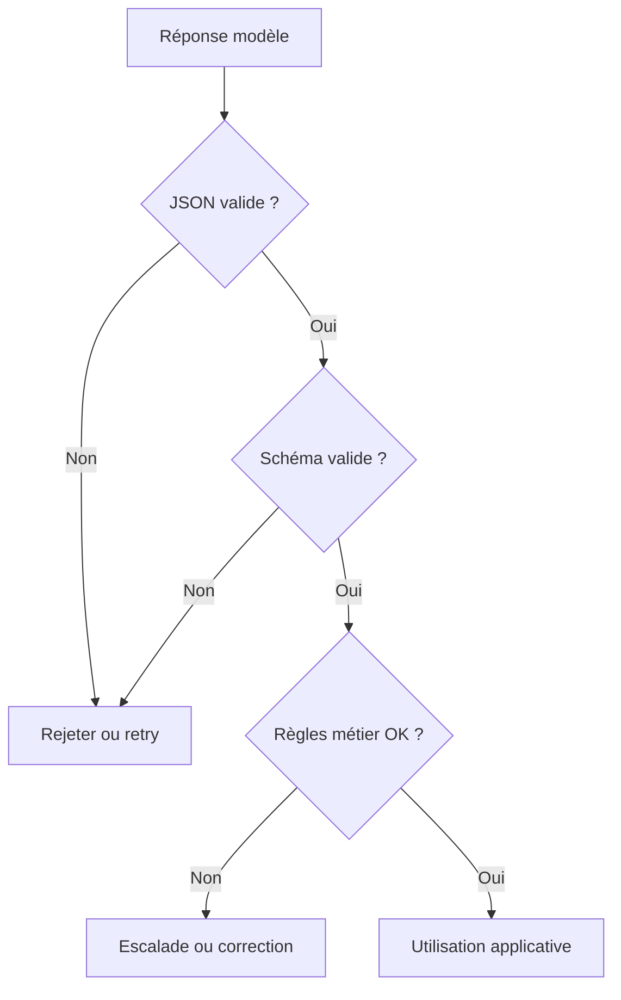
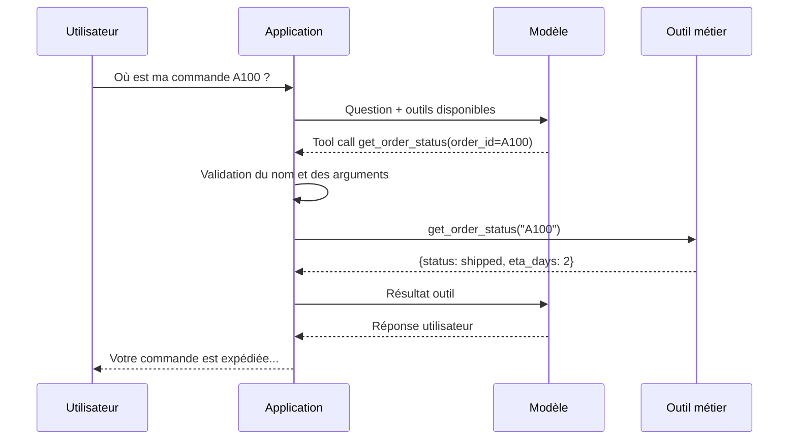
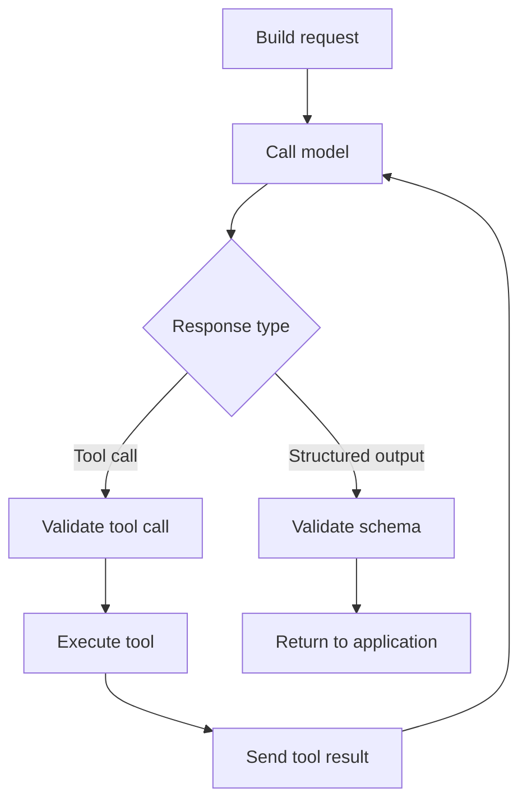

# Chapitre — API modernes : Responses API, Structured Outputs, Tool Calling

## 1. Pourquoi les API modernes changent la manière de construire avec les LLM

Les premières intégrations de LLM ressemblaient souvent à ceci :

```text
prompt texte -> modèle -> texte libre
```

Cette approche est simple pour une démonstration, mais fragile pour un backend. Un système de production a besoin de contrats :

- quelle est l'instruction durable ?
- quelle est l'entrée utilisateur ?
- quel format la sortie doit-elle respecter ?
- le modèle peut-il demander des actions ?
- qui exécute ces actions ?
- comment valider le résultat ?

Les API modernes répondent à ces questions en séparant les responsabilités.



Un AI Engineer ne traite pas le LLM comme une boîte magique. Il le traite comme un composant probabiliste placé derrière une interface déterministe autant que possible.

## 2. Comment penser une Responses API

Une API orientée réponses regroupe généralement :

- un modèle ;
- des instructions ;
- une entrée ;
- des paramètres de génération ;
- un format de sortie attendu ;
- une liste d'outils disponibles ;
- des métadonnées d'exécution.

Exemple conceptuel :

```json
{
  "model": "example-modern-llm",
  "instructions": "Classify the ticket. Return only structured data.",
  "input": [
    {
      "role": "user",
      "content": "Urgent production API timeout is blocking checkout."
    }
  ],
  "response_format": {
    "type": "json_schema",
    "json_schema": {
      "name": "support_ticket_classification",
      "strict": true,
      "schema": {
        "type": "object",
        "required": ["category", "priority", "summary"]
      }
    }
  }
}
```

La séparation `instructions` / `input` rend l'appel plus lisible et plus maintenable. Les instructions représentent le comportement attendu du système. L'entrée représente le cas traité.

## 3. Pourquoi utiliser des Structured Outputs

Un modèle peut produire du texte très convaincant mais inutilisable par une application. Par exemple :

```text
The issue is probably technical and urgent.
```

Pour un humain, c'est clair. Pour une API backend, c'est ambigu. Une sortie structurée transforme la réponse en contrat exploitable :

```json
{
  "category": "technical",
  "priority": "high",
  "summary": "Production API timeout is blocking checkout."
}
```

### Pourquoi ?

Les Structured Outputs servent à :

- réduire le parsing fragile ;
- rendre les résultats testables ;
- intégrer le LLM à des workflows ;
- stocker les résultats en base ;
- déclencher des traitements downstream.

### Comment ?

On définit un schéma avec :

- les champs requis ;
- les types ;
- les valeurs autorisées ;
- la politique sur les champs supplémentaires.

Exemple :

```json
{
  "type": "object",
  "required": ["category", "priority", "summary"],
  "properties": {
    "category": {
      "type": "string",
      "enum": ["billing", "technical", "account", "other"]
    },
    "priority": {
      "type": "string",
      "enum": ["low", "medium", "high"]
    },
    "summary": {
      "type": "string",
      "minLength": 12
    }
  },
  "additionalProperties": false
}
```

### Quand l'utiliser ?

Utiliser une sortie structurée lorsque :

- la réponse alimente une API ;
- la réponse est stockée ;
- la réponse déclenche une action ;
- la réponse doit être évaluée automatiquement ;
- plusieurs services consomment le résultat.

### Quand ne pas l'utiliser ?

Éviter une sortie structurée stricte lorsque :

- le besoin est exploratoire ;
- l'objectif est un brouillon créatif ;
- la structure exacte n'est pas encore connue ;
- le coût de maintenance du schéma dépasse le bénéfice.

Même dans ces cas, il est souvent utile de demander une structure légère.

## 4. Limite importante : JSON ne signifie pas vérité

Une sortie structurée garantit mieux la forme, pas le fond.

Un modèle peut produire :

```json
{
  "category": "billing",
  "priority": "high",
  "summary": "The customer was charged twice."
}
```

Le JSON peut être valide alors que la classification est fausse. L'application doit donc distinguer :

- validation syntaxique ;
- validation de schéma ;
- validation métier ;
- validation de sécurité ;
- validation humaine si nécessaire.



## 5. Tool Calling : donner des capacités contrôlées au modèle

Un LLM seul ne connaît pas l'état temps réel de votre application. Il ne sait pas lire votre base de données, vérifier une commande, créer un ticket ou envoyer un email.

Le Tool Calling consiste à exposer au modèle une liste de fonctions disponibles. Le modèle ne doit pas exécuter la fonction. Il demande à l'application de l'exécuter.

Exemple de demande d'outil :

```json
{
  "name": "get_order_status",
  "arguments": {
    "order_id": "A100"
  }
}
```

L'application reçoit cette demande, la valide, appelle la fonction réelle, puis renvoie le résultat au modèle ou à l'utilisateur.



## 6. Pourquoi le modèle ne doit pas exécuter directement les actions

Le modèle peut proposer une action, mais l'application garde le contrôle.

Raisons principales :

- sécurité ;
- audit ;
- permissions ;
- idempotence ;
- contrôle des coûts ;
- conformité ;
- observabilité ;
- gestion des erreurs.

Un mauvais design serait :

```text
LLM -> supprime directement une ressource en production
```

Un design robuste est :

```text
LLM -> demande une action
Application -> valide
Application -> applique les règles métier
Application -> exécute ou refuse
```

## 7. Comment concevoir un registre d'outils

Un registre d'outils est une table contrôlée des fonctions autorisées.

Exemple conceptuel :

```python
registry.register("get_order_status", get_order_status)
result = registry.call("get_order_status", {"order_id": "A100"})
```

Avantages :

- seuls les outils déclarés sont appelables ;
- les noms sont explicites ;
- les arguments peuvent être validés ;
- les erreurs sont centralisées ;
- les tests sont simples.

## 8. Quand utiliser le Tool Calling

Utiliser le Tool Calling lorsque le modèle doit :

- interroger une donnée externe ;
- déclencher un workflow ;
- calculer avec une fonction fiable ;
- appeler une API métier ;
- enrichir sa réponse avec un contexte dynamique.

Exemples :

- vérifier le statut d'une commande ;
- créer un ticket support ;
- rechercher un document ;
- récupérer une météo ;
- calculer un devis ;
- appeler une base de connaissances.

## 9. Quand ne pas utiliser le Tool Calling

Éviter le Tool Calling lorsque :

- la réponse peut être donnée directement ;
- l'action n'a pas de valeur métier ;
- l'outil expose un risque disproportionné ;
- les arguments ne peuvent pas être validés ;
- l'appel est trop coûteux ;
- la latence rend l'expérience mauvaise.

Un outil doit représenter une capacité utile, pas une manière de compenser un prompt imprécis.

## 10. Architecture minimale d'une boucle moderne

Une boucle simple peut être décrite ainsi :

1. construire la requête ;
2. envoyer au modèle ;
3. recevoir une réponse ;
4. si la réponse est un tool call, valider et exécuter l'outil ;
5. renvoyer le résultat au modèle ou formater la réponse ;
6. valider la sortie finale ;
7. journaliser l'appel.



## 11. Mini-implémentation sans réseau

Le lab du jour utilise une simulation déterministe. C'est intentionnel.

Pourquoi ne pas commencer directement avec une API réelle ?

- les clés API ne doivent pas être nécessaires pour apprendre le pattern ;
- les tests doivent être reproductibles ;
- le coût doit rester nul ;
- l'apprenant doit comprendre la mécanique avant le SDK ;
- les erreurs de réseau ne doivent pas masquer les erreurs de design.

Le Jour 7 branchera ces concepts sur un premier client Python.

## 12. Points clés à retenir

- Une API moderne fournit un contrat plus riche qu'un simple prompt texte.
- Les Structured Outputs réduisent l'ambiguïté mais ne remplacent pas la validation métier.
- Le Tool Calling donne des capacités au modèle sans lui céder le contrôle.
- L'application reste responsable de l'exécution, de la sécurité et de l'audit.
- Les tests déterministes sont indispensables avant l'intégration fournisseur.
