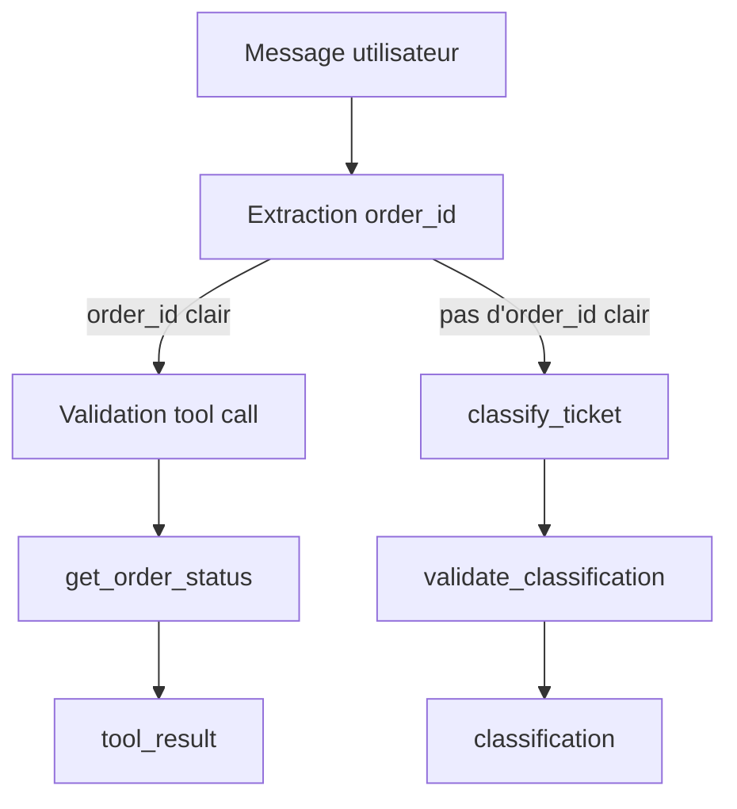

# Corrigé du challenge — Semaine 1 Jour 6 : API modernes

## Rappel du challenge

Construire une mini-couche d'orchestration capable de traiter une demande support avec deux modes :

1. classification structurée ;
2. appel d'outil pour enrichir la réponse.

Le livrable demandé est un fichier Python `support_orchestrator.py` sans appel réseau.

---

## 1. Solution proposée — `support_orchestrator.py`

```python
from __future__ import annotations

import re
from typing import Any, Callable


CLASSIFICATION_SCHEMA = {
    "type": "object",
    "required": ["category", "priority", "summary"],
    "properties": {
        "category": {
            "type": "string",
            "enum": ["billing", "order", "technical", "other"],
        },
        "priority": {
            "type": "string",
            "enum": ["low", "medium", "high"],
        },
        "summary": {
            "type": "string",
        },
    },
    "additionalProperties": False,
}


ORDERS = {
    "A100": {
        "order_id": "A100",
        "status": "shipped",
        "eta_days": 2,
    },
    "B200": {
        "order_id": "B200",
        "status": "processing",
        "eta_days": 5,
    },
}


def get_order_status(order_id: str) -> dict[str, Any]:
    """Retourne le statut d'une commande connue.

    L'outil est volontairement local et déterministe pour le lab.
    """
    if not isinstance(order_id, str) or not order_id.strip():
        raise ValueError("order_id must be a non-empty string")

    normalized_order_id = order_id.strip().upper()

    if normalized_order_id not in ORDERS:
        return {
            "order_id": normalized_order_id,
            "status": "unknown",
            "eta_days": None,
        }

    return dict(ORDERS[normalized_order_id])


TOOL_REGISTRY: dict[str, Callable[..., dict[str, Any]]] = {
    "get_order_status": get_order_status,
}


def extract_order_id(text: str) -> str | None:
    """Extrait un identifiant de commande clair.

    Convention du lab :
    - une commande est représentée par une lettre majuscule suivie de trois chiffres ;
    - exemple : A100.
    """
    if not isinstance(text, str):
        raise TypeError("text must be a string")

    match = re.search(r"\b[A-Z][0-9]{3}\b", text.upper())
    if match is None:
        return None

    return match.group(0)


def validate_classification(payload: dict[str, Any]) -> None:
    """Valide la sortie structurée de classification.

    Cette fonction simule la validation applicative qui accompagne un Structured Output.
    """
    required_keys = {"category", "priority", "summary"}

    if set(payload.keys()) != required_keys:
        raise ValueError("classification payload must contain exactly category, priority and summary")

    if payload["category"] not in {"billing", "order", "technical", "other"}:
        raise ValueError("invalid category")

    if payload["priority"] not in {"low", "medium", "high"}:
        raise ValueError("invalid priority")

    if not isinstance(payload["summary"], str) or not payload["summary"].strip():
        raise ValueError("summary must be a non-empty string")


def classify_ticket(text: str) -> dict[str, Any]:
    """Classifie une demande support de façon déterministe.

    Dans un vrai système, cette fonction pourrait appeler un modèle avec Structured Outputs.
    Ici, elle reste locale pour rendre les tests reproductibles.
    """
    if not isinstance(text, str):
        raise TypeError("text must be a string")

    normalized = text.lower()

    if any(keyword in normalized for keyword in ["payment", "invoice", "charged", "billing"]):
        category = "billing"
    elif any(keyword in normalized for keyword in ["order", "shipment", "delivery"]):
        category = "order"
    elif any(keyword in normalized for keyword in ["api", "bug", "error", "checkout", "timeout"]):
        category = "technical"
    else:
        category = "other"

    if any(keyword in normalized for keyword in ["urgent", "blocked", "blocks", "down", "critical"]):
        priority = "high"
    elif category in {"billing", "technical"}:
        priority = "medium"
    else:
        priority = "low"

    result = {
        "category": category,
        "priority": priority,
        "summary": text.strip(),
    }

    validate_classification(result)
    return result


def execute_tool(name: str, arguments: dict[str, Any]) -> dict[str, Any]:
    """Exécute un outil autorisé après validation minimale."""
    if name not in TOOL_REGISTRY:
        raise ValueError(f"unknown tool: {name}")

    if not isinstance(arguments, dict):
        raise TypeError("tool arguments must be a dictionary")

    if name == "get_order_status":
        if set(arguments.keys()) != {"order_id"}:
            raise ValueError("get_order_status expects exactly order_id")
        return TOOL_REGISTRY[name](arguments["order_id"])

    raise ValueError(f"tool is not executable: {name}")


def handle_user_message(text: str) -> dict[str, Any]:
    """Orchestre la classification ou l'appel d'outil.

    Règle :
    - si un order_id clair est trouvé, on appelle get_order_status ;
    - sinon, on retourne une classification structurée.
    """
    if not isinstance(text, str):
        raise TypeError("text must be a string")

    order_id = extract_order_id(text)

    if order_id is not None:
        result = execute_tool(
            "get_order_status",
            {"order_id": order_id},
        )
        return {
            "type": "tool_result",
            "tool": "get_order_status",
            "result": result,
        }

    return {
        "type": "classification",
        "result": classify_ticket(text),
    }
```

---

## 2. Tests unitaires proposés

Créer un fichier `test_support_orchestrator.py`.

```python
import pytest

from support_orchestrator import (
    classify_ticket,
    extract_order_id,
    get_order_status,
    handle_user_message,
)


def test_handle_order_status_request():
    result = handle_user_message("Where is my order A100?")

    assert result == {
        "type": "tool_result",
        "tool": "get_order_status",
        "result": {
            "order_id": "A100",
            "status": "shipped",
            "eta_days": 2,
        },
    }


def test_handle_technical_ticket():
    result = handle_user_message("Urgent API bug blocks checkout.")

    assert result == {
        "type": "classification",
        "result": {
            "category": "technical",
            "priority": "high",
            "summary": "Urgent API bug blocks checkout.",
        },
    }


def test_no_tool_call_without_clear_order_id():
    result = handle_user_message("Where is my order?")

    assert result["type"] == "classification"
    assert result["result"]["category"] == "order"


def test_unknown_order_returns_unknown_status():
    result = get_order_status("Z999")

    assert result == {
        "order_id": "Z999",
        "status": "unknown",
        "eta_days": None,
    }


def test_extract_order_id_rejects_unclear_identifier():
    assert extract_order_id("My order is probably 100") is None


def test_classify_ticket_rejects_non_string():
    with pytest.raises(TypeError):
        classify_ticket(None)
```

---

## 3. Résultat attendu pour les deux cas obligatoires

### Cas 1

Entrée :

```text
Where is my order A100?
```

Sortie :

```json
{
  "type": "tool_result",
  "tool": "get_order_status",
  "result": {
    "order_id": "A100",
    "status": "shipped",
    "eta_days": 2
  }
}
```

### Cas 2

Entrée :

```text
Urgent API bug blocks checkout.
```

Sortie :

```json
{
  "type": "classification",
  "result": {
    "category": "technical",
    "priority": "high",
    "summary": "Urgent API bug blocks checkout."
  }
}
```

---

## 4. Explication d'architecture

La solution sépare volontairement quatre responsabilités.



### Classification structurée

La fonction `classify_ticket` simule une sortie structurée. Elle retourne toujours un dictionnaire conforme au contrat attendu.

### Tool Calling

Le modèle n'exécute pas directement l'outil. Dans cette solution locale, l'orchestrateur décide d'appeler `get_order_status` uniquement si un `order_id` clair est trouvé.

### Validation

La validation est séparée dans `validate_classification` et `execute_tool`.

Cette séparation rend le système plus maintenable et testable.

---

## 5. Gestion des erreurs

La solution gère explicitement :

- texte non string ;
- `order_id` vide ;
- commande inconnue ;
- outil inconnu ;
- arguments invalides ;
- payload de classification invalide.

Exemple :

```python
if name not in TOOL_REGISTRY:
    raise ValueError(f"unknown tool: {name}")
```

Cette vérification empêche un modèle ou un appelant de déclencher un outil non autorisé.

---

## 6. Extension facultative sécurisée

L'extension demandée peut être ajoutée ainsi :

```python
def create_support_ticket_request(summary: str) -> dict[str, str]:
    if not isinstance(summary, str) or not summary.strip():
        raise ValueError("summary must be a non-empty string")

    return {
        "type": "confirmation_required",
        "action": "create_support_ticket",
        "summary": summary.strip(),
    }
```

Cette fonction ne crée pas directement le ticket. Elle produit une demande de confirmation, ce qui est plus sûr pour une action avec effet de bord.

---

## 7. Critères d'évaluation

| Critère | Validation dans la solution |
|---|---|
| Clarté de l'architecture | Fonctions séparées pour extraction, classification, validation et outil |
| Validation des sorties | `validate_classification` |
| Séparation décision/exécution | `handle_user_message` décide, `execute_tool` exécute |
| Tests reproductibles | Aucune dépendance réseau |
| Code simple et lisible | Dictionnaires locaux, fonctions typées, exceptions explicites |

---

## 8. Propositions d'amélioration

Ces propositions ne modifient pas les spécifications existantes.

### Proposition 1 — Ajouter un vrai validateur JSON Schema

Remplacer la validation manuelle par une bibliothèque dédiée dans une semaine ultérieure consacrée aux systèmes de production.

### Proposition 2 — Ajouter des traces d'observabilité

Ajouter des logs structurés pour suivre :

- la décision prise ;
- l'outil appelé ;
- les arguments validés ;
- les erreurs ;
- le temps d'exécution.
