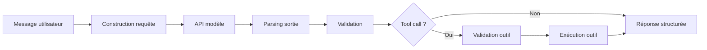

# Corrigé d'interview — Semaine 1 Jour 6 : API modernes

## Objectif

Ce corrigé fournit les réponses attendues aux questions d'entretien du Jour 6.

Le niveau attendu est celui d'un AI Backend Engineer capable d'expliquer comment intégrer un LLM dans un système logiciel : contrat de requête, sortie structurée, Tool Calling, validation, sécurité et observabilité.

---

## 1. Quelle différence faites-vous entre une API de complétion et une API moderne orientée réponses ?

### Réponse attendue

Une API de complétion historique reçoit principalement un prompt textuel et retourne du texte. Une API moderne orientée réponses structure davantage l'interaction avec le modèle.

Elle peut inclure :

- des instructions ;
- des messages ;
- des entrées multimodales selon les cas ;
- un format de sortie ;
- des outils déclarés ;
- des métadonnées ;
- des événements ;
- une gestion plus claire du cycle de réponse.

### Réponse courte d'entretien

Une API de complétion produit du texte à partir d'un prompt. Une API moderne expose un contrat plus riche pour construire des applications : instructions, entrées, outils et sorties structurées.

---

## 2. Pourquoi les Structured Outputs sont-ils importants en backend ?

### Réponse attendue

Un backend consomme des contrats. Une réponse libre est difficile à parser et fragile en production.

Les Structured Outputs permettent :

- de réduire l'ambiguïté ;
- de valider la forme de la réponse ;
- de brancher la sortie sur du code ;
- de stocker des données plus facilement ;
- de tester les intégrations ;
- de limiter les erreurs de parsing.

### Limite importante

Un schéma valide ne garantit pas que le contenu est vrai ou correct.

---

## 3. Est-ce qu'un schéma JSON garantit que le modèle a raison ?

### Réponse attendue

Non.

Un schéma JSON peut améliorer la conformité de forme, mais il ne garantit pas :

- la vérité ;
- la complétude ;
- la conformité métier ;
- la sécurité ;
- la pertinence de la décision.

### Réponse courte d'entretien

Le schéma vérifie la forme. Le backend doit encore vérifier le fond.

---

## 4. Qu'est-ce qu'un Tool Call ?

### Réponse attendue

Un Tool Call est une demande structurée du modèle indiquant qu'une fonction applicative devrait être appelée avec certains arguments.

Le modèle ne doit pas exécuter l'outil directement. Il propose un appel. L'application :

1. parse la demande ;
2. valide le nom de l'outil ;
3. valide les arguments ;
4. vérifie les permissions ;
5. exécute ou refuse l'action ;
6. journalise le résultat.

### Exemple conceptuel

```json
{
  "name": "get_order_status",
  "arguments": {
    "order_id": "A100"
  }
}
```

---

## 5. Pourquoi ne faut-il pas laisser le modèle exécuter directement un outil ?

### Réponse attendue

Parce que le modèle n'est pas une frontière de sécurité.

L'application doit contrôler :

- les permissions ;
- les effets de bord ;
- les coûts ;
- les erreurs ;
- les retries ;
- les accès aux données ;
- les logs ;
- les règles métier.

### Bon signal en entretien

Mentionner la différence entre décision suggérée par le modèle et exécution autorisée par le système.

---

## 6. Comment testez-vous un flux de Tool Calling sans appeler un fournisseur LLM ?

### Réponse attendue

On simule la sortie du modèle avec des objets JSON déterministes.

Tests à écrire :

- parsing du tool call ;
- rejet d'un JSON invalide ;
- rejet d'un outil inconnu ;
- validation des arguments ;
- exécution d'un outil autorisé ;
- gestion des erreurs ;
- non-exécution d'un outil risqué.

### Exemple

```python
def test_tool_call_parsing():
    raw = '{"name": "get_order_status", "arguments": {"order_id": "A100"}}'
    parsed = parse_tool_call(raw)
    assert parsed["name"] == "get_order_status"
```

---

## 7. Où placez-vous les retries ?

### Réponse attendue

Les retries doivent être placés avec prudence.

Ils sont possibles autour :

- de l'appel modèle ;
- du parsing si la sortie est mal formée ;
- d'un outil idempotent ;
- d'une erreur réseau transitoire.

Ils sont dangereux autour :

- d'actions destructives ;
- de paiements ;
- de créations multiples ;
- d'envois d'e-mails ;
- de modifications d'état non idempotentes.

### Réponse courte d'entretien

On retry uniquement ce qui est sûr à répéter ou explicitement idempotent.

---

## 8. Quelle différence entre validation de schéma et validation métier ?

### Réponse attendue

La validation de schéma vérifie la forme. La validation métier vérifie le sens.

### Exemple

Sortie :

```json
{
  "category": "billing",
  "priority": "high",
  "refund_amount": 1000000
}
```

Le schéma peut être valide si `refund_amount` est un nombre. Mais la validation métier doit vérifier si ce montant est autorisé.

### Tableau

| Validation | Vérifie |
|---|---|
| Schéma | Types, champs requis, enum, champs supplémentaires |
| Métier | Permissions, règles internes, seuils, cohérence, sécurité |

---

## 9. Quels risques introduit le Tool Calling ?

### Réponse attendue

Risques principaux :

- appel d'un outil non prévu ;
- arguments malveillants ;
- fuite de données ;
- action destructive ;
- coût élevé ;
- boucle infinie ;
- injection via données utilisateur ;
- mauvaise journalisation ;
- absence de confirmation humaine.

### Mitigations

- registre d'outils fermé ;
- validation stricte ;
- permissions ;
- allowlist ;
- confirmation sur actions sensibles ;
- timeouts ;
- logs ;
- tests.

---

## 10. Comment concevoir une API LLM maintenable ?

### Réponse attendue

Une intégration LLM maintenable sépare :

- construction de la requête ;
- appel modèle ;
- parsing ;
- validation ;
- orchestration des outils ;
- logique métier ;
- observabilité ;
- tests.

### Architecture attendue



---

## Synthèse attendue

Un candidat solide explique que les API modernes permettent de passer d'une simple génération de texte à une intégration logicielle contrôlée. Mais les garanties de production viennent toujours du backend : validation, permissions, tests et observabilité.
