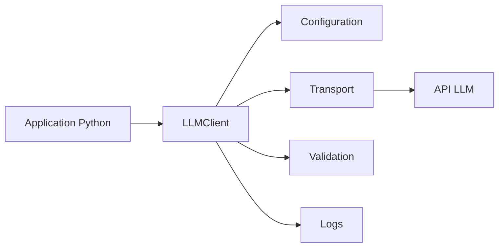
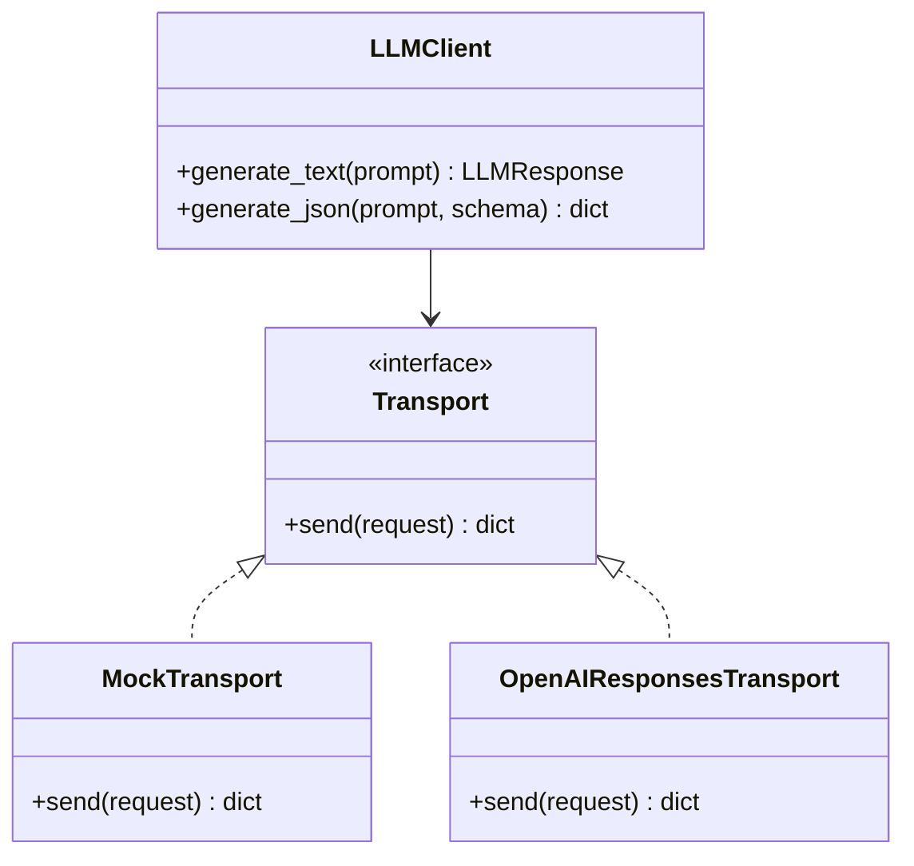
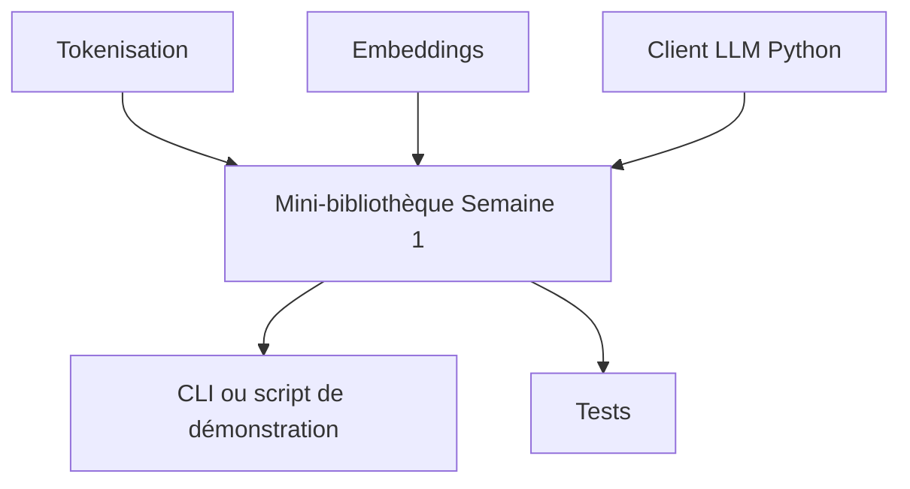

# Chapitre — Premier client Python

## 1. Pourquoi construire un client Python LLM ?

Un client Python LLM est une couche d’abstraction entre une application et un fournisseur de modèles.

Sans cette couche, l’application appelle directement le SDK ou l’API HTTP. Cela fonctionne pour un prototype, mais devient fragile dès que le projet grandit :

- la configuration se répète ;
- les prompts se mélangent à la logique métier ;
- les tests deviennent dépendants du réseau ;
- la gestion d’erreurs est dispersée ;
- les changements de modèle ou de fournisseur deviennent coûteux.

Dans une approche AI Engineering, on évite d’intégrer un appel LLM directement dans un contrôleur FastAPI, un notebook ou un script métier. On crée plutôt un composant dédié.



Le client devient un point d’entrée stable.

## 2. Comment penser l’architecture minimale ?

Un premier client peut être très simple, mais il doit déjà respecter quelques principes.

### 2.1 Interface claire

L’utilisateur du client ne devrait pas connaître tous les détails internes de l’API.

Exemple d’usage attendu :

```python
from python_client import LLMClient, LLMConfig, MockTransport

client = LLMClient(
    config=LLMConfig(model="mock-model"),
    transport=MockTransport()
)

answer = client.generate_text("Explique un token en une phrase.")
print(answer.text)
```

L’interface importante est `generate_text`. Le reste est interne.

### 2.2 Configuration externalisée

Les paramètres comme le modèle, le timeout ou la clé API ne doivent pas être codés en dur dans la logique métier.

Une bonne configuration répond à ces questions :

- quel modèle utiliser ?
- quelle température ?
- combien de tokens maximum ?
- quel timeout ?
- quelle clé API ?
- quel mode d’exécution : réel ou mock ?

### 2.3 Transport interchangeable

Le transport est la partie qui sait parler à un fournisseur.

Pour apprendre et tester, on utilise un `MockTransport`. En production, on remplace ce transport par un `OpenAIResponsesTransport`.

Cette séparation permet de tester la logique du client sans réseau et sans coût.



## 3. Le rôle du SDK moderne

Les API modernes de LLM exposent souvent :

- une API de génération ;
- des sorties structurées ;
- du streaming ;
- du tool calling ;
- des paramètres de sécurité ;
- des métadonnées d’usage.

Le client Python officiel d’OpenAI recommande l’instanciation explicite d’un objet client pour le code applicatif, plutôt que l’usage d’un état global implicite. La documentation officielle présente aussi la Responses API comme l’interface principale pour générer du texte avec les modèles récents.

Dans ce bootcamp, le client du Jour 7 garde une dépendance optionnelle au SDK. Cela permet d’exécuter les tests et le lab même si aucune clé API n’est disponible.

## 4. Pourquoi ne pas exposer directement le SDK ?

Exposer directement un SDK dans toute l’application crée un couplage fort.

Mauvais exemple :

```python
from openai import OpenAI

client = OpenAI()

def summarize(text: str) -> str:
    response = client.responses.create(
        model="gpt-5.5",
        input=f"Résume ce texte: {text}"
    )
    return response.output_text
```

Ce code fonctionne, mais il pose plusieurs problèmes :

- le modèle est codé en dur ;
- le prompt est mélangé au métier ;
- aucune stratégie de retry n’est prévue ;
- aucun mock simple n’est possible ;
- la fonction dépend directement d’un fournisseur.

Meilleure approche :

```python
def summarize(text: str, llm: LLMClient) -> str:
    response = llm.generate_text(
        "Résume le texte suivant en trois phrases.",
        user_input=text
    )
    return response.text
```

La logique métier dépend d’une interface interne, pas d’un SDK externe.

## 5. Gestion des entrées

Un client LLM reçoit généralement :

- une instruction système ou développeur ;
- une entrée utilisateur ;
- des paramètres de génération ;
- parfois un schéma de sortie.

Dans notre lab, la requête interne est représentée par `LLMRequest`.

```python
@dataclass
class LLMRequest:
    prompt: str
    user_input: str | None = None
    temperature: float = 0.2
    max_output_tokens: int = 500
```

Cette structure évite de passer partout des dictionnaires anonymes.

## 6. Gestion des sorties

Un appel LLM ne devrait pas retourner une chaîne brute sans contexte.

Une réponse utile contient :

- le texte final ;
- le modèle utilisé ;
- des métadonnées ;
- éventuellement la réponse brute ;
- un indicateur de mode mock ou réel.

```python
@dataclass
class LLMResponse:
    text: str
    model: str
    raw: dict[str, Any]
```

En production, on ajouterait souvent :

- latence ;
- tokens d’entrée ;
- tokens de sortie ;
- coût estimé ;
- identifiant de requête ;
- statut de sécurité.

## 7. Sorties structurées

Une sortie structurée est indispensable dès qu’une application doit consommer automatiquement le résultat.

Exemple :

```json
{
  "label": "technical",
  "confidence": 0.91,
  "reason": "Le texte parle d'API, de client Python et de tests."
}
```

Le client du lab propose une méthode `generate_json` qui :

1. appelle le modèle ;
2. récupère le texte ;
3. parse le JSON ;
4. valide la présence des champs attendus ;
5. retourne un dictionnaire Python.

Cette méthode est volontairement simple. L’objectif est de comprendre la mécanique avant d’introduire Pydantic, JSON Schema et les helpers avancés.

## 8. Gestion d’erreurs

Un client LLM doit transformer les erreurs techniques en erreurs compréhensibles.

Exemples :

- clé API absente ;
- timeout ;
- sortie JSON invalide ;
- champ obligatoire manquant ;
- réseau indisponible ;
- quota dépassé ;
- modèle invalide.

Dans le lab, trois erreurs sont définies :

- `LLMClientError` : erreur générique ;
- `LLMConfigurationError` : configuration invalide ;
- `LLMValidationError` : sortie non conforme.

## 9. Quand utiliser cette approche ?

Utilise un client dédié quand :

- le projet dépasse le simple notebook ;
- plusieurs modules appellent un LLM ;
- tu veux tester sans appeler l’API ;
- tu prépares une API backend ;
- tu veux changer de modèle sans modifier tout le code ;
- tu veux tracer les appels ;
- tu dois valider les sorties.

## 10. Quand ne pas l’utiliser ?

Un client abstrait peut être excessif quand :

- tu fais une démonstration de dix lignes ;
- tu explores rapidement un modèle dans un notebook ;
- tu n’as pas encore stabilisé le besoin ;
- l’objectif est uniquement pédagogique sur l’API brute.

Même dans ces cas, il faut éviter de diffuser du code jetable dans une base de production.

## 11. Préparation au mini-projet de Semaine 1

Le mini-projet de la semaine demande une bibliothèque Python illustrant tokenisation, embeddings et premier appel LLM.

Le client du Jour 7 sert de brique finale :



L’objectif n’est pas de construire un framework complet, mais de poser les fondations d’un code propre.
