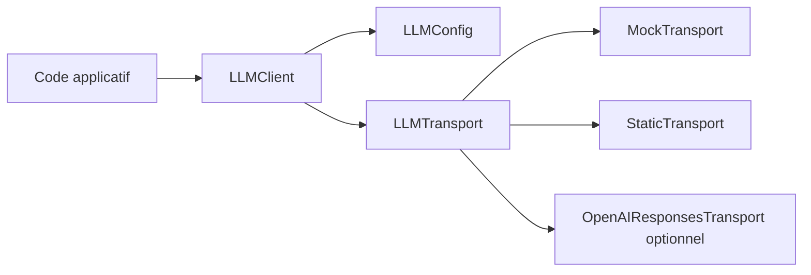

# Corrigé — Challenge

La solution complète se trouve dans :

```text
book/week01/day07/labs/python_client/
```

## Architecture retenue



## Points importants

### 1. Injection de transport

Le client ne connaît pas directement le fournisseur externe.

```python
client = LLMClient(
    config=LLMConfig(model="mock-model"),
    transport=MockTransport()
)
```

### 2. Tests déterministes

Les tests utilisent `MockTransport` et `StaticTransport`, donc aucun appel réseau n’est nécessaire.

### 3. Validation JSON

`generate_json` parse la réponse et vérifie les champs obligatoires.

```python
result = client.generate_json(
    "Classe ce texte.",
    required_fields=["label", "confidence", "reason"]
)
```

### 4. Erreurs spécifiques

La solution distingue :

- configuration invalide ;
- réponse invalide ;
- erreur générique client.

## Commandes

Depuis le dossier racine du livrable :

```bash
python -m pytest tests/week01/day07
```

Pour exécuter la démo :

```bash
python examples/week01/day07/demo_first_client.py
```

## Pourquoi cette solution est acceptable ?

Elle est volontairement simple, mais elle respecte les principes attendus :

- séparation des responsabilités ;
- code exécutable ;
- testabilité ;
- extensibilité ;
- préparation aux API modernes.
