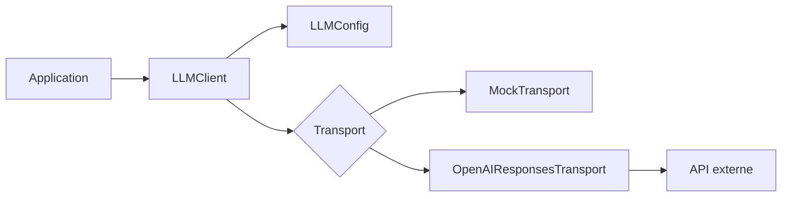

# Corrigés — Exercices

## Corrigé 1 — Identifier les responsabilités

Le code mélange :

- configuration de la clé API ;
- instanciation du SDK ;
- choix du modèle ;
- appel réseau ;
- logique d’affichage ;
- absence de gestion d’erreur ;
- absence de retour exploitable.

Il est difficile à tester car il dépend directement du réseau, d’une clé API réelle et d’un fournisseur externe.

À extraire :

- `LLMConfig` pour la configuration ;
- `LLMClient` pour l’interface applicative ;
- `Transport` pour l’appel externe ;
- une réponse typée ;
- une gestion d’erreurs.

## Corrigé 2 — Configuration

```python
from dataclasses import dataclass
import os

@dataclass(frozen=True)
class LLMConfig:
    model: str = "gpt-5.5"
    temperature: float = 0.2
    max_output_tokens: int = 500
    timeout_seconds: float = 30.0
    api_key: str | None = None

    @classmethod
    def from_env(cls) -> "LLMConfig":
        return cls(api_key=os.getenv("OPENAI_API_KEY"))
```

## Corrigé 3 — Transport mock

```python
class MockTransport:
    def send(self, request):
        return {
            "text": "Réponse mock",
            "model": "mock-model",
            "raw": {"mock": True}
        }
```

## Corrigé 4 — Client minimal

```python
from dataclasses import dataclass
from typing import Any

@dataclass
class LLMResponse:
    text: str
    model: str
    raw: dict[str, Any]

class LLMClient:
    def __init__(self, config, transport):
        self.config = config
        self.transport = transport

    def generate_text(self, prompt: str) -> LLMResponse:
        raw = self.transport.send({"prompt": prompt})
        return LLMResponse(
            text=raw["text"],
            model=raw.get("model", self.config.model),
            raw=raw
        )
```

## Corrigé 5 — Sortie JSON

```python
import json

class LLMValidationError(Exception):
    pass

def generate_json(self, prompt: str, required_fields: list[str]) -> dict:
    response = self.generate_text(prompt)

    try:
        data = json.loads(response.text)
    except json.JSONDecodeError as exc:
        raise LLMValidationError("La réponse n'est pas un JSON valide.") from exc

    missing = [field for field in required_fields if field not in data]
    if missing:
        raise LLMValidationError(f"Champs manquants: {missing}")

    return data
```

## Corrigé 6 — Testabilité

```python
def test_generate_text_returns_mock_response():
    client = LLMClient(config=LLMConfig(model="mock-model"), transport=MockTransport())
    response = client.generate_text("Bonjour")
    assert response.text

def test_generate_json_requires_fields():
    transport = StaticTransport('{"label": "technical"}')
    client = LLMClient(config=LLMConfig(model="mock-model"), transport=transport)

    with pytest.raises(LLMValidationError):
        client.generate_json("Classe ce texte", required_fields=["label", "confidence"])
```

## Corrigé 7 — Architecture


