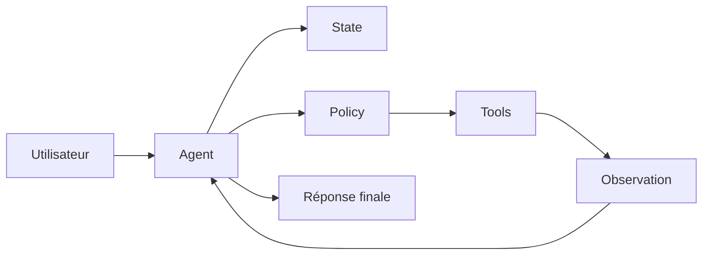

# Semaine 2 — Jour 1 : Architecture d’un agent

## Thème

Architecture d’un agent IA mono-agent.

## Objectif de la journée

Comprendre comment structurer un agent IA simple en composants explicites :

- entrée utilisateur ;
- état conversationnel ;
- politique de décision ;
- outils ;
- exécution ;
- observation ;
- réponse finale.

À la fin de la journée, l’apprenant sait expliquer, implémenter et tester une architecture minimale d’agent sans dépendre d’un framework externe.

## Position dans la semaine

La semaine 2 construit progressivement un assistant IA mono-agent.

Ce jour 1 pose les fondations :



Les jours suivants ajouteront :

- function calling ;
- sorties structurées ;
- état conversationnel avancé ;
- mémoire ;
- boucle agentique ;
- planification ;
- autonomie contrôlée.

## Fichiers de la journée

```text
book/week02/day01/
├── README.md
├── learning_objectives.md
├── chapter.md
├── exercises.md
├── interview.md
├── challenge.md
├── references.md
├── corriges/
│   ├── exercises_solution.md
│   ├── interview_solution.md
│   ├── challenge_solution.md
│   └── review.md
├── diagrams/
│   └── agent_architecture.md
├── assets/
│   └── README.md
└── labs/
    ├── README.md
    └── agent_architecture_lab.py
```

## Livrables apprenant

- Un schéma d’architecture d’agent.
- Un agent Python minimal.
- Une trace d’exécution lisible.
- Une analyse des limites de l’architecture.
