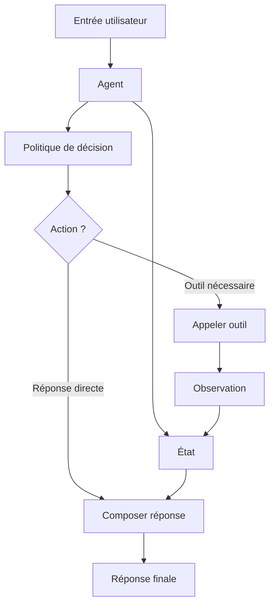

# Chapitre — Architecture d’un agent IA

## 1. Pourquoi parler d’architecture d’agent ?

Un appel simple à un modèle de langage suit souvent cette forme :

```python
response = model.generate(prompt)
```

C’est utile pour une tâche ponctuelle, mais insuffisant pour construire un assistant fiable.

Un agent IA ajoute une couche d’orchestration autour du modèle. Il ne se contente pas de produire du texte. Il peut :

- interpréter une intention ;
- décider d’une action ;
- appeler un outil ;
- lire une observation ;
- mettre à jour un état ;
- produire une réponse finale.

Dans un bootcamp d’AI Engineering, l’objectif n’est pas seulement de “faire parler un LLM”. L’objectif est de construire un système maintenable, observable et testable.

## 2. Définition opérationnelle

Dans ce cours, un agent est défini comme :

> Un composant logiciel qui reçoit une entrée, maintient un état, décide d’une prochaine action, utilise éventuellement des outils, puis produit une sortie.

Cette définition reste volontairement simple. Elle permet de construire un premier agent mono-agent sans framework externe.

## 3. Les composants minimaux

### 3.1 Entrée utilisateur

L’entrée utilisateur est la demande brute.

Exemple :

```text
Quel est le statut de ma commande 123 ?
```

Cette entrée n’est pas encore une action. L’agent doit l’interpréter.

### 3.2 État

L’état représente ce que l’agent sait pendant l’exécution.

Exemple :

```python
state = {
    "user_input": "Quel est le statut de ma commande 123 ?",
    "intent": None,
    "tool_result": None,
    "final_answer": None,
    "trace": []
}
```

Un état explicite rend le comportement inspectable.

### 3.3 Politique de décision

La politique de décision choisit la prochaine action.

Dans un agent avancé, cette politique peut être pilotée par un LLM. Pour cette première journée, elle est codée simplement en Python.

Exemple :

```python
def decide_next_action(user_input: str) -> str:
    if "commande" in user_input.lower():
        return "lookup_order"
    return "answer_directly"
```

### 3.4 Outils

Un outil est une fonction externe à l’agent principal.

Exemple :

```python
def lookup_order(order_id: str) -> dict:
    return {
        "order_id": order_id,
        "status": "shipped",
        "eta": "2026-07-05"
    }
```

Dans un vrai système, l’outil peut appeler une API, une base de données ou un service interne.

### 3.5 Observation

L’observation est le résultat retourné par l’outil.

Exemple :

```python
{
    "order_id": "123",
    "status": "shipped",
    "eta": "2026-07-05"
}
```

L’agent utilise cette observation pour construire sa réponse.

### 3.6 Réponse finale

La réponse finale est ce que l’utilisateur reçoit.

Exemple :

```text
Votre commande 123 a été expédiée. Livraison estimée : 2026-07-05.
```

## 4. Architecture logique



## 5. Trace d’exécution

Une trace permet de comprendre ce que l’agent a fait.

Exemple :

```python
trace = [
    "received_user_input",
    "detected_order_intent",
    "called_lookup_order",
    "received_tool_observation",
    "generated_final_answer"
]
```

La trace est essentielle pour :

- déboguer ;
- évaluer ;
- auditer ;
- enseigner ;
- préparer les tests.

## 6. Exemple complet

```python
from dataclasses import dataclass, field
from typing import Any


@dataclass
class AgentState:
    user_input: str
    action: str | None = None
    observation: dict[str, Any] | None = None
    final_answer: str | None = None
    trace: list[str] = field(default_factory=list)


def extract_order_id(text: str) -> str:
    tokens = text.replace("?", "").split()
    for token in tokens:
        if token.isdigit():
            return token
    return "unknown"


def lookup_order(order_id: str) -> dict[str, str]:
    return {
        "order_id": order_id,
        "status": "expédiée",
        "eta": "2026-07-05",
    }


def decide_action(user_input: str) -> str:
    text = user_input.lower()
    if "commande" in text:
        return "lookup_order"
    return "answer_directly"


def run_agent(user_input: str) -> AgentState:
    state = AgentState(user_input=user_input)
    state.trace.append("received_user_input")

    state.action = decide_action(user_input)
    state.trace.append(f"selected_action:{state.action}")

    if state.action == "lookup_order":
        order_id = extract_order_id(user_input)
        state.trace.append(f"extracted_order_id:{order_id}")

        state.observation = lookup_order(order_id)
        state.trace.append("called_tool:lookup_order")

        state.final_answer = (
            f"Votre commande {state.observation['order_id']} est "
            f"{state.observation['status']}. "
            f"Livraison estimée : {state.observation['eta']}."
        )
        state.trace.append("generated_answer_from_observation")
    else:
        state.final_answer = (
            "Je peux vous aider. Pouvez-vous préciser votre demande ?"
        )
        state.trace.append("generated_direct_answer")

    return state


if __name__ == "__main__":
    result = run_agent("Quel est le statut de ma commande 123 ?")
    print(result.final_answer)
    print(result.trace)
```

## 7. Ce que cet agent ne fait pas encore

Cet agent est volontairement limité.

Il ne fait pas encore :

- d’appel réel à un LLM ;
- de function calling ;
- de validation de sortie structurée ;
- de mémoire longue durée ;
- de planification multi-étapes ;
- de gestion robuste des erreurs ;
- de garde-fous de sécurité.

Ces limites sont utiles. Elles rendent l’architecture visible avant d’ajouter des couches plus avancées.

## 8. Bonnes pratiques

### Séparer les responsabilités

Une fonction ne doit pas tout faire.

Préférer :

- une fonction pour décider ;
- une fonction pour appeler l’outil ;
- une fonction pour composer la réponse ;
- un objet pour porter l’état.

### Garder un état explicite

Un état explicite facilite les tests.

Mauvais signe :

```python
global_memory = {}
```

Meilleur choix :

```python
state = AgentState(user_input=user_input)
```

### Tracer les décisions

Chaque action importante doit laisser une trace.

```python
state.trace.append("called_tool:lookup_order")
```

### Tester les chemins principaux

Un agent simple doit au minimum tester :

- réponse directe ;
- appel d’outil ;
- extraction d’information ;
- réponse finale ;
- trace.

## 9. Préparation au jour 2

Le jour 2 introduira le function calling.

L’architecture du jour 1 prépare cette évolution :

```text
decision rule -> tool call
```

deviendra :

```text
LLM tool selection -> structured function call -> tool execution
```

L’important est que l’agent reste structuré avant d’être rendu plus intelligent.
