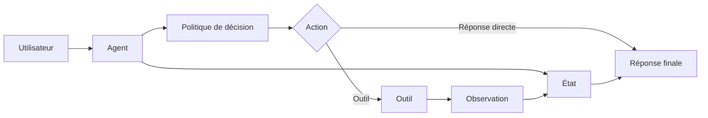
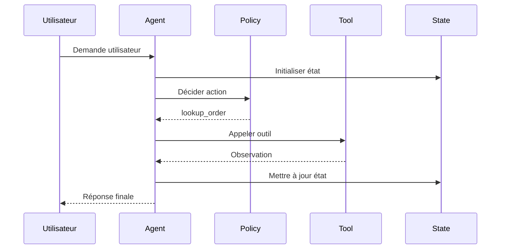
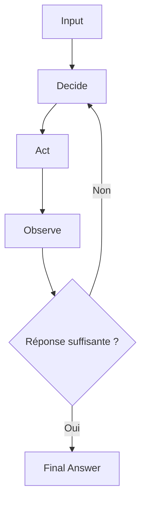

# Diagrammes — Architecture d’un agent

## Vue composants

```mermaid
flowchart LR
    User[Utilisateur] --> Agent[Agent]
    Agent --> State[État]
    Agent --> Policy[Politique de décision]
    Policy --> Decision{Action}
    Decision -->|Réponse directe| Answer[Réponse finale]
    Decision -->|Outil| Tool[Outil]
    Tool --> Observation[Observation]
    Observation --> State
    State --> Answer
```

## Vue séquence

```mermaid
sequenceDiagram
    participant U as Utilisateur
    participant A as Agent
    participant P as Policy
    participant T as Tool
    participant S as State

    U->>A: Demande utilisateur
    A->>S: Initialiser état
    A->>P: Décider action
    P-->>A: lookup_order
    A->>T: Appeler outil
    T-->>A: Observation
    A->>S: Mettre à jour état
    A-->>U: Réponse finale
```

## Boucle conceptuelle

```mermaid
flowchart TD
    I[Input] --> D[Decide]
    D --> A[Act]
    A --> O[Observe]
    O --> R{Réponse suffisante ?}
    R -->|Non| D
    R -->|Oui| F[Final Answer]
```

Pour le jour 1, la boucle reste limitée à une seule action.
