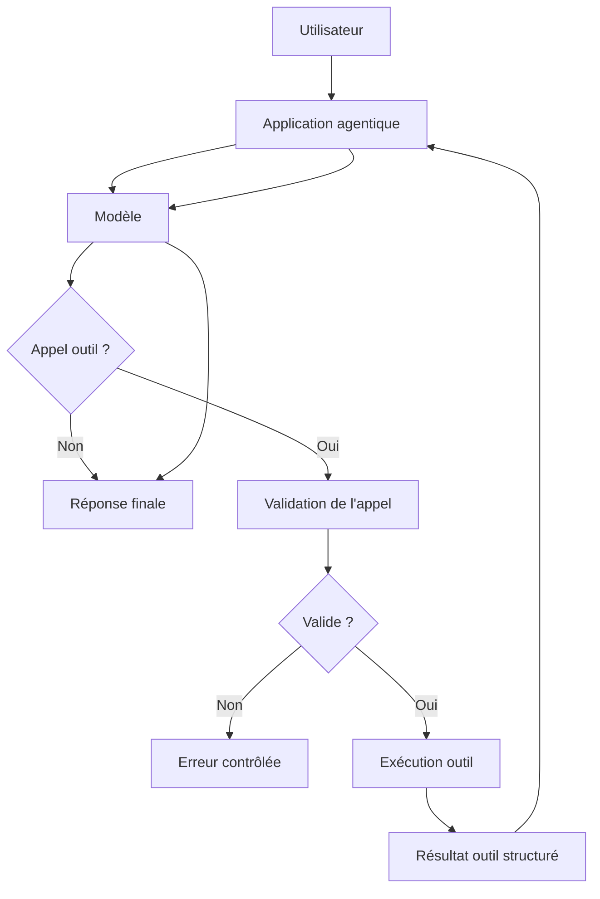
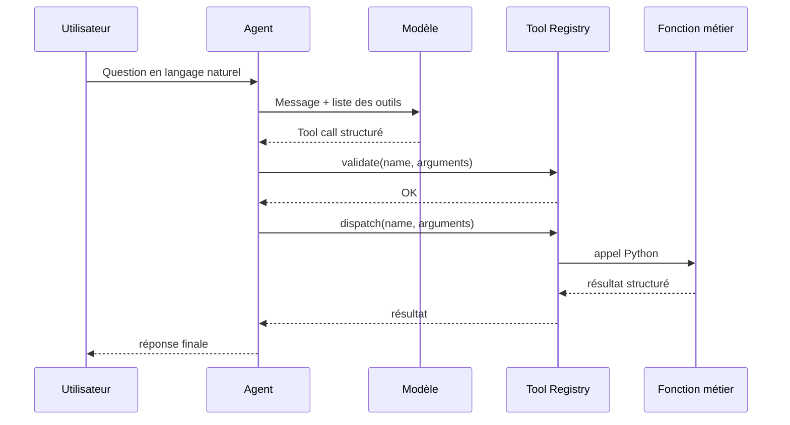

# Chapitre — Function Calling

## 1. Pourquoi le function calling existe

Un modèle de langage est très bon pour interpréter une demande, produire du texte et raisonner sur une intention. En revanche, il ne doit pas être considéré comme un moteur d’exécution fiable.

Dans une application IA, certaines actions doivent être contrôlées :

- lire une base de données ;
- appeler une API interne ;
- créer un ticket ;
- déclencher un paiement ;
- envoyer un email ;
- modifier une ressource.

Le **function calling** sert à transformer une intention naturelle en appel structuré.

L’idée centrale est simple :

> Le modèle choisit une fonction et propose des arguments. L’application valide et exécute.

## 2. Modèle mental

Sans function calling, l’utilisateur demande :

```text
Où en est ma commande ORD-1001 ?
```

Le modèle pourrait répondre avec une supposition.

Avec function calling, le modèle peut produire une structure de ce type :

```json
{
  "name": "get_order_status",
  "arguments": {
    "order_id": "ORD-1001"
  }
}
```

L’application reçoit cette structure, vérifie que l’outil existe, valide les arguments, exécute la fonction, puis produit une réponse fondée sur le résultat réel.

## 3. Boucle standard



Le point important est la frontière de responsabilité :

| Élément | Responsabilité |
|---|---|
| Utilisateur | Exprime un besoin en langage naturel |
| Modèle | Sélectionne un outil et propose des arguments |
| Application | Valide, exécute, observe et contrôle |
| Outil | Effectue une opération métier précise |
| Réponse finale | Explique le résultat à l’utilisateur |

## 4. Anatomie d’un outil

Un outil exposé au modèle contient généralement :

- un nom stable ;
- une description claire ;
- un schéma d’arguments ;
- une fonction métier réelle côté application.

Exemple de contrat :

```json
{
  "name": "get_order_status",
  "description": "Récupère le statut logistique d'une commande client.",
  "parameters": {
    "type": "object",
    "properties": {
      "order_id": {
        "type": "string",
        "description": "Identifiant de commande, par exemple ORD-1001."
      }
    },
    "required": ["order_id"],
    "additionalProperties": false
  }
}
```

Ce contrat ne contient pas l’implémentation. Il décrit seulement ce que le modèle a le droit de demander.

## 5. Contrat faible vs contrat fort

Un mauvais outil est vague :

```json
{
  "name": "do_action",
  "description": "Fait une action utilisateur."
}
```

Problèmes :

- impossible de savoir quelle action est autorisée ;
- arguments non définis ;
- validation difficile ;
- surface d’abus élevée ;
- logs peu exploitables.

Un bon outil est spécifique :

```json
{
  "name": "create_support_ticket",
  "description": "Crée un ticket de support pour une commande existante.",
  "parameters": {
    "type": "object",
    "properties": {
      "order_id": {"type": "string"},
      "issue": {"type": "string"},
      "priority": {"type": "string", "enum": ["low", "normal", "high"]}
    },
    "required": ["order_id", "issue", "priority"],
    "additionalProperties": false
  }
}
```

Ce contrat rend l’appel plus prévisible, testable et observable.

## 6. Le registre d’outils

Dans une architecture propre, l’agent ne connaît pas directement les fonctions métier. Il passe par un **Tool Registry**.

Rôles du registre :

1. déclarer les outils disponibles ;
2. exposer les schémas au modèle ;
3. vérifier qu’un outil demandé existe ;
4. valider les arguments ;
5. dispatcher vers la fonction Python correcte.



## 7. Exemple exécutable minimal

Le code ci-dessous illustre la mécanique sans fournisseur LLM externe. Le modèle est remplacé par un planificateur déterministe pour rendre l’exercice reproductible.

```python
from dataclasses import dataclass
from typing import Any, Callable


@dataclass
class ToolCall:
    name: str
    arguments: dict[str, Any]


class ToolRegistry:
    def __init__(self) -> None:
        self._tools: dict[str, tuple[dict[str, Any], Callable[..., dict[str, Any]]]] = {}

    def register(self, schema: dict[str, Any], handler: Callable[..., dict[str, Any]]) -> None:
        name = schema["name"]
        self._tools[name] = (schema, handler)

    def validate(self, call: ToolCall) -> None:
        if call.name not in self._tools:
            raise ValueError(f"Outil inconnu: {call.name}")

        schema, _ = self._tools[call.name]
        parameters = schema["parameters"]
        required = parameters.get("required", [])
        properties = parameters.get("properties", {})

        for field in required:
            if field not in call.arguments:
                raise ValueError(f"Argument manquant: {field}")

        if parameters.get("additionalProperties") is False:
            extra = set(call.arguments) - set(properties)
            if extra:
                raise ValueError(f"Arguments non autorisés: {sorted(extra)}")

        for field, value in call.arguments.items():
            expected_type = properties[field].get("type")
            if expected_type == "string" and not isinstance(value, str):
                raise TypeError(f"{field} doit être une chaîne")
            if "enum" in properties[field] and value not in properties[field]["enum"]:
                raise ValueError(f"{field} doit être dans {properties[field]['enum']}")

    def dispatch(self, call: ToolCall) -> dict[str, Any]:
        self.validate(call)
        _, handler = self._tools[call.name]
        return handler(**call.arguments)
```

## 8. Le modèle ne doit pas décider seul

Un risque fréquent consiste à faire confiance au modèle parce que la structure paraît correcte.

Exemple dangereux :

```python
function_name = model_output["name"]
arguments = model_output["arguments"]
globals()[function_name](**arguments)
```

Ce pattern est à éviter.

Problèmes :

- un nom de fonction arbitraire pourrait être demandé ;
- les arguments ne sont pas validés ;
- le modèle peut produire des champs inattendus ;
- l’application perd le contrôle de sa surface d’action.

Le bon pattern est :

```python
call = ToolCall(name="get_order_status", arguments={"order_id": "ORD-1001"})
result = registry.dispatch(call)
```

Le registre devient le passage obligatoire.

## 9. Gestion des erreurs

Les erreurs ne sont pas exceptionnelles dans un agent. Elles font partie du protocole.

Cas courants :

- outil inexistant ;
- argument manquant ;
- type invalide ;
- ressource introuvable ;
- API externe indisponible ;
- action refusée pour raisons de sécurité.

Une application robuste transforme ces erreurs en résultats structurés.

Exemple :

```json
{
  "ok": false,
  "error": {
    "code": "ORDER_NOT_FOUND",
    "message": "Aucune commande ne correspond à ORD-9999."
  }
}
```

Cela évite que la boucle agentique s’arrête brutalement.

## 10. Sécurité minimale

Le function calling doit être conçu avec une posture de sécurité stricte.

Règles de base :

1. ne jamais exécuter un outil absent du registre ;
2. refuser les arguments supplémentaires ;
3. séparer outils de lecture et outils d’écriture ;
4. demander confirmation avant une action irréversible ;
5. journaliser les appels ;
6. appliquer des permissions côté application ;
7. limiter la donnée renvoyée au modèle.

## 11. Observabilité

Chaque appel d’outil doit être observable.

Un log utile contient :

- identifiant de conversation ;
- nom de l’outil ;
- arguments validés ;
- durée ;
- résultat ou code d’erreur ;
- statut final.

Exemple :

```json
{
  "conversation_id": "conv_123",
  "tool": "get_order_status",
  "arguments": {"order_id": "ORD-1001"},
  "duration_ms": 12,
  "ok": true
}
```

Sans observabilité, un agent devient difficile à déboguer.

## 12. Function calling et architecture agentique

Le function calling est la première brique opérationnelle d’un agent.

Il ne suffit pas à créer un agent autonome, mais il introduit trois fondations :

- une interface d’action ;
- une boucle d’exécution ;
- une séparation entre décision et contrôle.

Les prochains jours ajouteront :

- des sorties structurées ;
- un état conversationnel ;
- de la mémoire ;
- une boucle agentique plus complète ;
- de la planification.

## 13. Résumé

Le function calling permet au modèle de demander une action structurée. L’application reste responsable de la validation et de l’exécution.

Un système de qualité professionnelle repose sur :

- des contrats d’outils précis ;
- un registre d’outils explicite ;
- une validation stricte ;
- des erreurs structurées ;
- des logs ;
- des tests.
