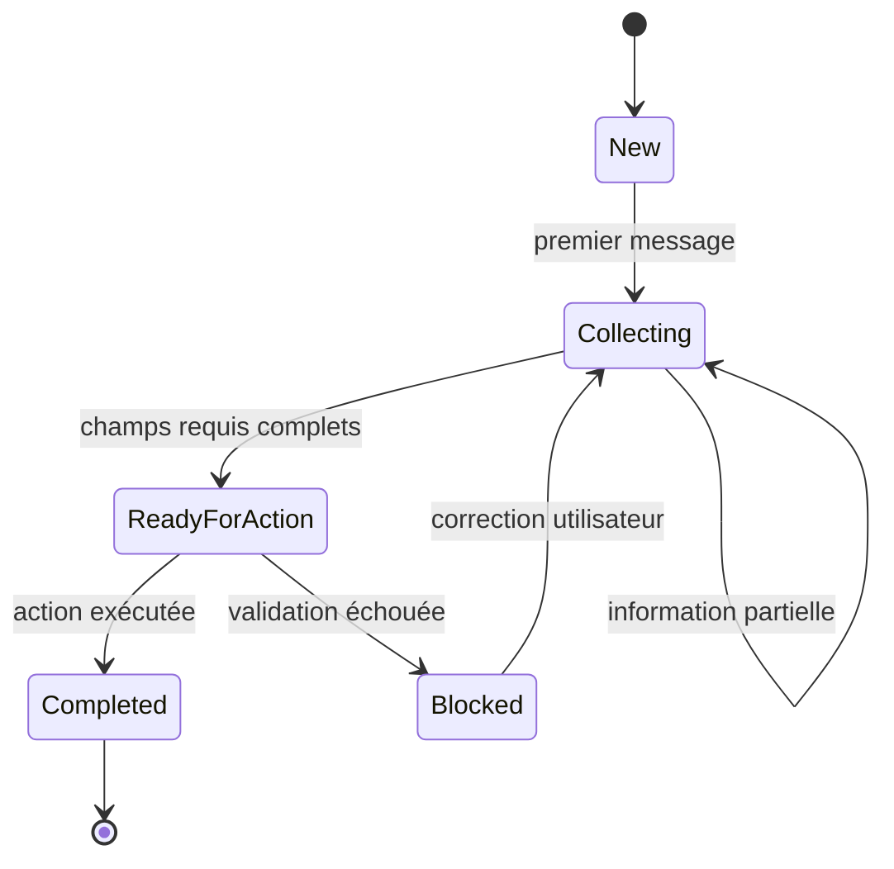

# Chapitre — Conversation State

## 1. Le problème d’un agent stateless

Un agent stateless traite chaque message comme s’il était indépendant.

Exemple :

```text
Utilisateur : Je veux un remboursement.
Assistant : Quel est votre numéro de commande ?
Utilisateur : ORD-1001
```

Un système stateless voit seulement le dernier message :

```text
ORD-1001
```

Il ne sait plus :

- que l’utilisateur demande un remboursement ;
- pourquoi le numéro de commande est fourni ;
- quel champ vient d’être complété ;
- quelles informations restent à demander ;
- quelle étape du processus est en cours.

Pour un chatbot de démonstration, cela peut parfois passer.

Pour un agent backend, c’est un problème d’architecture.

Un agent professionnel doit porter une représentation explicite de la conversation.

## 2. Définition

Le **Conversation State** est l’état applicatif courant d’une conversation.

Il représente ce que le backend sait actuellement du dialogue.

Il peut contenir :

- l’identifiant de session ;
- l’identifiant utilisateur ;
- l’historique récent ;
- l’intention courante ;
- les champs métier déjà collectés ;
- les champs encore manquants ;
- les résultats d’outils ;
- le statut de progression ;
- les métadonnées utiles au contrôle du flux.

Exemple simplifié :

```json
{
  "session_id": "session_001",
  "user_id": "user_123",
  "intent": "refund",
  "slots": {
    "order_id": "ORD-1001",
    "email": "lea@example.com"
  },
  "missing_fields": ["reason"],
  "status": "collecting",
  "turn_count": 3
}
```

Cet objet permet à l’application de prendre une décision stable :

```text
Il manque encore la raison du remboursement.
La prochaine réponse doit demander cette information.
```

## 3. Conversation State, historique et mémoire

Il faut distinguer trois notions proches.

### Historique conversationnel

L’historique est la liste des messages échangés.

Exemple :

```json
[
  {"role": "user", "content": "Je veux un remboursement."},
  {"role": "assistant", "content": "Quel est votre numéro de commande ?"},
  {"role": "user", "content": "ORD-1001"}
]
```

L’historique est utile pour reconstruire le contexte linguistique.

Mais il n’est pas suffisant pour piloter un backend.

Un backend ne veut pas reparcourir tout le texte à chaque tour pour deviner l’état métier.

### Conversation State

Le state est une représentation structurée de la situation courante.

Il répond à des questions comme :

- quelle est l’intention active ?
- quels champs sont remplis ?
- quels champs manquent ?
- quelle étape du workflow est en cours ?
- une action peut-elle être déclenchée ?

Le state doit être lisible par du code.

### Memory

La mémoire, qui sera traitée au jour suivant, concerne la conservation d’informations au-delà de la conversation immédiate.

Exemples :

- préférence de langue d’un utilisateur ;
- historique long terme d’un client ;
- résumé durable d’une relation ;
- faits personnalisés persistants.

La différence principale :

```text
Conversation State = état opérationnel de la conversation courante.
Memory = connaissances persistantes utilisables dans plusieurs conversations.
```

## 4. Pourquoi le state doit être explicite

On pourrait demander au modèle :

```text
Relis la conversation et décide quoi faire.
```

Cette approche est fragile.

Elle dépend :

- de la fenêtre de contexte ;
- de la qualité du prompt ;
- de la capacité du modèle à ne pas oublier ;
- de la cohérence des messages précédents ;
- du coût en tokens ;
- du comportement non déterministe du modèle.

Un state explicite déplace une partie du contrôle vers le backend.

Le modèle peut aider à extraire ou interpréter.

Mais l’application conserve le contrat de progression.

## 5. Les composants d’un état conversationnel

Un bon state minimal contient plusieurs couches.

### Identité de session

La session évite de mélanger les conversations.

```json
{
  "session_id": "support_2026_0001",
  "user_id": "user_123"
}
```

L’identifiant de session ne doit pas être confondu avec l’identifiant utilisateur.

Un même utilisateur peut avoir plusieurs sessions.

Une même session doit appartenir à un seul utilisateur.

### Historique court

L’historique court peut être utile pour :

- afficher la conversation ;
- donner du contexte au modèle ;
- auditer un comportement ;
- comprendre pourquoi un état a changé.

Il faut toutefois éviter d’y stocker trop de données.

### Intention active

L’intention représente le besoin principal détecté.

Exemples :

```text
refund
order_status
technical_issue
unknown
```

L’intention peut être inconnue au début.

Elle peut être révisée si l’utilisateur clarifie sa demande.

Mais une révision doit être explicite.

### Slots métier

Les slots sont les champs nécessaires au traitement.

Exemple pour une demande de remboursement :

```json
{
  "order_id": "ORD-1001",
  "email": "lea@example.com",
  "reason": "double_billing"
}
```

Les slots sont essentiels parce qu’ils permettent de savoir si une action peut être exécutée.

### Champs manquants

Les champs manquants peuvent être calculés.

Exemple :

```text
required_fields(refund) = order_id, email, reason
known_slots = order_id, email
missing_fields = reason
```

Il est préférable de recalculer les champs manquants à partir de l’intention et des slots plutôt que de les maintenir manuellement.

### Résultats d’outils

Un agent peut appeler des outils.

Les résultats d’outils peuvent enrichir le state :

```json
{
  "tool_results": {
    "get_order_status": {
      "status": "delivered",
      "delivered_at": "2026-08-01"
    }
  }
}
```

Il faut distinguer :

- ce que l’utilisateur a dit ;
- ce qu’un outil a confirmé ;
- ce que le modèle a inféré.

### Statut

Le statut indique la progression.

Exemples :

```text
collecting
ready_for_action
completed
blocked
```

Le statut permet d’éviter d’appeler un outil trop tôt.

## 6. Cycle de vie du state

Un état conversationnel suit un cycle.



À chaque tour :

1. charger l’état ;
2. ajouter le message utilisateur ;
3. extraire les informations utiles ;
4. mettre à jour les slots ;
5. recalculer les champs manquants ;
6. décider la prochaine action ;
7. ajouter la réponse assistant ;
8. sauvegarder l’état.

## 7. State update

La mise à jour d’état est une opération critique.

Elle doit être :

- déterministe autant que possible ;
- testable ;
- observable ;
- réversible si nécessaire ;
- stricte sur les champs acceptés.

Exemple de pseudo-code :

```python
def handle_turn(state, user_message):
    state.messages.append(user_message)

    extraction = extract_information(user_message, state)

    state.intent = resolve_intent(state.intent, extraction.intent)
    state.slots.update(extraction.slots)

    missing = missing_required_fields(state)

    if missing:
        assistant_message = ask_for(missing[0])
        state.status = "collecting"
    else:
        assistant_message = confirm_ready(state)
        state.status = "ready_for_action"

    state.messages.append(assistant_message)
    return state
```

Le modèle peut intervenir dans `extract_information`.

Mais la logique de mise à jour doit rester sous contrôle applicatif.

## 8. Gestion des corrections utilisateur

Un utilisateur peut corriger une information :

```text
Utilisateur : Ma commande est ORD-1001.
Assistant : Quelle adresse email ?
Utilisateur : Pardon, la commande est ORD-2002.
```

Le state doit permettre une correction.

Mais une correction peut avoir des impacts.

Si un outil a déjà été appelé avec `ORD-1001`, le résultat de cet outil devient potentiellement invalide.

Le système doit donc décider :

- remplacer le slot ;
- invalider certains résultats d’outils ;
- journaliser la correction ;
- redemander confirmation si le changement est critique.

## 9. Isolation des sessions

Un problème grave dans les agents stateful est la fuite d’état.

Exemple dangereux :

```text
Session A : email = alice@example.com
Session B : l’agent réutilise accidentellement alice@example.com
```

Cette erreur peut créer :

- une fuite de données personnelles ;
- une mauvaise action métier ;
- une violation de conformité ;
- une perte de confiance utilisateur.

Règles de base :

- ne jamais utiliser une variable globale mutable pour stocker l’état d’un utilisateur ;
- toujours indexer l’état par session ;
- vérifier que `session_id` et `user_id` correspondent ;
- tester explicitement deux sessions parallèles ;
- effacer ou expirer les états inactifs.

## 10. Sérialisation

Un state doit souvent être sauvegardé.

La sérialisation JSON est un bon format pédagogique.

Exemple :

```python
serialized = json.dumps(state.to_dict())
restored = ConversationState.from_dict(json.loads(serialized))
```

En production, l’état peut être stocké dans :

- Redis ;
- PostgreSQL ;
- un store managé ;
- un système de session du framework agentique ;
- un backend conversationnel fournisseur.

Le choix dépend :

- de la durée de vie de la session ;
- des exigences de confidentialité ;
- du volume de conversations ;
- des besoins d’audit ;
- du coût d’accès ;
- de la stratégie de rétention.

## 11. Relation avec les APIs modernes

Les plateformes agentiques proposent souvent des mécanismes de continuité de conversation.

Ces mécanismes peuvent gérer l’historique ou une partie de l’état.

Mais cela ne supprime pas le besoin d’un state applicatif métier.

Un backend doit encore savoir :

- quelle intention métier est active ;
- quels champs requis sont validés ;
- quel outil peut être appelé ;
- quelle action a déjà été exécutée ;
- quelles données doivent être stockées ou supprimées.

Le state applicatif est donc complémentaire au state géré par un fournisseur ou un SDK.

## 12. Design recommandé

Pour un premier agent de production, utiliser une structure simple :

```text
ConversationState
├── session_id
├── user_id
├── intent
├── slots
├── tool_results
├── messages
├── turn_count
└── status
```

Puis ajouter des couches seulement quand elles sont nécessaires :

- version de schéma ;
- deadline ou expiration ;
- consentements ;
- résumé compressé ;
- traces d’audit ;
- provenance des champs ;
- stratégie de nettoyage.

Ne pas commencer par un state trop complexe.

Un état trop riche devient difficile à maintenir.

## 13. Anti-patterns

### Anti-pattern 1 — Tout stocker dans le prompt

Le prompt ne remplace pas le state.

Il peut contenir un résumé de l’état, mais il ne doit pas être la source de vérité.

### Anti-pattern 2 — Tout stocker dans l’historique

L’historique est du texte.

Le backend a besoin de données structurées.

### Anti-pattern 3 — Corriger silencieusement

Si l’utilisateur corrige une donnée, le système doit gérer explicitement le changement.

### Anti-pattern 4 — Utiliser un state global

Un dictionnaire global peut être acceptable pour un exercice local.

En production, il faut un store isolé, sécurisé et expirant.

### Anti-pattern 5 — Confondre state et mémoire

Le state répond à la question :

```text
Où en est cette conversation ?
```

La mémoire répond à la question :

```text
Que sait-on durablement de cet utilisateur ou de ce domaine ?
```

## 14. Synthèse

Le Conversation State est la colonne vertébrale d’un agent multi-tours.

Il transforme un dialogue libre en processus contrôlable.

Un agent robuste ne s’appuie pas uniquement sur le modèle pour se souvenir.

Il maintient un état applicatif explicite, validé, sérialisable et testable.

Le jour suivant étendra cette logique vers la **Memory** : ce qui doit survivre au-delà de la conversation courante.
