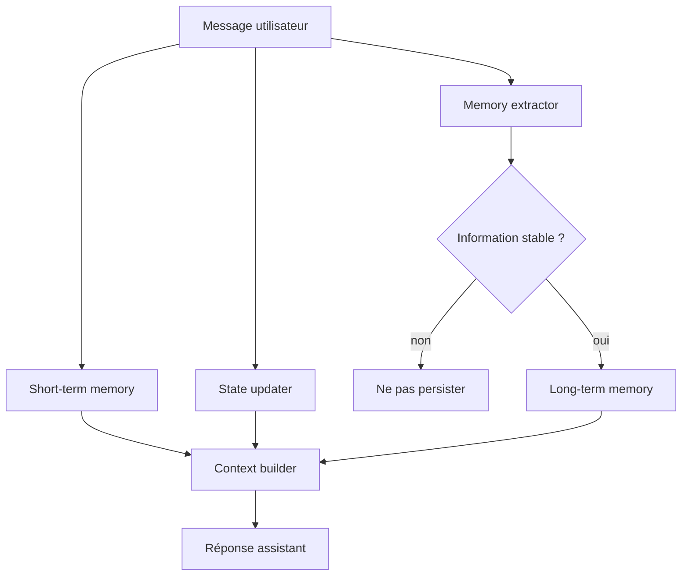

# Chapitre — Memory courte, longue et state

## 1. Pourquoi la mémoire est un problème d’architecture

Un agent IA semble plus intelligent lorsqu’il se souvient.

Mais dans un système professionnel, la mémoire n’est pas une impression utilisateur. C’est une responsabilité d’architecture.

Un agent doit répondre à trois questions :

1. **Que dois-je garder pour les prochains tours ?**
2. **Que dois-je savoir pour terminer la tâche en cours ?**
3. **Que puis-je retenir durablement pour de futures conversations ?**

Ces trois questions correspondent à trois couches différentes :

```text
Short-term memory
Conversation state
Long-term memory
```

Les mélanger produit des systèmes fragiles.

## 2. Les trois couches

### 2.1 Short-term memory

La mémoire courte contient le contexte récent nécessaire à la conversation immédiate.

Exemples :

- dernier message utilisateur ;
- dernière réponse assistant ;
- résultat d’un outil appelé il y a deux tours ;
- résumé court des derniers échanges.

Elle sert à maintenir la fluidité.

Elle ne doit pas devenir une base durable.

### 2.2 Conversation state

Le conversation state représente la tâche active.

Exemples :

```json
{
  "intent": "create_support_ticket",
  "slots": {
    "product": "API",
    "severity": "high"
  },
  "missing_slots": ["description"],
  "status": "collecting"
}
```

Il ne répond pas à la question “qui est cet utilisateur ?”.

Il répond à la question “où en est-on dans cette tâche ?”.

### 2.3 Long-term memory

La mémoire longue contient des informations stables et réutilisables dans de futures conversations.

Exemples :

- nom préféré ;
- langue préférée ;
- environnement technique favori ;
- préférence de format de réponse ;
- contrainte durable explicitement donnée.

Elle doit être sélective.

Une bonne mémoire longue ressemble plus à un profil contrôlé qu’à un transcript complet.

## 3. Pourquoi l’historique brut ne suffit pas

Une stratégie naïve consiste à renvoyer tous les messages précédents dans le prompt.

Cela échoue pour quatre raisons.

### 3.1 Coût

Chaque message ajouté consomme des tokens.

Une conversation longue devient coûteuse même si la nouvelle question est simple.

### 3.2 Bruit

Tous les échanges passés ne sont pas utiles.

Un détail ancien peut perturber la réponse actuelle.

### 3.3 Fenêtre de contexte

Même les modèles à grande fenêtre ont une limite.

Une application fiable doit décider quoi garder.

### 3.4 Gouvernance

L’historique brut peut contenir des données sensibles, temporaires ou obsolètes.

La mémoire doit donc être filtrée.

## 4. Règles de promotion vers la mémoire longue

Une information ne doit pas être stockée durablement simplement parce qu’elle apparaît dans une conversation.

Elle doit satisfaire plusieurs critères :

1. **Explicitement déclarée** : l’utilisateur l’a formulée clairement.
2. **Stable** : elle est susceptible de rester vraie.
3. **Utile** : elle améliore de futures interactions.
4. **Non sensible** : elle ne crée pas de risque inutile.
5. **Révocable** : elle peut être supprimée.

Exemples acceptables :

```text
Je préfère les réponses courtes.
Je travaille surtout en Python.
Tu peux m’appeler Lina.
```

Exemples à éviter :

```text
Je suis malade aujourd’hui.
Mon mot de passe est...
Voici une donnée bancaire.
J’étais énervé hier.
```

## 5. Modèle mental d’un agent mémoire-aware

Un agent mémoire-aware peut être représenté ainsi :



Le point important : la mémoire longue ne reçoit pas tout.

Elle reçoit uniquement ce que la politique de mémoire autorise.

## 6. Exemple de structure Python

Une implémentation minimale peut utiliser trois objets :

```python
@dataclass
class ShortTermMemory:
    max_messages: int
    messages: list[Message]

@dataclass
class ConversationState:
    intent: str | None
    slots: dict[str, str]
    missing_slots: list[str]
    status: str

@dataclass
class UserProfile:
    user_id: str
    display_name: str | None
    preferences: dict[str, str]
    facts: list[str]
```

Ce design rend les responsabilités visibles.

## 7. Construction du contexte

Avant d’appeler un modèle, l’application construit un contexte utile.

Exemple :

```text
Profil utilisateur:
- Nom préféré: Lina
- Langage préféré: Python
- Format préféré: réponse courte

État courant:
- Intention: create_support_ticket
- Produit: API
- Champs manquants: description

Historique récent:
- user: Mon endpoint échoue depuis ce matin.
- assistant: Quel produit est concerné ?
- user: L'API de billing.
```

L’agent ne doit pas envoyer toute la base mémoire.

Il sélectionne ce qui est pertinent.

## 8. Oubli et sécurité

Une mémoire professionnelle doit supporter l’oubli.

Cela implique :

- suppression du profil utilisateur ;
- suppression des messages courts associés ;
- suppression ou expiration des informations stockées ;
- possibilité de reconstruire un profil propre.

Dans un produit réel, ces mécanismes sont liés aux politiques de confidentialité, à la gouvernance des données et aux exigences réglementaires.

Dans ce bootcamp, l’objectif est de construire le réflexe d’architecture : **toute mémoire doit avoir une politique d’écriture, de lecture et de suppression**.

## 9. Liens avec les jours précédents

### Avec Function Calling

La mémoire peut être exposée via des outils :

```text
get_user_profile(user_id)
save_user_preference(user_id, key, value)
delete_user_memory(user_id)
```

### Avec Structured Outputs

L’extraction mémoire doit idéalement produire une sortie structurée :

```json
{
  "should_store": true,
  "memory_type": "preference",
  "key": "preferred_language",
  "value": "Python",
  "confidence": 0.93
}
```

### Avec Conversation State

Le state ne remplace pas la mémoire.

Le state dit :

```text
Nous sommes en train de créer un ticket.
```

La mémoire longue dit :

```text
Cet utilisateur préfère les exemples Python.
```

## 10. Anti-patterns

### Anti-pattern 1 : tout stocker

Stocker tous les messages en mémoire longue crée une mémoire coûteuse, bruyante et risquée.

### Anti-pattern 2 : mémoire globale

Une mémoire partagée par défaut entre utilisateurs crée des fuites de données.

### Anti-pattern 3 : mémoire implicite

Le modèle décide seul de ce qui est vrai et durable.

C’est dangereux car une phrase temporaire peut devenir une “préférence”.

### Anti-pattern 4 : mémoire non effaçable

Un système qui mémorise mais ne peut pas oublier est incomplet.

## 11. Architecture cible du jour

Le lab implémente :

- une mémoire courte bornée ;
- un état de conversation simple ;
- une mémoire longue par utilisateur ;
- une extraction déterministe de préférences ;
- une fonction de construction de contexte ;
- une fonction d’oubli utilisateur ;
- une suite de tests.

Le but n’est pas de simuler un LLM.

Le but est de construire la couche applicative qui rend un LLM utilisable dans un agent réel.

## 12. À retenir

Un agent fiable ne dépend pas seulement du modèle.

Il dépend de la qualité de son environnement :

- outils ;
- schémas ;
- état ;
- mémoire ;
- tests ;
- politique de données.

La mémoire est donc une compétence d’AI Engineering, pas seulement une fonctionnalité conversationnelle.
