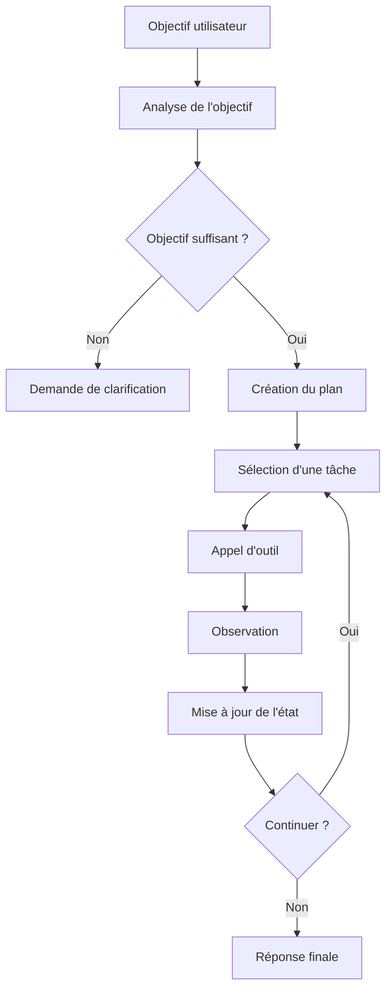
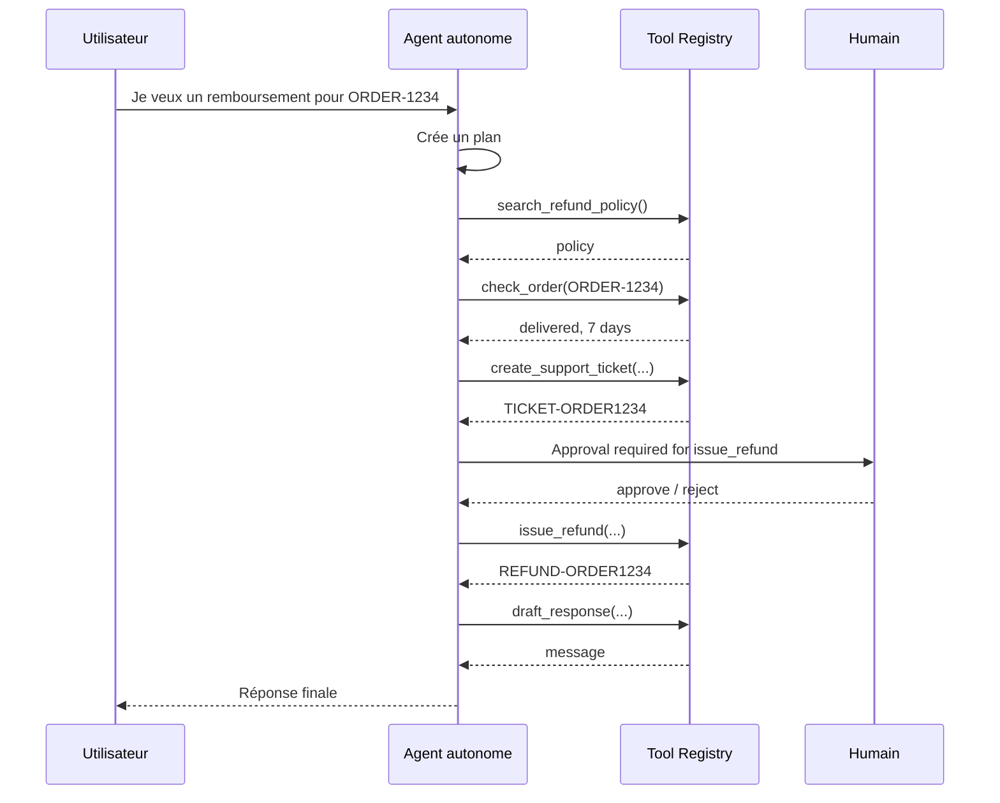

# Chapitre — Agent autonome contrôlé

## 1. Définition

Un agent autonome est un système capable de poursuivre un objectif en plusieurs étapes.

Il ne se contente pas de répondre à une question. Il peut :

- planifier ;
- appeler des outils ;
- observer les résultats ;
- modifier son plan ;
- décider de continuer ou de s'arrêter.

Dans un contexte professionnel, l'autonomie doit toujours être **contrôlée**. Un agent utile n'est pas seulement un agent qui agit. C'est un agent qui agit dans un cadre explicite.

## 2. Différence entre chatbot, assistant outillé et agent autonome

Un chatbot simple produit une réponse textuelle.

Un assistant outillé peut appeler une fonction lorsque le modèle le décide.

Un agent autonome possède une boucle d'exécution plus complète :



Le coeur du système est donc la boucle :

```text
plan -> act -> observe -> update state -> decide
```

## 3. Le contrat d'un agent autonome

Un agent autonome sérieux doit posséder un contrat explicite.

Ce contrat décrit :

- ce que l'agent a le droit de faire ;
- les outils disponibles ;
- les entrées obligatoires ;
- les actions qui nécessitent une validation humaine ;
- les conditions d'arrêt ;
- la forme des traces ;
- la forme de l'état persistant.

Sans contrat, l'agent devient difficile à tester, à auditer et à maintenir.

## 4. Les composants minimaux

### 4.1 Objective

L'objectif est la demande métier à accomplir.

Exemples :

```text
Je veux un remboursement pour ORDER-1234.
Crée un ticket support pour mon incident.
Analyse cette demande et propose la prochaine action.
```

Un objectif peut être incomplet. Dans ce cas, l'agent ne doit pas inventer les informations manquantes.

### 4.2 Plan

Le plan est une liste de tâches.

Chaque tâche doit être explicite :

```json
{
  "id": "T2",
  "name": "Vérifier la commande",
  "tool_name": "check_order",
  "arguments": {
    "order_id": "ORDER-1234"
  },
  "status": "pending"
}
```

Un plan utile n'est pas forcément complexe. Il doit être suffisamment concret pour être exécuté.

### 4.3 Tool Registry

Le registre d'outils est la surface d'action de l'agent.

Il contient :

- le nom de l'outil ;
- sa description ;
- son handler ;
- son niveau de sûreté ;
- son schéma d'arguments dans une version production.

Dans le lab, le registre est volontairement simple mais respecte ce principe.

### 4.4 Agent State

L'état contient ce que l'agent sait pendant l'exécution :

- objectif ;
- tâches ;
- statut ;
- étape courante ;
- budget utilisé ;
- informations manquantes ;
- réponse finale ;
- traces.

L'état est différent de la mémoire longue.

L'état représente l'exécution en cours. La mémoire représente ce qui peut survivre à l'exécution.

### 4.5 Traces

Les traces permettent de comprendre ce qui s'est passé.

Elles répondent à des questions comme :

- quel plan a été créé ?
- quel outil a été appelé ?
- avec quels arguments ?
- quelle observation a été reçue ?
- pourquoi l'agent s'est-il arrêté ?

Sans traces, un agent autonome est une boîte noire.

## 5. Boucle d'exécution

Une boucle agentique robuste suit généralement cette structure :

```python
while status == "running":
    task = select_next_task(state)
    if task is None:
        return finalize(state)

    if guardrail_blocks(task, state):
        return ask_human_or_stop(state)

    result = execute_tool(task)
    update_state(state, task, result)

    if should_stop(state):
        return finalize(state)
```

Cette boucle doit être limitée.

Les deux limites les plus simples sont :

- `max_steps` ;
- `max_budget`.

Ces limites évitent les agents infinis, coûteux ou incontrôlables.

## 6. Garde-fous

Un garde-fou est une règle qui empêche une action non souhaitée.

Exemples :

- ne pas exécuter plus de 10 étapes ;
- ne pas dépasser un budget ;
- ne pas appeler un outil inconnu ;
- ne pas déclencher une action sensible sans approbation humaine ;
- ne pas continuer si une donnée obligatoire manque.

Dans le lab, l'outil `issue_refund` est marqué comme sensible.

L'agent peut préparer un remboursement, mais il ne peut pas le déclencher sans validation.

## 7. Autonomie et responsabilité

L'autonomie ne signifie pas absence de contrôle.

Un agent autonome professionnel doit être capable de dire :

```text
Je ne peux pas continuer sans approbation humaine.
```

ou :

```text
Je ne peux pas continuer sans identifiant de commande.
```

Cette capacité est aussi importante que l'appel d'outil lui-même.

## 8. Exemple de scénario

Objectif :

```text
Je veux un remboursement pour ORDER-1234.
```

Plan possible :

1. lire la politique de remboursement ;
2. vérifier la commande ;
3. créer un ticket de suivi ;
4. préparer le remboursement ;
5. rédiger la réponse finale.

Exécution :



## 9. Architecture du lab

Le lab contient :

- `TaskStatus` ;
- `RunStatus` ;
- `ToolResult` ;
- `ToolDefinition` ;
- `Task` ;
- `TraceEvent` ;
- `AgentState` ;
- `ToolRegistry` ;
- `AutonomousSupportAgent`.

L'agent est mono-agent : il ne délègue pas à un second agent.

Il peut cependant appeler plusieurs outils.

## 10. Erreurs fréquentes

### Confondre autonomie et absence de limite

Un agent autonome sans limite d'étapes est dangereux.

### Confondre plan et raisonnement caché

Le plan doit être observable et exploitable.

Il ne doit pas contenir de raisonnement privé. Il doit décrire les actions.

### Exécuter une action sensible automatiquement

Un remboursement, un virement, une suppression ou une modification irréversible doivent passer par une approbation explicite.

### Ne pas tester les statuts d'arrêt

Un agent doit être testé autant sur ses échecs que sur ses succès.

## 11. Critères d'un bon agent autonome

Un bon agent autonome est :

- déterministe sur ses règles critiques ;
- testable sans modèle ;
- explicite dans son état ;
- limité par budget et étapes ;
- capable de demander de l'aide ;
- capable d'expliquer son exécution par traces ;
- intégrable à une future API.

## 12. Préparation de la suite

La semaine suivante introduira les architectures multi-agents et MCP.

La transition naturelle est la suivante :

- aujourd'hui : un agent autonome contrôlé ;
- semaine 3 : plusieurs agents spécialisés ;
- MCP : standardiser l'accès aux outils et contextes externes.

L'objectif est de ne jamais perdre le contrat d'ingénierie construit cette semaine.
