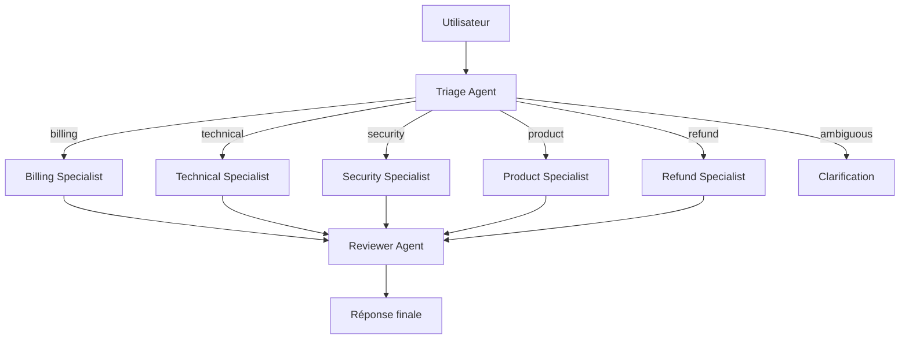

# Corrigé — Challenge

## Schéma

## Agents

1. `triage_agent`
2. `billing_specialist`
3. `technical_specialist`
4. `security_specialist`
5. `product_refund_specialist`
6. `reviewer_agent`

## Règles de routage

- `invoice`, `payment`, `subscription` → billing.
- `bug`, `error`, `crash`, `latency` → technical.
- `access`, `permission`, `breach`, `security` → security.
- `feature`, `roadmap`, `improvement`, `refund`, `cancel` → product/refund.
- Score faible ou plusieurs catégories → clarification.

## Partage d’état

Toujours partagé :

- message courant ;
- décision de routage ;
- trace.

Sous condition :

- historique ;
- contexte compte ;
- résultat intermédiaire.

Jamais partagé :

- secrets système ;
- raisonnement interne ;
- données sensibles sans besoin strict.

## Métriques

- taux de routage correct ;
- taux de clarification ;
- taux d’escalade humaine ;
- temps de résolution ;
- coût par ticket ;
- taux de rejet reviewer ;
- satisfaction utilisateur.

## Stratégie de test

- tests unitaires du router ;
- tests de contrats JSON ;
- tests de demandes ambiguës ;
- tests de reviewer ;
- tests anti-boucles ;
- tests de non-partage de données sensibles.

## Propositions d’amélioration

Ajouter un dataset de tickets annotés pour mesurer offline la qualité du routage avant mise en production.
