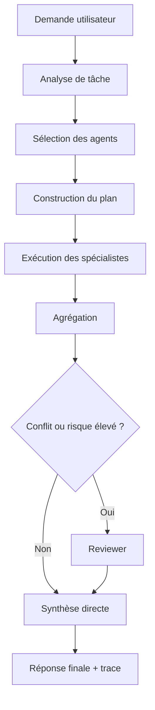
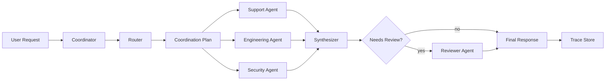

# Chapitre — Coordination multi-agents

## 1. Pourquoi coordonner ?

Un système multi-agent peut paraître simple au départ :

```text
Utilisateur → Agent A → Agent B → Réponse
```

Mais dès que plusieurs agents disposent de compétences différentes, il faut répondre à des questions d'ingénierie :

- quel agent doit travailler ?
- quel agent doit décider ?
- quel contexte doit être partagé ?
- que faire si deux agents sont en désaccord ?
- comment éviter les boucles ?
- comment expliquer le résultat ?
- comment tester le workflow ?

La coordination est la réponse à ces questions.

Un coordinateur multi-agent est une couche applicative qui transforme une demande utilisateur en exécution contrôlée.

## 2. Coordination vs intelligence

Il faut éviter une erreur fréquente : confondre intelligence et orchestration.

Un agent spécialiste peut très bien produire une bonne réponse locale.  
Mais cela ne garantit pas que le système global soit fiable.

Exemple :

- l'agent `product` veut accélérer la livraison ;
- l'agent `security` refuse une action non validée ;
- l'agent `support` veut répondre vite ;
- l'agent `reviewer` veut réduire le risque.

Sans coordination, le système peut produire une réponse incohérente.

La coordination définit les règles de composition.

## 3. Les rôles habituels

Dans un système multi-agent, on trouve souvent les rôles suivants.

### 3.1 Router

Le router décide quels agents sont pertinents.

Exemple :

```text
Demande : "Analyse ce bug de paiement et prépare une réponse client."
Agents utiles :
- support
- engineering
- billing
```

Le router ne résout pas nécessairement la tâche.  
Il sélectionne les capacités.

### 3.2 Manager

Le manager construit le plan.

Il peut décider :

- de lancer des agents en parallèle ;
- d'imposer un ordre ;
- de déclencher une revue ;
- de limiter le nombre d'itérations.

### 3.3 Specialist

Le specialist produit un résultat local.

Exemples :

- agent juridique ;
- agent sécurité ;
- agent produit ;
- agent support ;
- agent data ;
- agent backend.

### 3.4 Reviewer

Le reviewer vérifie la cohérence, le risque et les contradictions.

Il ne doit pas être appelé systématiquement si le coût est un problème.  
Mais il devient essentiel pour les décisions sensibles.

### 3.5 Synthesizer

Le synthesizer transforme plusieurs résultats locaux en réponse finale.

Il ne doit pas masquer les désaccords critiques.  
Il doit signaler ce qui est certain, incertain ou bloquant.

## 4. Patterns de coordination

## 4.1 Manager-worker

Le manager garde le contrôle.  
Les agents spécialistes sont appelés comme outils.

Avantages :

- contrôle centralisé ;
- traçabilité claire ;
- facilité de test ;
- pas de transfert incontrôlé.

Inconvénients :

- manager potentiellement complexe ;
- goulot d'étranglement ;
- moins flexible pour les conversations longues.

## 4.2 Handoff

Un agent transfère le contrôle à un autre agent.

Avantages :

- spécialisation forte ;
- bon pour les conversations orientées domaine ;
- naturel pour triage → spécialiste.

Inconvénients :

- risque de perte de contexte ;
- risque de chaîne de transferts ;
- besoin de traces précises.

## 4.3 Debate / critique

Plusieurs agents produisent des avis, puis un arbitre tranche.

Avantages :

- utile pour les décisions ambiguës ;
- améliore la robustesse ;
- met en évidence les désaccords.

Inconvénients :

- plus coûteux ;
- peut renforcer des hallucinations si les agents partagent les mêmes faiblesses ;
- nécessite une politique de décision claire.

## 4.4 Pipeline

Chaque agent enrichit progressivement un artefact.

Exemple :

```text
Requirements → Architecture → Security Review → Implementation Plan → Final Answer
```

Avantages :

- structure claire ;
- adapté aux livrables longs ;
- facile à auditer.

Inconvénients :

- moins adapté aux demandes ouvertes ;
- blocage si une étape échoue.

## 5. Le contrat de coordination

Un coordinateur fiable doit manipuler des structures explicites.

Exemple de contrat :

```json
{
  "task_id": "task-001",
  "required_domains": ["support", "engineering"],
  "risk_level": "medium",
  "selected_agents": ["support_agent", "engineering_agent"],
  "requires_review": true,
  "max_rounds": 2
}
```

Ce contrat rend le système :

- testable ;
- sérialisable ;
- observable ;
- réutilisable.

## 6. Limiter le contexte

Un piège courant consiste à transmettre toute la conversation à tous les agents.

C'est souvent une mauvaise pratique :

- coût plus élevé ;
- fuite d'informations entre domaines ;
- perte de focus ;
- difficultés de debug ;
- risque de contamination du raisonnement.

Un coordinateur doit fournir à chaque agent un contexte minimal.

Exemple :

```text
Agent billing :
- problème : facture incorrecte
- client : entreprise
- montant : 240 €
- contrainte : répondre sans promettre de remboursement automatique
```

Il n'a pas besoin de recevoir tout l'historique technique.

## 7. Gestion des conflits

Deux agents peuvent produire des conclusions incompatibles.

Exemple :

```text
engineering: "Le bug est résolu."
support: "Le client rapporte encore l'erreur."
```

Le coordinateur doit détecter que la synthèse ne peut pas simplement dire :  
"Tout est résolu."

Stratégies possibles :

1. demander une clarification ;
2. déclencher une revue ;
3. produire une réponse avec incertitude explicite ;
4. relancer un agent avec observation complémentaire ;
5. refuser de conclure si le risque est trop élevé.

## 8. Traces et observabilité

Une exécution multi-agent doit produire une trace.

La trace doit contenir :

- l'entrée ;
- les agents sélectionnés ;
- l'ordre d'exécution ;
- les résultats locaux ;
- les conflits détectés ;
- la décision finale ;
- les raisons de revue ;
- les limites rencontrées.

Sans trace, il est presque impossible de déboguer un système multi-agent.

## 9. Boucle de coordination

Le flux général est le suivant :



## 10. Règles de conception

Un coordinateur professionnel doit suivre ces règles.

### Règle 1 — Déterminisme d'abord

La sélection des agents doit être aussi stable que possible.  
Pour une même tâche, le système doit produire un plan comparable.

### Règle 2 — Limites explicites

Le coordinateur doit avoir :

- un nombre maximum de rounds ;
- une liste d'agents autorisés ;
- une politique de revue ;
- une stratégie de fallback.

### Règle 3 — Contexte minimal

Chaque agent reçoit ce dont il a besoin, pas plus.

### Règle 4 — Conflits visibles

Un conflit ne doit pas être caché dans une réponse fluide.

### Règle 5 — Test sans LLM

La logique de coordination doit être testable sans dépendre d'un modèle externe.  
Le LLM peut être branché plus tard, mais le workflow doit être validé avant.

## 11. Exemple d'architecture



## 12. Application dans le lab

Le lab du jour implémente :

- un registre d'agents ;
- une tâche structurée ;
- un plan de coordination ;
- une sélection de spécialistes ;
- une exécution déterministe ;
- une détection de conflit ;
- un reviewer ;
- une synthèse finale ;
- une trace JSON.

Le but n'est pas de simuler un LLM.  
Le but est de construire l'ossature d'orchestration sur laquelle un LLM pourra ensuite être branché.

## 13. Lien avec MCP

La semaine 3 prépare l'introduction de MCP.

La coordination multi-agent doit rester indépendante du protocole d'outillage.  
Un agent peut utiliser :

- des outils Python locaux ;
- des APIs internes ;
- des outils exposés via MCP ;
- d'autres agents appelés comme outils.

Le coordinateur doit donc manipuler des contrats clairs plutôt que des détails d'implémentation.

## 14. Anti-patterns

### 14.1 Tous les agents répondent toujours

C'est coûteux et bruyant.  
Un bon coordinateur sélectionne.

### 14.2 Le reviewer décide sans critères

Une revue sans grille produit une opinion de plus.  
Il faut des critères : risque, conflit, incomplétude, action sensible.

### 14.3 Handoff non traçable

Si un agent transfère le contrôle sans trace, le système devient impossible à auditer.

### 14.4 Contexte global partagé

Tous les agents ne doivent pas voir toute la conversation.

### 14.5 Boucle infinie de désaccord

Un conflit doit avoir une limite d'itérations et un statut final clair.

## 15. Résumé

La coordination est une couche centrale de l'AI Engineering.

Elle permet de passer :

```text
plusieurs agents qui répondent
```

à :

```text
un système multi-agent contrôlé, observable et testable
```

La qualité d'un système multi-agent dépend souvent moins du nombre d'agents que de la qualité de sa coordination.
