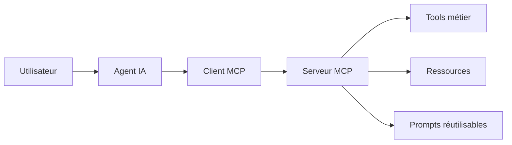

# Semaine 3 — Jour 3 : MCP Server

## Position dans le bootcamp

Ce jour appartient à la **Semaine 3 — Multi-Agent & MCP**.

Après avoir étudié :

- les architectures multi-agents ;
- la coordination entre agents ;
- les patterns manager-worker, router, reviewer et handoff ;

cette journée introduit le **Model Context Protocol côté serveur**.

L’objectif est de comprendre comment un système IA peut exposer des capacités applicatives à travers un contrat standardisé, plutôt que par des intégrations ad hoc.

## Objectif du jour

Construire un serveur MCP minimal, testable et compréhensible, capable d’exposer :

- des tools ;
- des resources ;
- des prompts ;
- une couche de validation ;
- des réponses JSON-RPC ;
- des erreurs contrôlées ;
- une trace exploitable par un client ou un agent.

## Pourquoi c’est important en AI Engineering

Un agent ne doit pas appeler directement toutes les fonctions internes d’une application.

En production, il faut un contrat entre :

- le modèle ou l’agent ;
- le client MCP ;
- le serveur MCP ;
- les systèmes métier ;
- les règles de sécurité.

Le serveur MCP devient une frontière d’architecture :



## Livrables du jour

| Fichier | Rôle |
|---|---|
| `learning_objectives.md` | Objectifs pédagogiques |
| `chapter.md` | Chapitre principal |
| `exercises.md` | Exercices étudiants |
| `interview.md` | Questions d’entretien |
| `challenge.md` | Challenge AI Engineering |
| `references.md` | Références |
| `corriges/` | Solutions et notes formateur |
| `diagrams/` | Diagrammes Mermaid |
| `assets/` | Schémas et exemples JSON |
| `labs/` | Code Python exécutable |

## Lab principal

Le lab implémente un serveur MCP pédagogique en Python standard library.

Il couvre :

- `initialize` ;
- `tools/list` ;
- `tools/call` ;
- `resources/list` ;
- `resources/read` ;
- `prompts/list` ;
- `prompts/get` ;
- gestion d’erreurs JSON-RPC ;
- validation d’arguments ;
- garde-fou sur les actions sensibles ;
- journalisation de traces.

## Prérequis

- Python 3.10+
- Compréhension des jours précédents de la Semaine 2 et de la Semaine 3
- Notions de JSON Schema
- Notions d’agent loop
- Notions de tool registry

## Commandes utiles

Depuis le dossier `labs/` :

```bash
python mcp_server.py
python test_mcp_server.py
```

## Résultat attendu

À la fin de la journée, l’apprenant doit pouvoir expliquer :

- ce qu’un serveur MCP expose ;
- comment décrire un tool ;
- comment valider un appel d’outil ;
- comment séparer outil, ressource et prompt ;
- pourquoi la sécurité doit être côté serveur ;
- comment un agent peut découvrir des capacités sans connaître leur implémentation interne.
