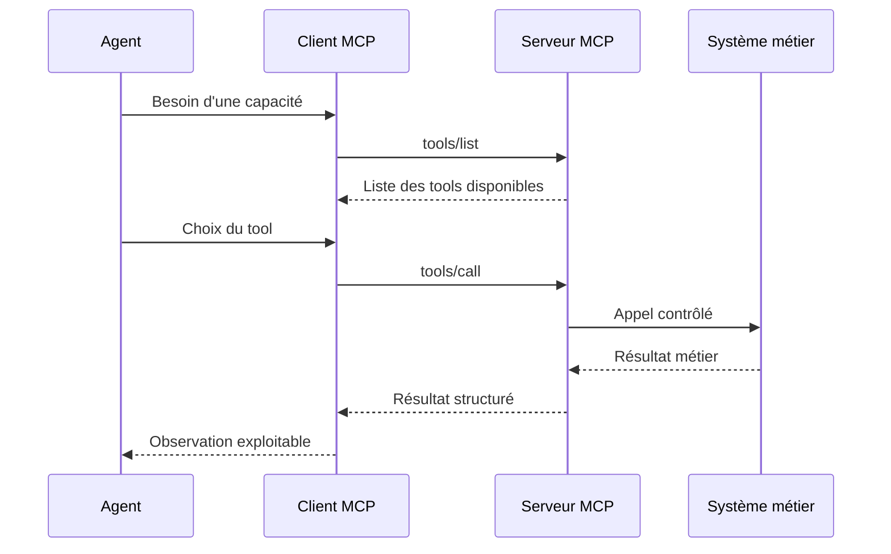
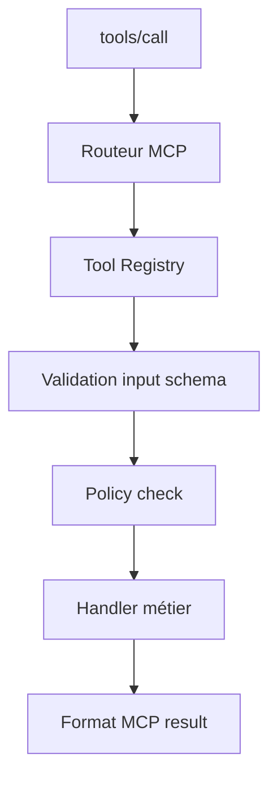
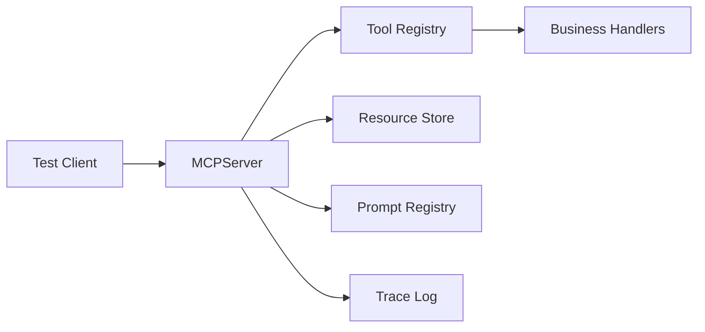

# Chapitre — Construire un MCP Server

## 1. Problème de départ

Dans les jours précédents, nous avons construit des agents capables :

- de choisir un outil ;
- de coordonner plusieurs spécialistes ;
- de router une tâche ;
- de produire une synthèse.

Mais un problème reste ouvert : **comment exposer les outils à l’agent de manière standardisée ?**

Sans protocole, chaque équipe finit par inventer son propre format :

```python
agent.register_tool("search", search_function)
agent.register_tool("billing_lookup", billing_lookup_function)
agent.register_tool("send_email", send_email_function)
```

Cela fonctionne dans un prototype, mais devient fragile en production.

Questions difficiles :

- Comment un agent découvre-t-il les outils disponibles ?
- Comment décrire les arguments attendus ?
- Comment distinguer une ressource documentaire d’une action ?
- Comment tracer un appel ?
- Comment gérer une action sensible ?
- Comment connecter plusieurs clients à la même surface d’outillage ?

Le Model Context Protocol répond à ce besoin en standardisant la frontière entre client et serveur.

## 2. Rôle d’un serveur MCP

Un serveur MCP expose des capacités à un client MCP.

Dans une architecture agentique, le client MCP est généralement utilisé par l’agent ou par l’orchestrateur.



Le serveur MCP n’est pas un modèle de langage.

Il est une couche d’adaptation et de contrôle entre le monde agentique et les systèmes applicatifs.

## 3. Tools, resources et prompts

MCP structure les capacités serveur en plusieurs familles.

### Tools

Un tool représente une action invocable.

Exemples :

- rechercher un ticket ;
- créer un brouillon de réponse ;
- calculer un remboursement ;
- ouvrir une alerte ;
- récupérer le statut d’une commande.

Un tool doit avoir :

- un nom stable ;
- une description claire ;
- un schéma d’entrée ;
- une politique de sécurité ;
- une sortie structurée.

### Resources

Une resource représente une donnée ou un contenu consultable.

Exemples :

- documentation interne ;
- fiche produit ;
- procédure support ;
- base de connaissances ;
- configuration lue seule.

Une resource ne doit pas être confondue avec un tool.

Lire une procédure est une consultation.
Créer un ticket est une action.

### Prompts

Un prompt représente un gabarit réutilisable.

Exemples :

- prompt de triage support ;
- prompt de revue sécurité ;
- prompt de résumé incident ;
- prompt d’analyse de demande client.

Le prompt n’est pas l’exécution.
Il est une ressource d’instruction standardisée.

## 4. JSON-RPC comme enveloppe

MCP s’appuie sur des messages structurés.

Dans ce lab, nous utilisons une enveloppe pédagogique inspirée de JSON-RPC :

```json
{
  "jsonrpc": "2.0",
  "id": "req-001",
  "method": "tools/call",
  "params": {
    "name": "lookup_order",
    "arguments": {
      "order_id": "ORD-1001"
    }
  }
}
```

La réponse réussie ressemble à ceci :

```json
{
  "jsonrpc": "2.0",
  "id": "req-001",
  "result": {
    "content": [
      {
        "type": "text",
        "text": "Commande ORD-1001: shipped"
      }
    ],
    "structuredContent": {
      "order_id": "ORD-1001",
      "status": "shipped"
    },
    "isError": false
  }
}
```

Une erreur contrôlée ressemble à ceci :

```json
{
  "jsonrpc": "2.0",
  "id": "req-002",
  "error": {
    "code": -32602,
    "message": "Invalid params",
    "data": {
      "field": "order_id",
      "reason": "required"
    }
  }
}
```

## 5. Le tool registry côté serveur

Le serveur MCP ne doit pas exposer directement toutes les fonctions Python.

Il doit passer par un registre.



Le registre contient :

- la description du tool ;
- le schéma d’entrée ;
- le handler ;
- les règles de sécurité ;
- les métadonnées utiles.

Ce design facilite :

- les tests ;
- la documentation ;
- le versioning ;
- l’observabilité ;
- la désactivation d’un tool.

## 6. Validation stricte

Un serveur MCP doit refuser une requête invalide avant d’appeler le système métier.

Exemples d’erreurs à détecter :

- nom d’outil inconnu ;
- argument obligatoire manquant ;
- type incorrect ;
- enum invalide ;
- propriété inattendue ;
- action sensible sans confirmation.

La validation est une responsabilité serveur.

Le modèle peut proposer un appel d’outil incorrect.
Le serveur doit rester fiable.

## 7. Actions sensibles

Tous les tools n’ont pas le même niveau de risque.

Exemples de tools peu risqués :

- `lookup_order`
- `search_knowledge_base`
- `summarize_policy`

Exemples de tools sensibles :

- `refund_order`
- `send_email`
- `delete_user_data`
- `change_subscription`

Un serveur MCP doit pouvoir exiger une confirmation ou un contexte supplémentaire.

Dans le lab, le tool `refund_order` exige :

```json
{
  "approved_by_human": true
}
```

Sans cette validation, le serveur refuse l’appel.

## 8. Observabilité minimale

Un serveur MCP doit produire des traces.

Une trace utile contient :

- l’identifiant de requête ;
- la méthode appelée ;
- le nom du tool ;
- le statut ;
- l’erreur éventuelle ;
- le timestamp ;
- une durée.

Dans un système de production, ces traces alimentent :

- debugging ;
- monitoring ;
- audit ;
- analyse de coût ;
- évaluation de sûreté.

## 9. Architecture du lab

Le lab implémente un serveur en mémoire.

Il contient :

- `MCPServer` ;
- `ToolDefinition` ;
- `ResourceDefinition` ;
- `PromptDefinition` ;
- `MCPError` ;
- des handlers métier simulés ;
- des tests unitaires.

Le but n’est pas de réimplémenter toute la spécification MCP.

Le but est de comprendre l’architecture serveur :



## 10. Points de vigilance

### Ne pas exposer trop d’outils

Un serveur MCP doit exposer une surface cohérente.

Trop d’outils augmentent :

- le bruit dans le contexte ;
- les mauvais choix d’outils ;
- la complexité de sécurité ;
- la maintenance.

### Nommer les tools pour le modèle

Un nom comme `exec_op_43` est inutilisable.

Préférer :

- `lookup_order`
- `search_knowledge_base`
- `create_support_draft`
- `refund_order`

### Décrire les effets

Un tool doit dire s’il lit, écrit, modifie, supprime ou déclenche une action externe.

### Ne pas faire confiance au client

Même si le client semble fiable, le serveur doit valider :

- permissions ;
- types ;
- champs ;
- limites ;
- confirmations.

## 11. Résumé

Un serveur MCP est une frontière d’architecture.

Il expose des capacités à un agent, mais garde le contrôle sur :

- ce qui est disponible ;
- comment les appels sont validés ;
- ce qui est exécuté ;
- ce qui est refusé ;
- ce qui est tracé.

Le jour suivant construira le complément naturel : **MCP Client**.
