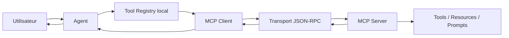
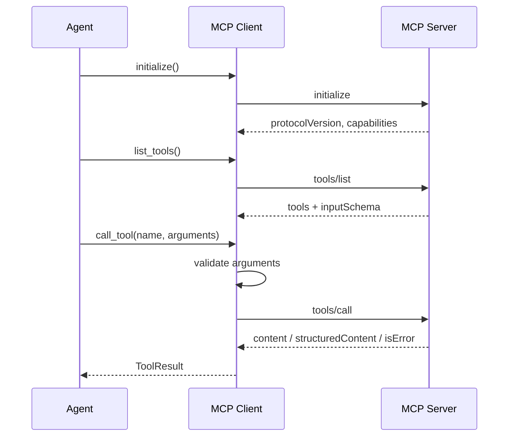

# Chapitre — Construire un client MCP

## 1. Pourquoi un client MCP ?

Le jour précédent a construit un serveur MCP. Ce serveur sait exposer des capacités, mais il ne suffit pas à construire un système agentique utilisable.

Un agent a besoin d'une couche cliente pour :

- se connecter à un serveur ;
- découvrir les capacités disponibles ;
- lire les schémas d'entrée ;
- appeler les tools ;
- traiter les erreurs ;
- transformer les résultats en observations exploitables ;
- enregistrer des traces.

En production, ce client devient une frontière importante. Il protège l'agent contre les appels invalides et protège le serveur contre des arguments mal formés.

## 2. Le rôle du client dans l'architecture



Le client MCP est une couche d'intégration, pas une couche de raisonnement.

Il ne doit pas décider de l'objectif utilisateur. Il doit rendre les capacités serveur utilisables de manière fiable.

## 3. Cycle minimal

Un client MCP suit généralement ce cycle :



## 4. Découverte des tools

La découverte est essentielle, car elle permet d'éviter de hardcoder les capacités.

Un tool MCP contient au minimum :

- un nom ;
- une description ;
- un schéma d'entrée ;
- éventuellement des métadonnées.

Exemple :

```json
{
  "name": "get_ticket",
  "description": "Retourne le détail d'un ticket support.",
  "inputSchema": {
    "type": "object",
    "required": ["ticket_id"],
    "properties": {
      "ticket_id": {"type": "string"}
    },
    "additionalProperties": false
  }
}
```

Le client transforme cette définition en `ToolSpec` locale.

## 5. Validation locale

La validation locale ne remplace pas la validation serveur, mais elle améliore la robustesse.

Elle permet de :

- détecter les champs obligatoires manquants ;
- refuser les types incorrects ;
- bloquer les propriétés non autorisées ;
- éviter les appels réseau inutiles ;
- produire une erreur claire pour l'agent.

Dans le lab, la validation supporte un sous-ensemble volontaire :

- `type: object` ;
- `required` ;
- `properties` ;
- `additionalProperties: false` ;
- types primitifs : `string`, `integer`, `number`, `boolean`, `object`, `array`.

Cette limitation est intentionnelle. L'objectif est de comprendre la frontière d'intégration, pas de réimplémenter tout JSON Schema.

## 6. Appel d'un tool

Un appel MCP `tools/call` transporte :

- le nom du tool ;
- les arguments ;
- les métadonnées client utiles ;
- un identifiant JSON-RPC.

Le résultat peut contenir :

- du texte ;
- du contenu structuré ;
- un indicateur d'erreur métier ;
- des métadonnées additionnelles.

Le client doit convertir ce résultat en observation exploitable par l'agent.

## 7. Erreurs

Un bon client distingue plusieurs familles d'erreurs :

| Famille | Exemple | Traitement |
|---|---|---|
| Erreur locale | argument manquant | ne pas appeler le serveur |
| Erreur protocolaire | JSON-RPC invalide | lever une exception technique |
| Erreur serveur | tool inconnu | convertir en exception lisible |
| Erreur métier | `isError: true` | retourner une observation d'échec |
| Erreur sécurité | approbation absente | bloquer avant appel |

## 8. Cache

La liste des tools ne doit pas forcément être redemandée à chaque appel.

Un cache local peut être utile, mais il doit rester invalidable.

Risques du cache :

- tool supprimé côté serveur ;
- schéma modifié ;
- permission modifiée ;
- politique de sécurité changée.

Dans ce lab, `list_tools(use_cache=True)` réutilise le cache, tandis que `refresh_tools()` force une nouvelle découverte.

## 9. Sécurité côté client

Le client est un point naturel pour appliquer certains contrôles :

- liste d'outils autorisés ;
- validation stricte des arguments ;
- blocage d'actions sensibles sans approbation ;
- journalisation des appels ;
- limitation du nombre d'appels ;
- masquage de secrets dans les traces.

Le lab implémente un exemple simple : un tool marqué `dangerous` exige `approved=True`.

## 10. Adaptation en registre d'outils agentique

Un agent n'a pas besoin de connaître MCP en détail.

Il veut souvent une interface du type :

```python
tools = client.as_agent_tools()
observation = tools["get_ticket"]({"ticket_id": "INC-42"})
```

Cette adaptation permet de changer le protocole ou le transport sans modifier la logique agentique.

## 11. Anti-patterns

### Anti-pattern 1 — L'agent parle directement au serveur

Cela couple le raisonnement au transport et rend les tests difficiles.

### Anti-pattern 2 — Ne pas valider localement

L'agent peut envoyer des arguments invalides et produire des boucles inutiles.

### Anti-pattern 3 — Cacher sans invalidation

Le système devient fragile dès que le serveur évolue.

### Anti-pattern 4 — Traiter toutes les erreurs pareil

Une erreur utilisateur, une erreur protocolaire et une erreur sécurité n'ont pas le même impact.

## 12. Synthèse

Un client MCP professionnel doit fournir :

- une interface stable pour l'agent ;
- une découverte dynamique des capacités ;
- une validation locale ;
- une gestion d'erreurs claire ;
- une politique de sécurité ;
- des traces ;
- une séparation nette entre protocole et raisonnement.
