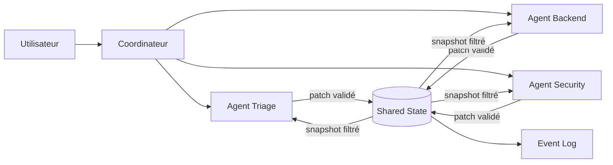

# Chapitre — Sharing State

## 1. Pourquoi partager l'état ?

Un agent isolé peut fonctionner avec :

- son prompt ;
- son historique récent ;
- ses outils ;
- son état de tâche.

Un système multi-agent doit résoudre un problème supplémentaire : plusieurs agents contribuent à une même tâche.

Exemple :

```text
Utilisateur : "Analyse ce ticket incident et propose un plan de mitigation."
```

Un orchestrateur peut appeler :

- un agent `triage` ;
- un agent `security` ;
- un agent `backend`;
- un agent `reviewer`.

Chaque agent produit une information partielle. Le système doit décider :

- où stocker cette information ;
- qui peut la lire ;
- qui peut la modifier ;
- comment résoudre un conflit ;
- quelle partie transmettre au prochain agent.

Sans stratégie de sharing state, les agents finissent par :

- se répéter ;
- perdre des informations ;
- écraser le travail des autres ;
- exposer des données privées ;
- transmettre trop de contexte au modèle ;
- produire des réponses incohérentes.

## 2. Quatre formes d'état à distinguer

Dans un système agentique professionnel, il faut distinguer plusieurs couches.

| Couche | Durée | Exemple | Risque principal |
|---|---:|---|---|
| Local state | durée d'un agent | brouillon interne d'un agent reviewer | fuite ou dépendance implicite |
| Conversation state | durée d'une conversation | intention, slots, historique court | confusion multi-tours |
| Shared state | durée d'un workflow | facts, décisions, plan, outputs intermédiaires | conflit ou pollution globale |
| Long-term memory | durable | préférences utilisateur, résumé historique | persistance abusive |

Le jour 5 de la semaine 2 a introduit la mémoire. Ici, l'objectif est différent : partager un état de workflow entre composants.

## 3. Le piège de la mémoire globale

La solution naïve consiste à créer un dictionnaire global :

```python
state = {}
```

Puis chaque agent écrit dedans :

```python
state["analysis"] = "..."
state["decision"] = "..."
state["risk"] = "..."
```

Cela semble simple, mais produit rapidement des problèmes :

1. aucune règle de propriété ;
2. aucune version ;
3. aucun contrôle d'accès ;
4. aucune trace ;
5. aucune distinction entre données temporaires et durables ;
6. aucun mécanisme de conflit ;
7. aucune garantie de contexte minimal.

Dans un vrai système d'AI Engineering, le shared state est un composant explicite.

## 4. Modèle de shared state

Un store d'état partagé peut être modélisé comme un ensemble de clés versionnées.

Chaque entrée possède :

- une clé ;
- une valeur ;
- une version ;
- un propriétaire ;
- une visibilité ;
- le dernier agent modificateur.

Exemple :

```json
{
  "incident.summary": {
    "value": "Erreur 500 sur l'endpoint /checkout",
    "version": 1,
    "owner": "triage",
    "visibility": "shared",
    "updated_by": "triage"
  }
}
```

Cette structure permet de répondre à des questions essentielles :

- qui a créé cette information ?
- quelle est la dernière version ?
- quel agent peut la lire ?
- quel agent peut l'écraser ?
- quelle modification a produit ce changement ?

## 5. Visibilité

Le lab utilise trois niveaux de visibilité.

| Visibilité | Lecture | Usage |
|---|---|---|
| `private` | propriétaire uniquement | brouillon, diagnostic sensible |
| `shared` | agents explicitement autorisés ou workflow interne | coordination |
| `public` | tous les agents du workflow | faits validés, statut global |

Une donnée privée ne doit pas apparaître dans un snapshot destiné à un autre agent.

## 6. Versioning et conflits

Quand deux agents lisent une même clé puis écrivent dessus, un conflit peut apparaître.

Scénario :

```text
1. agent A lit plan.version = 1
2. agent B lit plan.version = 1
3. agent A écrit plan.version = 2
4. agent B tente d'écrire avec expected_version = 1
```

L'écriture de B doit être refusée.

Ce mécanisme s'appelle souvent **compare-and-set**.

Il évite les pertes silencieuses d'information.

## 7. Patch atomique

Un agent peut vouloir modifier plusieurs clés en même temps :

```json
{
  "incident.status": "investigating",
  "incident.owner": "backend",
  "incident.next_step": "inspect logs"
}
```

Si une seule écriture échoue, le patch ne doit pas laisser le store dans un état partiellement modifié.

La règle professionnelle est :

```text
tout passe ou rien ne passe
```

Le lab implémente cette propriété avec `apply_patch`.

## 8. Handoff contextuel

Un handoff n'est pas un dump complet de l'état.

Un bon handoff contient :

- l'objectif ;
- les faits validés ;
- les contraintes ;
- les clés nécessaires au prochain agent ;
- éventuellement les incertitudes.

Il ne doit pas contenir :

- brouillons privés ;
- logs bruts inutiles ;
- historiques longs ;
- données non nécessaires à la prochaine étape.

Exemple :

```json
{
  "from": "triage",
  "to": "backend",
  "context": {
    "incident.summary": {
      "value": "Erreur 500 sur /checkout",
      "version": 1
    }
  }
}
```

## 9. Événements et observabilité

Chaque modification importante doit produire un événement.

Un événement minimal contient :

- un identifiant ;
- l'agent ;
- l'opération ;
- la clé ;
- la version ;
- le statut.

Exemple :

```json
{
  "event_id": 3,
  "agent": "backend",
  "operation": "write",
  "key": "incident.root_cause",
  "version": 1,
  "status": "applied"
}
```

Ce journal permet de :

- comprendre ce qui s'est passé ;
- reconstruire la chronologie ;
- détecter les effets de bord ;
- auditer les décisions ;
- alimenter l'observabilité de production.

## 10. Sharing State et MCP

MCP standardise la manière dont un agent ou un client accède à des outils, ressources et prompts exposés par un serveur.

Le sharing state ne remplace pas MCP.

Il complète MCP.

Dans une architecture possible :

```text
Agent A -> MCP Client -> MCP Server -> Resource
Agent B -> MCP Client -> MCP Server -> Resource
Coordinator -> Shared State Store
```

Le shared state contient l'état du workflow.

MCP expose des capacités et des ressources.

Le piège serait de confondre :

- **resource MCP** : donnée ou contexte exposé via protocole ;
- **shared state applicatif** : état de coordination du workflow.

Un bon design peut exposer certaines parties du shared state comme ressources MCP, mais uniquement avec un contrat d'accès clair.

## 11. Pattern recommandé

Pour un système multi-agent simple :

1. chaque agent possède son état local ;
2. le coordinateur possède le shared state ;
3. les agents écrivent via des patches validés ;
4. chaque écriture est versionnée ;
5. les snapshots sont filtrés par permission ;
6. les handoffs sont minimaux ;
7. les événements sont traçables ;
8. la mémoire long terme reste séparée.

## 12. Diagramme conceptuel



## 13. Anti-patterns

### Anti-pattern 1 : tout mettre dans le prompt

Un prompt qui contient l'intégralité du workflow devient coûteux, fragile et difficile à auditer.

### Anti-pattern 2 : tout mettre dans la mémoire long terme

La mémoire long terme ne doit pas contenir tous les états temporaires d'une tâche.

### Anti-pattern 3 : laisser chaque agent écrire librement

Sans validation, l'état partagé devient incohérent.

### Anti-pattern 4 : transmettre les brouillons privés

Un agent peut avoir besoin de raisonner localement. Ce raisonnement ne doit pas être automatiquement partagé.

### Anti-pattern 5 : ignorer les versions

Sans versioning, les conflits deviennent silencieux.

## 14. Checklist de conception

Avant de partager une donnée, demander :

- Cette donnée est-elle nécessaire à un autre agent ?
- Est-elle temporaire ou durable ?
- Qui peut la lire ?
- Qui peut la modifier ?
- Quelle est sa version ?
- Doit-elle être incluse dans un handoff ?
- Doit-elle être exposée comme ressource MCP ?
- Doit-elle apparaître dans les traces ?
- Comment l'effacer ?

## 15. Résumé

Le partage d'état est une compétence centrale d'AI Engineering.

Un système multi-agent robuste ne dépend pas d'une mémoire globale implicite.

Il repose sur :

- un état partagé explicite ;
- des écritures versionnées ;
- des permissions ;
- des snapshots filtrés ;
- des handoffs minimaux ;
- des traces ;
- des tests.
