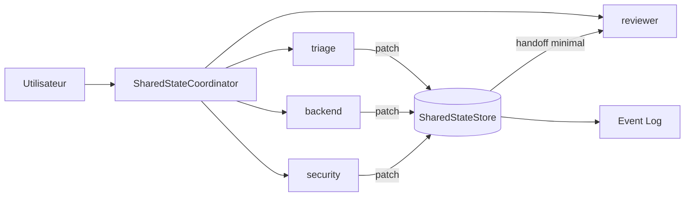

# Corrigé — Challenge — Shared State Coordinator

## Solution attendue

Une solution correcte introduit un coordinateur qui possède le store partagé et n'autorise pas les agents à modifier directement un dictionnaire global.

## Architecture recommandée



## Pseudo-code

```python
class SharedStateCoordinator:
    def __init__(self):
        self.store = SharedStateStore()

    def run(self, objective: str) -> dict:
        self.store.write(
            agent="coordinator",
            key="objective",
            value=objective,
            visibility="public"
        )

        self.store.apply_patch(
            agent="triage",
            writes={
                "incident.summary": {
                    "value": "Incident checkout à investiguer",
                    "visibility": "shared"
                }
            }
        )

        self.store.apply_patch(
            agent="backend",
            writes={
                "incident.root_cause": {
                    "value": "Timeout base de données probable",
                    "visibility": "shared"
                }
            }
        )

        handoff = self.store.create_handoff(
            from_agent="backend",
            to_agent="reviewer",
            keys=[
                "objective",
                "incident.summary",
                "incident.root_cause"
            ]
        )

        return {
            "status": "completed",
            "summary": "Incident analysé et prêt pour revue.",
            "handoff": handoff,
            "state": self.store.snapshot("reviewer"),
            "events": self.store.events()
        }
```

## Points évalués

Une bonne solution doit :

- centraliser le shared state ;
- empêcher les accès privés non autorisés ;
- utiliser des versions ;
- préserver l'atomicité des patches ;
- tracer les changements ;
- produire un handoff minimal ;
- garder la mémoire long terme hors du workflow temporaire.

## Bonus MCP Resource

Une méthode `export_as_mcp_resource` peut produire :

```json
{
  "uri": "state://incident/current",
  "mimeType": "application/json",
  "text": "{...}"
}
```

Elle doit filtrer les clés privées avant exposition.
