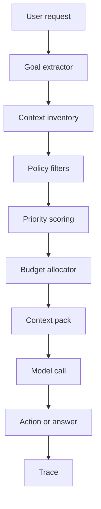

# Chapitre — Context Engineering

## 1. Pourquoi le Context Engineering existe

Un agent IA ne raisonne jamais dans le vide. Il reçoit une entrée composée de plusieurs couches :

- instructions système ;
- message utilisateur courant ;
- historique conversationnel ;
- état de tâche ;
- mémoire utilisateur ;
- résultats de recherche ;
- ressources MCP ;
- schémas d’outils ;
- traces ou décisions intermédiaires.

Le problème est que toutes ces informations ne doivent pas être injectées au modèle à chaque tour.

Le **Context Engineering** est la discipline qui consiste à concevoir, sélectionner et organiser le contexte disponible pour qu’un modèle puisse accomplir une tâche avec le moins de bruit possible.

## 2. Prompt Engineering vs Context Engineering

Le prompt engineering se concentre souvent sur la formulation d’une instruction.

Le context engineering se concentre sur le système complet qui décide :

- quelles informations sont disponibles ;
- lesquelles sont pertinentes ;
- lesquelles sont autorisées ;
- dans quel ordre elles doivent apparaître ;
- sous quelle forme elles doivent être fournies ;
- lesquelles doivent être exclues.

Un prompt peut être parfait et échouer si le contexte est mauvais.

Un contexte bien conçu permet au modèle de :

- comprendre l’objectif ;
- utiliser le bon état ;
- éviter les contradictions ;
- appeler les bons outils ;
- ignorer les informations obsolètes ;
- limiter les hallucinations.

## 3. Les couches de contexte

Dans un système agentique moderne, on distingue plusieurs couches.

### 3.1 Instruction système

Elle définit le rôle, les règles et les limites générales.

Exemple :

```text
Tu es un agent support interne. Tu dois répondre uniquement avec les sources autorisées.
```

Cette couche doit être stable et courte.

### 3.2 Objectif courant

L’objectif courant vient de la demande utilisateur ou du plan de l’agent.

Exemple :

```text
Résoudre un incident de facturation pour le client ACME.
```

Cette couche oriente la sélection.

### 3.3 État de tâche

L’état de tâche décrit la progression actuelle.

Exemple :

```json
{
  "ticket_id": "T-204",
  "status": "waiting_for_user",
  "missing_fields": ["invoice_id"]
}
```

Cette donnée est applicative. Elle ne doit pas être confondue avec un souvenir long terme.

### 3.4 Historique récent

L’historique récent contient les derniers tours de conversation utiles.

Il ne doit pas être conservé indéfiniment dans le prompt.

Un bon système conserve :

- les derniers messages importants ;
- les décisions actives ;
- les questions non résolues ;
- les contraintes explicitement données.

### 3.5 Mémoire longue

La mémoire longue conserve des préférences ou informations persistantes.

Exemple :

```text
L’utilisateur préfère des réponses avec exemples Python.
```

Une mémoire longue ne doit pas être injectée automatiquement. Elle doit passer par une politique de pertinence et d’autorisation.

### 3.6 Ressources MCP

Les ressources MCP peuvent fournir de la documentation, des fichiers, des entrées métier ou des données externes.

Elles doivent être sélectionnées en fonction :

- de l’objectif ;
- de leur fraîcheur ;
- de leur autorisation ;
- de leur granularité ;
- de leur coût contextuel.

### 3.7 Outils

Les outils disponibles influencent le comportement du modèle.

Inclure trop d’outils peut dégrader la sélection d’action. Un agent doit recevoir uniquement les outils utiles à la tâche courante.

## 4. Architecture générale



Le moteur de contexte agit avant l’appel modèle.

Il ne remplace pas l’agent. Il prépare son environnement informationnel.

## 5. Budget de contexte

La fenêtre de contexte d’un modèle est limitée.

Même quand elle est grande, tout injecter est rarement une bonne idée.

Les problèmes classiques sont :

- dilution de l’information utile ;
- conflits entre documents ;
- exposition d’informations privées ;
- coût inutile ;
- latence ;
- difficulté de debug.

Un budget doit répondre à la question :

```text
Combien d’information peut-on injecter pour cette tâche ?
```

Le lab utilise une estimation volontairement simple du nombre de tokens. En production, on utiliserait le tokenizer du modèle ciblé.

## 6. Priorisation

Tous les éléments de contexte ne se valent pas.

Une stratégie simple peut utiliser :

1. criticité métier ;
2. proximité avec l’objectif courant ;
3. fraîcheur ;
4. visibilité ;
5. taille ;
6. niveau de confiance.

Exemple de priorité :

```text
system_instruction > task_state > relevant_resource > recent_message > long_term_memory > trace
```

Mais cette priorité dépend du produit.

Pour un agent médical, les règles de sécurité priment.  
Pour un agent développeur, le fichier courant peut primer.  
Pour un agent support, l’état du ticket peut primer.

## 7. Filtrage par visibilité

Le contexte partagé entre agents ne doit pas être injecté sans contrôle.

On peut utiliser trois niveaux :

| Niveau | Sens |
|---|---|
| `private` | réservé à l’agent ou au composant propriétaire |
| `shared` | partageable avec certains agents du workflow |
| `public` | injectable dans le contexte modèle |

Le lab permet de choisir les visibilités autorisées.

## 8. Réduction des données sensibles

Le contexte peut contenir :

- emails ;
- numéros de téléphone ;
- identifiants internes ;
- secrets ;
- informations client ;
- données contractuelles.

Le lab implémente une réduction simple :

```text
alice@example.com -> [REDACTED_EMAIL]
+33 6 12 34 56 78 -> [REDACTED_PHONE]
```

En production, cette étape serait plus robuste et auditée.

## 9. Déduplication

Les systèmes agentiques accumulent souvent la même information plusieurs fois :

- dans l’historique ;
- dans l’état ;
- dans une mémoire ;
- dans une ressource ;
- dans une trace.

La déduplication réduit le bruit.

Elle peut être :

- exacte ;
- par hash ;
- par similarité ;
- par source ;
- par version.

Le lab utilise une déduplication exacte normalisée.

## 10. Context pack

Le résultat du context engineering est un **context pack**.

Il contient :

- les éléments sélectionnés ;
- les éléments rejetés ;
- les raisons de rejet ;
- le nombre de tokens estimé ;
- les avertissements ;
- un rendu pour modèle ;
- une trace.

Exemple :

```json
{
  "goal": "résoudre un ticket de facturation",
  "total_tokens": 412,
  "selected": ["system", "task_state", "invoice_policy"],
  "dropped": [
    {
      "id": "old_chat",
      "reason": "budget_exceeded"
    }
  ]
}
```

## 11. Interaction avec MCP

MCP change la manière de concevoir le contexte.

Un serveur MCP peut exposer :

- des outils ;
- des ressources ;
- des prompts.

Le client ou l’agent ne doit pas tout injecter automatiquement.

Bonne pratique :

1. découvrir les capacités ;
2. sélectionner uniquement les capacités pertinentes ;
3. appeler une ressource si elle est nécessaire ;
4. injecter un extrait réduit ;
5. conserver le lien ou l’identifiant source ;
6. tracer la décision.

## 12. Context Engineering multi-agents

Dans une architecture multi-agents, chaque agent doit recevoir un contexte différent.

Exemple :

| Agent | Contexte utile |
|---|---|
| Router | objectif, domaines, contraintes |
| Researcher | question, sources, critères |
| Coder | fichier courant, erreurs, tests |
| Reviewer | solution, exigences, risques |
| Coordinator | état global, décisions, blocages |

Le mauvais pattern consiste à envoyer tout le contexte global à tous les agents.

Le bon pattern consiste à construire un context pack par agent et par tâche.

## 13. Critères d’un bon contexte

Un bon contexte est :

- minimal ;
- pertinent ;
- structuré ;
- traçable ;
- autorisé ;
- récent ;
- suffisamment complet ;
- aligné avec l’objectif.

Il doit éviter :

- l’excès d’historique ;
- les contradictions non signalées ;
- les outils inutiles ;
- les secrets ;
- les souvenirs non pertinents ;
- les documents obsolètes ;
- les instructions concurrentes.

## 14. Exemple métier

Demande utilisateur :

```text
Peux-tu vérifier pourquoi la facture F-392 n’a pas été payée ?
```

Contexte disponible :

- historique de conversation sur un autre ticket ;
- préférence utilisateur de format ;
- état du ticket actuel ;
- ressource MCP `billing_policy`;
- outil `get_invoice`;
- outil `refund_customer`;
- traces d’un ancien run.

Contexte à injecter :

- instruction système ;
- objectif ;
- état du ticket ;
- ressource de politique de facturation ;
- outil `get_invoice`.

Contexte à exclure :

- ancien ticket sans rapport ;
- outil `refund_customer` si aucun remboursement n’est demandé ;
- traces anciennes ;
- mémoire personnelle non pertinente.

## 15. Implémentation dans le lab

Le lab propose un moteur simple :

```python
engine = ContextEngineer()
pack = engine.build(
    goal="Resolve billing ticket",
    policy=ContextPolicy(max_tokens=120)
)
print(pack.render())
```

Le moteur :

1. applique les filtres ;
2. déduplique ;
3. trie par priorité ;
4. respecte le budget ;
5. réduit les données sensibles ;
6. conserve la trace des rejets.

## 16. Limites du lab

Le lab est volontairement pédagogique.

Il ne couvre pas :

- tokenization exacte ;
- embeddings ;
- ranking sémantique ;
- vector search ;
- compression LLM ;
- permissions réelles ;
- stockage distribué ;
- chiffrement ;
- observabilité production.

Ces éléments seront réintroduits dans les semaines suivantes.

## 17. À retenir

Le Context Engineering est l’une des compétences les plus importantes pour passer d’un prototype agentique à un système fiable.

La question n’est pas :

```text
Quel prompt dois-je écrire ?
```

La question devient :

```text
Quel contexte le modèle doit-il recevoir pour prendre une bonne décision, sans fuite, sans bruit et sous budget ?
```
