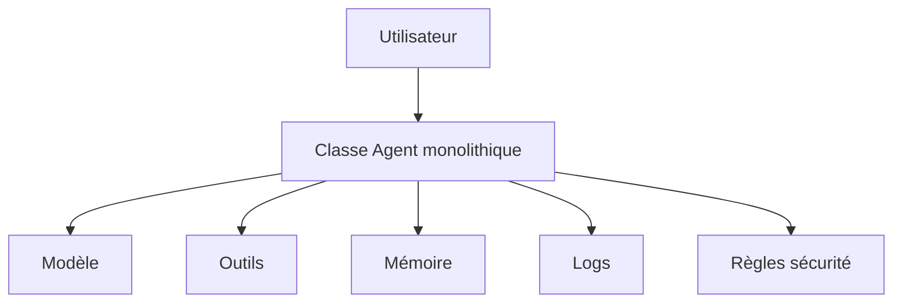
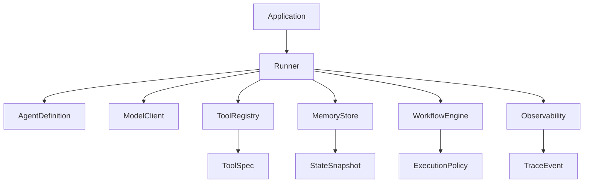

# Chapitre — Architecture d'un mini-framework d'agents

## 1. Pourquoi commencer par l'architecture ?

Un agent IA peut commencer comme un script :

```python
response = model(prompt)
if response.tool_call:
    result = call_tool(response.tool_call)
```

Ce script fonctionne pour une démo. Il ne suffit pas pour un système maintenable.

Dès que le produit grandit, plusieurs questions apparaissent :

- où enregistrer les outils ?
- qui valide les arguments ?
- qui décide si la boucle continue ?
- où stocker l'état ?
- comment tracer une exécution ?
- comment tester sans appeler un vrai modèle ?
- comment changer de fournisseur de modèle ?
- comment empêcher un outil sensible d'être appelé sans validation ?

L'architecture répond à ces questions avant que le code ne se rigidifie.

## 2. Le problème du script agentique monolithique

Un anti-pattern fréquent consiste à placer dans une seule classe :

- le prompt système ;
- l'appel au modèle ;
- les outils ;
- la mémoire ;
- la boucle ;
- les logs ;
- les règles de sécurité ;
- la logique métier.

Cette classe devient difficile à tester, difficile à relire et difficile à faire évoluer.



Le problème n'est pas que cette approche ne marche pas. Le problème est qu'elle mélange des responsabilités qui évoluent à des rythmes différents.

## 3. Composants minimaux du framework

Un mini-framework d'agents doit démarrer avec un nombre limité de composants, mais ces composants doivent être bien séparés.

### 3.1 AgentDefinition

`AgentDefinition` décrit ce qu'est un agent.

Il contient par exemple :

- un nom ;
- des instructions ;
- une liste d'outils autorisés ;
- une politique de mémoire ;
- un format de sortie attendu ;
- des garde-fous.

Il ne doit pas exécuter la boucle lui-même.

### 3.2 Runner

`Runner` exécute un agent.

Il orchestre :

- l'entrée utilisateur ;
- les appels au modèle ;
- les appels d'outils ;
- la mise à jour de l'état ;
- la décision d'arrêt ;
- la collecte de traces.

Le `Runner` est le moteur d'exécution.

### 3.3 ModelClient

`ModelClient` encapsule le fournisseur de modèle.

Le framework ne doit pas dépendre directement d'un SDK précis partout dans le code. Il doit définir un port :

```python
class ModelClient:
    def generate(self, messages, tools, output_schema):
        ...
```

L'implémentation peut ensuite utiliser un fournisseur donné.

### 3.4 ToolRegistry

`ToolRegistry` centralise les outils.

Il doit gérer :

- le nom des outils ;
- la description ;
- le schéma d'entrée ;
- la fonction exécutable ;
- les métadonnées de sécurité ;
- les règles d'autorisation.

Il évite que chaque agent reconstruise sa propre liste d'outils.

### 3.5 MemoryStore

`MemoryStore` isole la mémoire.

Il peut stocker :

- l'historique court terme ;
- l'état de tâche ;
- les préférences utilisateur ;
- des résumés ;
- des références externes.

La mémoire ne doit pas être un dictionnaire global non contrôlé.

### 3.6 WorkflowEngine

`WorkflowEngine` structure les étapes.

Il peut représenter :

- une boucle simple ;
- un graphe ;
- des transitions conditionnelles ;
- des limites d'itérations ;
- des handoffs ;
- des validations humaines.

Le jour 5 de la semaine construira ce composant plus en détail.

### 3.7 Observability

`Observability` capture les traces.

Un framework d'agents sans observabilité est difficile à exploiter. Il faut savoir :

- quel prompt a été envoyé ;
- quels outils ont été proposés ;
- quels outils ont été appelés ;
- quelles erreurs sont survenues ;
- combien d'étapes ont été exécutées ;
- pourquoi la boucle s'est arrêtée.

## 4. Frontières et dépendances

L'architecture recommandée suit une dépendance principale :

```text
Application
  -> Runner
    -> AgentDefinition
    -> ModelClient
    -> ToolRegistry
    -> MemoryStore
    -> WorkflowEngine
    -> Observability
```

Une règle importante : les composants bas niveau ne doivent pas dépendre du runner.

Par exemple :

- `ToolRegistry` ne doit pas connaître `Runner`.
- `MemoryStore` ne doit pas connaître `ModelClient`.
- `AgentDefinition` ne doit pas appeler directement un outil.
- `Observability` ne doit pas modifier le résultat métier.

## 5. Invariants d'architecture

Un invariant est une règle que l'architecture doit toujours respecter.

Pour ce mini-framework :

1. un agent est une définition, pas un moteur ;
2. le runner orchestre, mais ne contient pas de logique métier ;
3. le client modèle est remplaçable ;
4. les outils sont déclarés dans un registre ;
5. la mémoire est isolée derrière une interface ;
6. les traces ne modifient jamais l'exécution ;
7. les dépendances circulaires sont interdites ;
8. les garde-fous sont explicites ;
9. les erreurs d'outils sont représentées, pas cachées ;
10. la sérialisation JSON doit être possible pour l'audit.

## 6. Architecture cible de la semaine



Cette architecture sera construite progressivement :

- Jour 1 : architecture ;
- Jour 2 : abstraction Agent ;
- Jour 3 : Tool Registry ;
- Jour 4 : Memory Layer ;
- Jour 5 : Workflow Engine ;
- Jour 6 : Observabilité ;
- Jour 7 : Intégration.

## 7. Décisions d'architecture

Une décision d'architecture doit expliquer le choix, pas seulement le résultat.

Exemple :

```text
Décision : AgentDefinition ne contient pas la boucle d'exécution.
Raison : un agent doit rester déclaratif et testable.
Conséquence : le Runner porte la responsabilité d'orchestration.
Tradeoff : il faut définir un contrat clair entre AgentDefinition et Runner.
```

Ce format simple suffit pour ce bootcamp.

## 8. Exemple concret : assistant support

Supposons un assistant support capable de :

- classifier une demande ;
- rechercher une politique interne ;
- proposer une réponse ;
- escalader si le sujet est sensible.

Une mauvaise architecture placerait tout dans une fonction `handle_ticket`.

Une meilleure architecture :

- `AgentDefinition` décrit l'assistant support ;
- `ToolRegistry` expose `search_policy` et `create_ticket`;
- `MemoryStore` garde l'état de la demande ;
- `WorkflowEngine` impose une validation avant escalade ;
- `Observability` trace les décisions ;
- `Runner` orchestre la boucle.

Le gain n'est pas théorique : cette séparation permet de tester l'outil de recherche sans modèle, le runner sans API externe, et les garde-fous sans base de données.

## 9. Critères d'une architecture saine

Une architecture saine permet de répondre simplement à ces questions :

- Puis-je tester une boucle agentique sans appeler le modèle ?
- Puis-je ajouter un outil sans modifier le runner ?
- Puis-je changer de modèle sans modifier les agents ?
- Puis-je inspecter une exécution après coup ?
- Puis-je limiter les permissions d'un outil ?
- Puis-je réutiliser la mémoire dans plusieurs workflows ?
- Puis-je expliquer pourquoi une décision a été prise ?

Si la réponse est non, l'architecture est trop couplée.

## 10. Transition vers le jour 2

Le jour 2 implémentera l'abstraction `Agent`. Le travail du jour 1 garantit que cette abstraction ne sera pas une classe omnisciente.

Le bon objectif du jour 2 sera :

```text
Définir ce qu'un agent est, pas tout ce qu'un agent fait.
```
