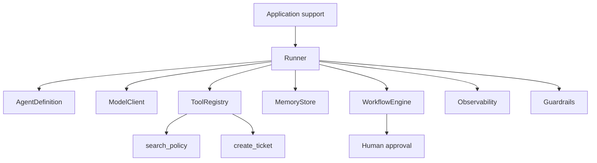

# Corrigé — Challenge

## Proposition d'architecture

### Composants

| Composant | Responsabilité |
|---|---|
| `AgentDefinition` | Décrire l'agent, ses instructions, ses outils autorisés et ses politiques. |
| `Runner` | Exécuter une boucle agentique à partir d'une définition d'agent. |
| `ModelClient` | Encapsuler l'appel au modèle. |
| `ToolRegistry` | Déclarer, valider et exécuter les outils. |
| `MemoryStore` | Lire et écrire l'état de conversation ou de tâche. |
| `WorkflowEngine` | Gérer transitions, limites, conditions d'arrêt et validations humaines. |
| `Observability` | Capturer événements, traces, erreurs et métriques. |
| `Guardrails` | Bloquer ou contrôler les entrées, sorties et appels sensibles. |

### Dépendances

```text
Application -> Runner
Runner -> AgentDefinition
Runner -> ModelClient
Runner -> ToolRegistry
Runner -> MemoryStore
Runner -> WorkflowEngine
Runner -> Observability
Runner -> Guardrails
```

Les composants spécialisés ne dépendent pas du runner.

### Invariants

```text
Le Runner orchestre, mais ne contient pas de logique métier support.
Le ToolRegistry est la seule source de vérité des outils.
L'Observability ne modifie jamais l'état métier.
```

### Décisions d'architecture

#### ADR 1 — Outils centralisés

```text
Décision :
Les outils seront déclarés dans ToolRegistry.

Contexte :
Plusieurs agents pourront utiliser des outils communs.

Raison :
Un registre central réduit la duplication et facilite la sécurité.

Conséquence :
Les agents référencent les outils par nom.

Tradeoff :
Le registre devient un composant critique à tester soigneusement.
```

#### ADR 2 — ModelClient comme port

```text
Décision :
Le modèle sera appelé via une interface ModelClient.

Contexte :
Le framework doit rester testable et remplaçable.

Raison :
Les détails fournisseur ne doivent pas polluer le runner.

Conséquence :
Les tests peuvent utiliser un faux client modèle.

Tradeoff :
Il faut maintenir une couche d'adaptation supplémentaire.
```

### Diagramme Mermaid



### Plan d'implémentation

1. Créer les dataclasses et contrats : `AgentDefinition`, `ToolSpec`, `ExecutionPolicy`.
2. Implémenter un `Runner` minimal avec faux `ModelClient`.
3. Ajouter `ToolRegistry`, validation et erreurs contrôlées.
4. Ajouter mémoire, workflow, observabilité et intégration finale.

## Commentaire formateur

Une bonne réponse évite de placer la logique support dans le runner. Le runner doit pouvoir exécuter plus tard un agent support, un agent recherche ou un agent code sans modification profonde.
