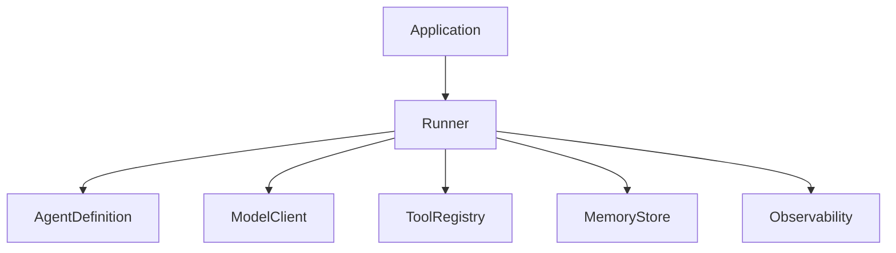

# Corrigé — Exercices

## Exercice 1 — Identifier les responsabilités

1. Stocker la description d'un outil : `ToolRegistry`.
2. Décider si une boucle doit continuer : `WorkflowEngine` ou politique d'exécution utilisée par le `Runner`.
3. Envoyer une requête au modèle : `ModelClient`.
4. Conserver un résumé de conversation : `MemoryStore`.
5. Écrire une trace d'exécution : `Observability`.
6. Décrire les instructions d'un agent : `AgentDefinition`.
7. Appliquer une limite d'itérations : `WorkflowEngine` ou `ExecutionPolicy`.
8. Refuser un appel d'outil sensible sans approbation : `Guardrail` ou métadonnée de sécurité du `ToolRegistry`, appliquée par le `Runner`.

## Exercice 2 — Détecter le couplage

La pseudo-architecture mélange :

- définition de l'agent ;
- appel modèle ;
- stockage mémoire ;
- logique d'outil ;
- logs ;
- sécurité ;
- boucle d'exécution ;
- logique métier support.

Composants à extraire :

- `AgentDefinition`;
- `ModelClient`;
- `ToolRegistry`;
- `MemoryStore`;
- `Runner`;
- `Observability`;
- `Guardrail`;
- éventuellement `WorkflowEngine`.

Le risque principal avec un deuxième agent est la duplication. Chaque nouvel agent réimplémente ses outils, sa mémoire, ses logs et ses validations. Le framework devient incohérent.

## Exercice 3 — Invariants possibles

Exemples :

```text
Le ToolRegistry ne dépend jamais du Runner.
Le ModelClient ne connaît aucun outil métier.
L'Observability ne modifie jamais l'état d'exécution.
La MemoryStore ne déclenche jamais d'appel modèle.
Le Runner ne contient pas de logique métier spécifique à un domaine.
```

## Exercice 4 — ADR simplifié

```text
Décision :
Les outils seront déclarés dans un registre centralisé.

Contexte :
Plusieurs agents devront utiliser des outils communs avec des schémas, permissions et descriptions cohérents.

Raison :
Un registre évite la duplication, rend les outils testables et permet d'appliquer des règles de sécurité uniformes.

Conséquence :
Les agents référencent des outils par nom au lieu de les instancier directement.

Tradeoff :
Il faut maintenir un contrat de registre et gérer les erreurs lorsqu'un outil demandé n'existe pas.
```

## Exercice 5 — Diagramme complété



## Exercice 6 — Lecture de code

1. Les composants déclarés sont notamment `application`, `runner`, `agent_definition`, `model_client`, `tool_registry`, `memory_store`, `workflow_engine`, `observability` et `guardrails`.
2. Dans l'architecture cible, aucun composant ne doit dépendre du `runner` sauf l'application qui l'utilise.
3. Non. Le validateur refuse les dépendances circulaires.
4. La méthode `render_mermaid()` rend le diagramme Mermaid.
