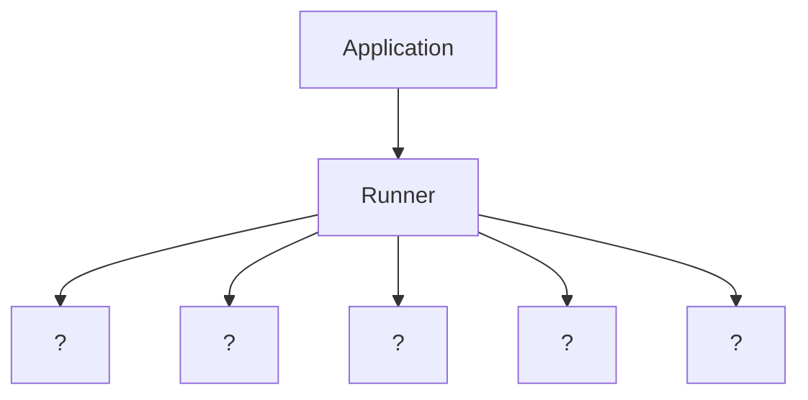

# Exercices — Architecture d'un mini-framework d'agents

## Exercice 1 — Identifier les responsabilités

Pour chaque responsabilité, indique le composant le plus approprié :

1. Stocker la description d'un outil.
2. Décider si une boucle doit continuer.
3. Envoyer une requête au modèle.
4. Conserver un résumé de conversation.
5. Écrire une trace d'exécution.
6. Décrire les instructions d'un agent.
7. Appliquer une limite d'itérations.
8. Refuser un appel d'outil sensible sans approbation.

## Exercice 2 — Détecter le couplage

Analyse cette pseudo-architecture :

```text
SupportAgent
├── openai_client
├── tools
├── user_profile
├── logs
├── run_loop()
├── save_memory()
├── call_billing_api()
└── validate_security()
```

Réponds :

1. Quelles responsabilités sont mélangées ?
2. Quels composants devraient être extraits ?
3. Quel risque apparaît si on veut ajouter un deuxième agent ?

## Exercice 3 — Écrire un invariant

Écris trois invariants d'architecture pour un framework d'agents.

Chaque invariant doit être formulé comme une règle vérifiable.

Exemple :

```text
Le ToolRegistry ne dépend jamais du Runner.
```

## Exercice 4 — ADR simplifié

Écris un mini Architecture Decision Record pour la décision suivante :

```text
Les outils seront déclarés dans un registre centralisé.
```

Le format attendu :

```text
Décision :
Contexte :
Raison :
Conséquence :
Tradeoff :
```

## Exercice 5 — Diagramme

Complète le diagramme Mermaid suivant avec les composants manquants :



## Exercice 6 — Lecture de code

Dans le lab, exécute :

```bash
python mini_framework_architecture.py
```

Puis réponds :

1. Quels composants sont déclarés ?
2. Quels composants dépendent directement du `runner` ?
3. Le framework autorise-t-il les dépendances circulaires ?
4. Quelle méthode rend le diagramme Mermaid ?
