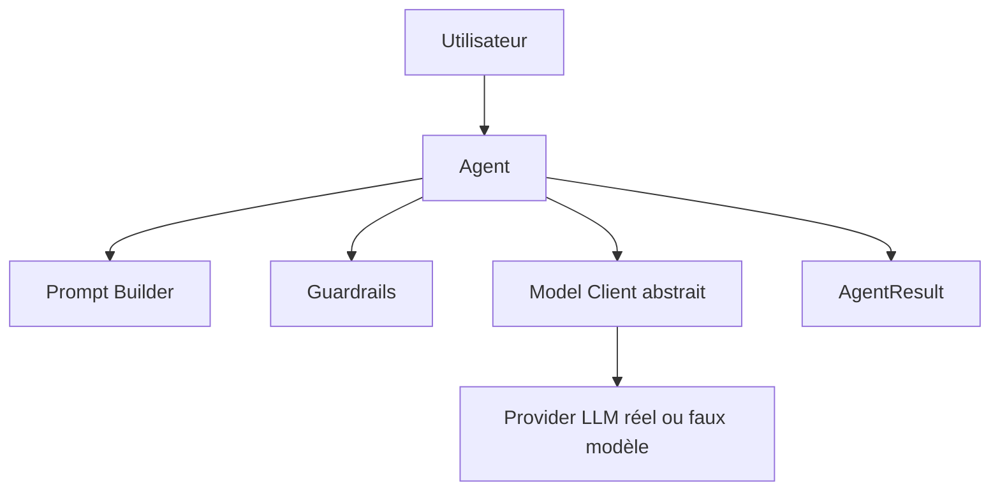
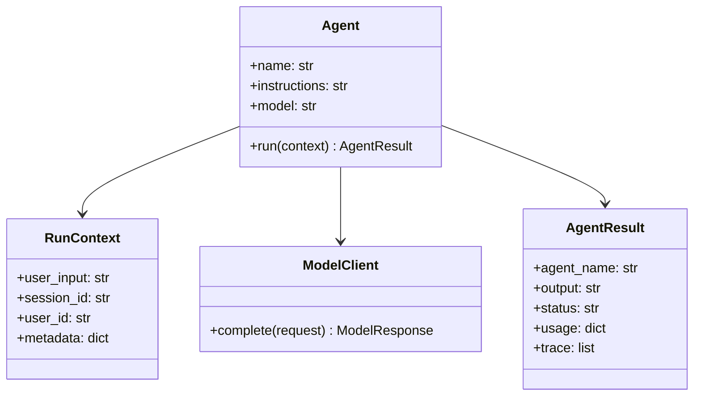

# Chapitre — Concevoir une abstraction Agent

## 1. Le problème

Dans beaucoup de prototypes IA, l’agent est écrit comme un bloc unique :

```python
prompt = "Tu es un assistant..."
response = client.responses.create(...)
print(response.output_text)
```

Cette approche fonctionne pour une démonstration, mais elle ne tient pas dans un framework :

- le prompt est difficile à tester ;
- le modèle est directement couplé au code métier ;
- les erreurs ne sont pas standardisées ;
- les traces ne sont pas collectées ;
- les règles de sécurité sont dispersées ;
- les futures extensions deviennent coûteuses.

Un framework doit transformer ce script implicite en composant explicite.

## 2. Définition d’un agent dans le mini-framework

Dans ce bootcamp, un `Agent` est une unité d’exécution capable de transformer une requête utilisateur en résultat contrôlé, en s’appuyant sur un client modèle abstrait.

Il possède :

| Élément | Rôle |
|---|---|
| `name` | Identifiant stable de l’agent |
| `instructions` | Règles système du comportement |
| `model` | Nom logique du modèle cible |
| `model_client` | Dépendance responsable de l’appel modèle |
| `guardrails` | Règles minimales avant exécution |
| `metadata` | Informations de traçabilité |
| `run()` | Méthode principale d’exécution |

L’agent ne doit pas connaître directement les détails HTTP, API vendor, retry réseau ou sérialisation fournisseur. Ces responsabilités appartiennent au `ModelClient`.

## 3. Séparation des responsabilités



### Agent

Responsable de :

- valider la configuration ;
- construire l’entrée modèle ;
- appliquer les garde-fous ;
- invoquer le client modèle ;
- produire un résultat standardisé.

### ModelClient

Responsable de :

- transformer une requête générique en appel modèle ;
- masquer les détails fournisseur ;
- retourner une sortie normalisée.

### Runner

Responsable plus tard de :

- orchestrer plusieurs exécutions ;
- gérer les workflows ;
- injecter mémoire, tools et observabilité.

Dans cette journée, le runner reste minimal. L’objectif est l’abstraction `Agent`.

## 4. Contrat d’entrée

Un agent reçoit une `RunContext`.

Exemple :

```python
RunContext(
    user_input="Explique le rôle d'un router agent.",
    session_id="session-123",
    user_id="user-42",
    metadata={"course": "ai-engineering"}
)
```

Ce contexte permet de transporter des informations sans polluer la signature de `run()`.

Un bon contrat d’entrée :

- est explicite ;
- reste sérialisable ;
- distingue utilisateur, session et métadonnées ;
- ne dépend pas encore d’une base de données ;
- peut évoluer vers la mémoire et l’observabilité.

## 5. Contrat de sortie

Un agent retourne un `AgentResult`.

Exemple :

```python
AgentResult(
    agent_name="explainer",
    output="Un router agent sélectionne le bon spécialiste...",
    status="completed",
    usage={"input_chars": 52, "output_chars": 64},
    trace=[...]
)
```

Le résultat ne doit pas être une simple chaîne de caractères.

Pourquoi ? Parce qu’en production, il faut savoir :

- quel agent a répondu ;
- si la tâche est terminée ;
- combien de contexte a été utilisé ;
- quelles étapes ont été exécutées ;
- si un garde-fou a bloqué l’exécution ;
- comment déboguer le comportement.

## 6. Guardrails minimaux

Un guardrail est une règle qui limite l’exécution.

Dans cette journée, nous gardons volontairement des guardrails simples :

- entrée vide interdite ;
- entrée trop longue interdite ;
- instructions vides interdites ;
- nom d’agent invalide interdit ;
- instruction SQL destructive simulée bloquée.

Ces règles ne remplacent pas une politique de sécurité complète, mais elles imposent déjà un contrat fiable.

## 7. Injection de dépendance

L’agent ne crée pas lui-même son client modèle.

Mauvais exemple :

```python
class Agent:
    def run(self, input):
        client = OpenAI()
        return client.responses.create(...)
```

Meilleur exemple :

```python
agent = Agent(
    name="explainer",
    instructions="Explique simplement.",
    model_client=fake_model_client
)
```

Ce design permet :

- de tester sans API externe ;
- de remplacer le fournisseur ;
- de simuler des erreurs ;
- de mesurer l’exécution ;
- d’éviter le couplage.

## 8. Agent déterministe pour les tests

Le lab utilise un `EchoModelClient`.

Ce faux client ne fait pas d’intelligence artificielle. Il retourne une réponse déterministe à partir du prompt reçu.

C’est volontaire.

Dans un framework, on teste d’abord le contrat logiciel :

- l’agent construit-il correctement ses messages ?
- les guardrails s’appliquent-ils ?
- le résultat est-il stable ?
- la trace est-elle présente ?
- la dépendance modèle est-elle correctement appelée ?

Les tests LLM réels viendront plus tard avec l’évaluation et l’observabilité.

## 9. Préparation aux jours suivants

L’abstraction du jour 2 prépare directement :

| Jour | Extension future |
|---|---|
| J3 Tool Registry | l’agent pourra recevoir des tools |
| J4 Memory Layer | le contexte pourra être enrichi par la mémoire |
| J5 Workflow Engine | le runner orchestrera plusieurs agents |
| J6 Observabilité | les traces seront exportées |
| J7 Intégration | tous les composants seront assemblés |

La règle importante : ne pas implémenter trop tôt les responsabilités futures dans l’agent.

## 10. Anti-patterns

### Agent omniscient

Un agent qui gère prompt, HTTP, mémoire, outils, logs et workflow devient impossible à maintenir.

### Agent sans contrat

Un agent qui retourne tantôt une chaîne, tantôt un dictionnaire, tantôt une exception non typée casse l’orchestration.

### Agent non testable

Un agent qui appelle directement un fournisseur externe dans ses tests ralentit la CI et rend les résultats instables.

### Agent trop abstrait

Une abstraction trop générique devient inutilisable. Le bon niveau d’abstraction est celui qui couvre les besoins immédiats tout en préparant l’évolution.

## 11. Design cible du jour



## 12. À retenir

Une abstraction `Agent` professionnelle est :

- explicite ;
- testable ;
- découplée du fournisseur ;
- orientée contrat ;
- observable ;
- limitée à ses responsabilités ;
- extensible sans devenir générique à l’excès.

Le but n’est pas de construire le framework complet en une journée. Le but est de définir le composant central sur lequel les autres briques pourront s’appuyer.
