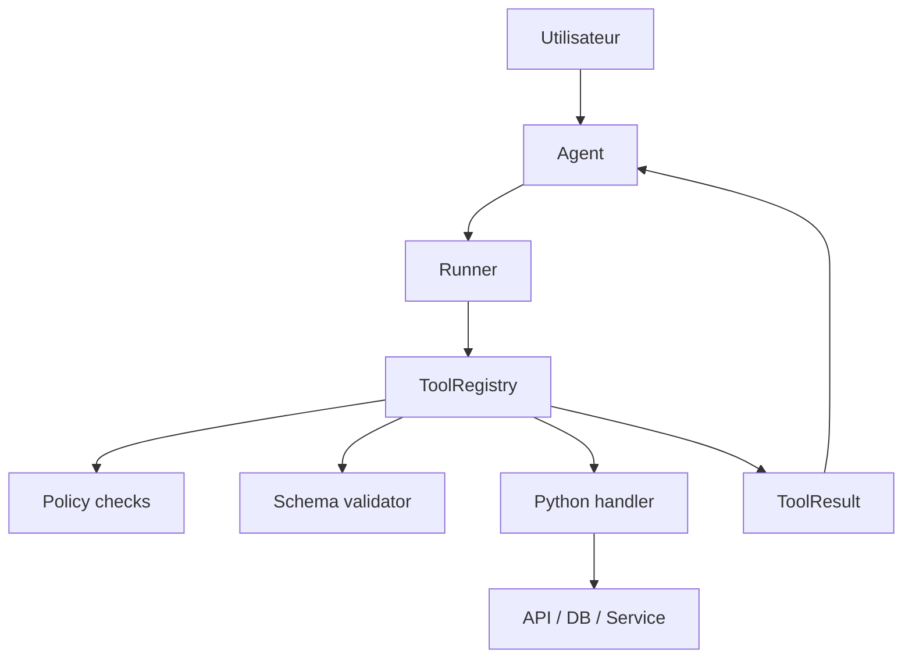
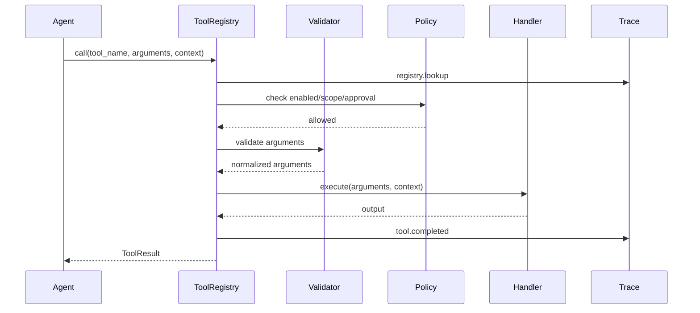

# Chapitre — Concevoir un Tool Registry

## 1. Pourquoi un registre d’outils ?

Un agent sans outil peut analyser, reformuler ou produire du texte. Un agent avec outils peut lire une base de connaissance, créer un ticket, appeler une API, interroger une base SQL ou déclencher un workflow.

Cette puissance crée immédiatement un problème d’architecture : le modèle ne doit pas pouvoir invoquer n’importe quelle fonction avec n’importe quels arguments.

Un `ToolRegistry` répond à ce problème. Il centralise :

| Responsabilité | Description |
|---|---|
| Découverte | Quels outils sont disponibles ? |
| Contrat | Quels arguments sont acceptés ? |
| Validation | Les arguments fournis sont-ils conformes ? |
| Autorisation | L’utilisateur ou l’agent a-t-il le droit d’appeler ce tool ? |
| Exécution | Comment appeler le handler réel ? |
| Résultat | Comment normaliser la sortie ? |
| Trace | Que s’est-il passé pendant l’appel ? |

Le registre d’outils est donc une frontière technique. Il protège le système contre les appels implicites, les arguments invalides, les actions prématurées et les comportements difficiles à déboguer.

## 2. Position dans le mini-framework



L’agent ne connaît pas les détails d’exécution. Il reçoit une liste de tools disponibles et choisit, via le modèle ou via une logique déterministe, un appel structuré.

Le registre prend ensuite le relais.

## 3. Contrat minimal d’un outil

Dans cette journée, un outil possède :

- `name` : identifiant stable ;
- `description` : description orientée modèle ;
- `input_schema` : schéma d’arguments ;
- `output_schema` : forme attendue de la sortie ;
- `sensitive` : indique si l’outil requiert une approbation humaine ;
- `required_scope` : permission applicative minimale ;
- `enabled` : activation ou désactivation ;
- `tags` : classification utile pour filtrage et documentation ;
- `handler` : fonction Python interne.

Le handler ne doit jamais être exposé dans le manifest public. Le modèle voit le contrat, pas le callable Python.

## 4. Cycle d’exécution



Le cycle volontairement simple est :

```text
discover → validate → authorize → execute → trace
```

En production, on peut ajouter des timeouts, retries, circuit breakers, quotas, sandboxing, audit logs et redaction automatique. Pour cette journée, on garde un noyau pédagogique mais testable.

## 5. Validation des arguments

Le lab implémente un sous-ensemble de JSON Schema :

- racine `type: object` ;
- `properties` ;
- `required` ;
- `additionalProperties`;
- types simples : `string`, `integer`, `number`, `boolean`, `object`, `array` ;
- `enum` ;
- `default`.

Exemple :

```json
{
  "type": "object",
  "properties": {
    "title": {
      "type": "string",
      "description": "Titre du ticket"
    },
    "priority": {
      "type": "string",
      "enum": ["low", "medium", "high"],
      "default": "medium"
    }
  },
  "required": ["title"],
  "additionalProperties": false
}
```

Cette validation n’est pas un validateur JSON Schema complet. Elle est suffisante pour enseigner l’invariant fondamental : aucun outil n’est exécuté avant validation.

## 6. Autorisation et outils sensibles

Un tool peut être techniquement valide mais métierement dangereux.

Exemples :

| Tool | Risque |
|---|---|
| `send_email` | communication externe non souhaitée |
| `create_ticket` | bruit opérationnel |
| `refund_customer` | impact financier |
| `delete_file` | perte de données |
| `run_shell_command` | risque système |

Le lab introduit deux contrôles :

1. `required_scope` : l’utilisateur ou le workflow doit posséder une permission.
2. `sensitive` : une approbation explicite doit être présente dans le contexte.

Un outil sensible sans approbation retourne `blocked`, pas `failed`. Ce détail est important : le système fonctionne correctement, mais refuse une action non autorisée.

## 7. Résultat normalisé

Chaque appel retourne un `ToolResult` :

```python
ToolResult(
    tool_name="add_numbers",
    status="completed",
    output={"sum": 42},
    error=None,
    elapsed_ms=1,
    trace=(...)
)
```

Les statuts utilisés dans le lab sont :

| Statut | Sens |
|---|---|
| `completed` | l’outil a terminé correctement |
| `blocked` | une politique empêche l’appel |
| `failed` | erreur de schéma, outil inconnu ou exception handler |

Ce contrat prépare l’intégration avec le runner du framework. Le runner n’aura pas besoin de connaître les exceptions internes du tool.

## 8. Décorateur `@tool`

Le lab propose aussi un décorateur pédagogique :

```python
@tool(description="Multiplie deux entiers.")
def multiply(a: int, b: int) -> dict:
    return {"product": a * b}
```

Le décorateur extrait les annotations simples et génère un schéma d’entrée. Cette mécanique imite le confort développeur attendu dans un framework, tout en gardant le contrat explicite.

## 9. Erreurs à éviter

### Exposer tous les tools à tous les agents

Un agent support client n’a pas besoin d’un outil de suppression de données. La liste des tools doit être adaptée au rôle, au contexte et aux permissions.

### Confondre validation modèle et validation serveur

Même si un modèle produit des arguments structurés, le serveur doit revalider. Le modèle propose ; le runtime contrôle.

### Laisser remonter les exceptions brutes

Une exception Python brute ne doit pas casser toute la boucle agentique. Elle doit être capturée et convertie en résultat exploitable.

### Mélanger logs, traces et réponse utilisateur

La trace est destinée au debug et à l’observabilité. Elle ne doit pas être automatiquement exposée à l’utilisateur final.

## 10. Préparation du jour suivant

Le jour 4 ajoutera la `Memory Layer`. Le registre d’outils doit donc rester indépendant de la mémoire. Un outil peut recevoir un contexte, mais il ne doit pas devenir lui-même un store d’état global.

## Propositions d’amélioration

Ces pistes ne modifient pas la spécification figée du projet :

- ajouter un timeout par outil ;
- connecter le registre à une couche d’observabilité structurée ;
- introduire un validateur JSON Schema complet ;
- ajouter un système de quotas par utilisateur ;
- générer automatiquement une documentation Markdown des tools.
