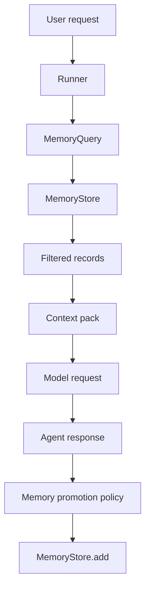

# Chapitre — Memory Layer

## 1. Pourquoi une Memory Layer ?

Un agent sans mémoire est limité à son contexte immédiat. Un agent avec une mauvaise mémoire est dangereux : il peut mélanger des utilisateurs, réutiliser des informations périmées ou injecter des données sensibles dans un prompt.

La Memory Layer d'un framework d'agents doit donc répondre à une question d'architecture :

> Quelles informations l'agent a-t-il le droit de réutiliser, dans quel contexte, pendant combien de temps et avec quelle traçabilité ?

## 2. Trois notions à ne pas confondre

### Historique conversationnel

L'historique conversationnel correspond aux messages récents nécessaires à la continuité d'un échange.

Exemple :

```text
User: Je veux réserver pour deux personnes.
Assistant: Quelle date ?
User: Vendredi soir.
```

Cet historique permet de comprendre que "vendredi soir" dépend de la demande précédente.

### Conversation state

Le state représente l'état structuré d'une tâche en cours.

Exemple :

```json
{
  "intent": "restaurant_booking",
  "party_size": 2,
  "date": "vendredi",
  "missing_fields": ["time", "location"]
}
```

Le state est une donnée applicative, pas une mémoire durable.

### Mémoire durable

La mémoire durable contient des informations réutilisables plus tard.

Exemple :

```json
{
  "kind": "preference",
  "content": "L'utilisateur préfère des réponses en Markdown structuré.",
  "visibility": "private"
}
```

La mémoire durable doit être filtrée, gouvernée et effaçable.

## 3. Contrat minimal d'une Memory Layer

Une Memory Layer utile expose généralement cinq opérations :

```text
add(record)
retrieve(query)
update(record_id, patch)
delete(record_id)
snapshot()
```

Dans un framework d'agents, le contrat doit rester indépendant du backend. Le backend peut être :

- in-memory pour les tests ;
- fichier JSON pour un prototype ;
- SQLite pour un outil local ;
- Redis pour de la mémoire courte ;
- PostgreSQL pour de la mémoire durable ;
- vector database pour de la recherche sémantique.

Le framework ne doit pas dépendre directement de ces choix.

## 4. Modèle de record mémoire

Un record mémoire doit porter plus qu'un contenu texte.

```json
{
  "id": "uuid",
  "namespace": "user:alice",
  "owner_agent": "planner",
  "kind": "preference",
  "content": "Alice préfère des réponses structurées.",
  "visibility": "private",
  "tags": ["preference", "format"],
  "importance": 0.9,
  "expires_at": null,
  "version": 1
}
```

### `namespace`

Le namespace évite les fuites entre utilisateurs, tenants, équipes ou sessions.

### `owner_agent`

L'agent propriétaire permet de savoir qui a créé la mémoire.

### `kind`

Le type indique la nature de l'information.

### `visibility`

La visibilité contrôle l'injection :

- `private` : seulement le propriétaire ou le contexte utilisateur autorisé ;
- `shared` : partage contrôlé entre agents ;
- `public` : information non sensible et réutilisable largement.

### `importance`

L'importance aide à prioriser le contexte quand le budget de tokens est limité.

### `expires_at`

L'expiration évite de réutiliser des informations temporaires.

## 5. Retrieval explicable

Dans un système de production, la récupération peut utiliser des embeddings et un reranker. Dans ce jour, on utilise un scoring déterministe pour rendre le mécanisme lisible.

Score pédagogique :

```text
score = importance
      + lexical_overlap(query, content)
      + tag_overlap(query, tags)
      + same_owner_agent_bonus
```

L'objectif n'est pas de battre une base vectorielle. L'objectif est de comprendre le contrat.

## 6. Mémoire et sécurité

Une mémoire d'agent peut devenir une source de fuite de données. Les risques principaux sont :

- stocker des PII sans politique ;
- partager une mémoire privée avec un agent non autorisé ;
- réutiliser une information ancienne ;
- rendre une mémoire impossible à supprimer ;
- confondre une observation non vérifiée avec un fait.

Le lab introduit trois garde-fous simples :

1. redaction email/téléphone ;
2. namespace obligatoire ;
3. visibilité obligatoire.

## 7. Mémoire et contexte

La mémoire ne doit pas être injectée brute dans le prompt. Elle doit passer par un **context builder**.

Pipeline recommandé :

```text
user request
→ retrieve memory
→ filter policy
→ rank
→ compact
→ inject into prompt
```

Le contexte final doit contenir uniquement les informations nécessaires à la tâche.

## 8. Exemple de flow



## 9. Ce que le mini-framework gagne

Avec `mini_framework/memory.py`, le framework dispose d'un composant réutilisable pour les jours suivants :

- le workflow engine pourra lire et écrire de la mémoire ;
- l'observabilité pourra tracer les décisions mémoire ;
- le runner pourra injecter un context pack ;
- les guardrails pourront bloquer certaines écritures.

## 10. Bonnes pratiques

- Ne jamais stocker tout l'historique comme mémoire durable.
- Ne jamais partager une mémoire sans visibilité explicite.
- Ne jamais injecter une mémoire sans ranking ni budget.
- Toujours prévoir un mécanisme d'oubli.
- Toujours auditer les créations, mises à jour et suppressions.
- Toujours distinguer fait vérifié, préférence utilisateur et observation outil.

## Résumé

Une Memory Layer est un contrat d'architecture. Elle transforme la mémoire d'un agent en composant testable, filtrable et remplaçable. C'est une étape essentielle pour passer d'un agent de démonstration à un framework d'agents maintenable.
