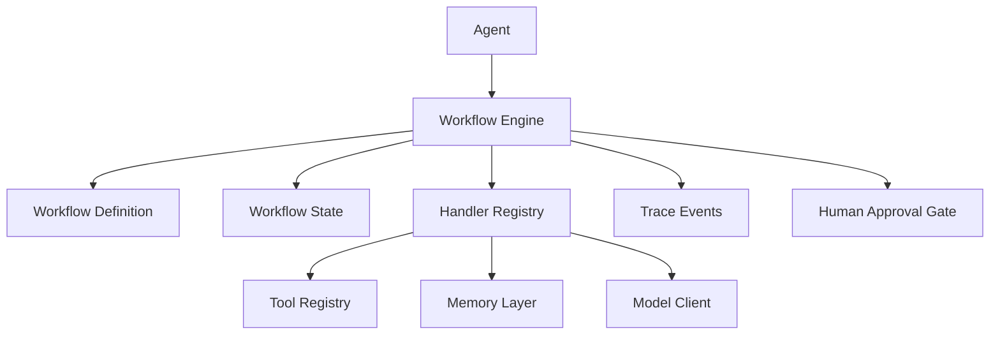
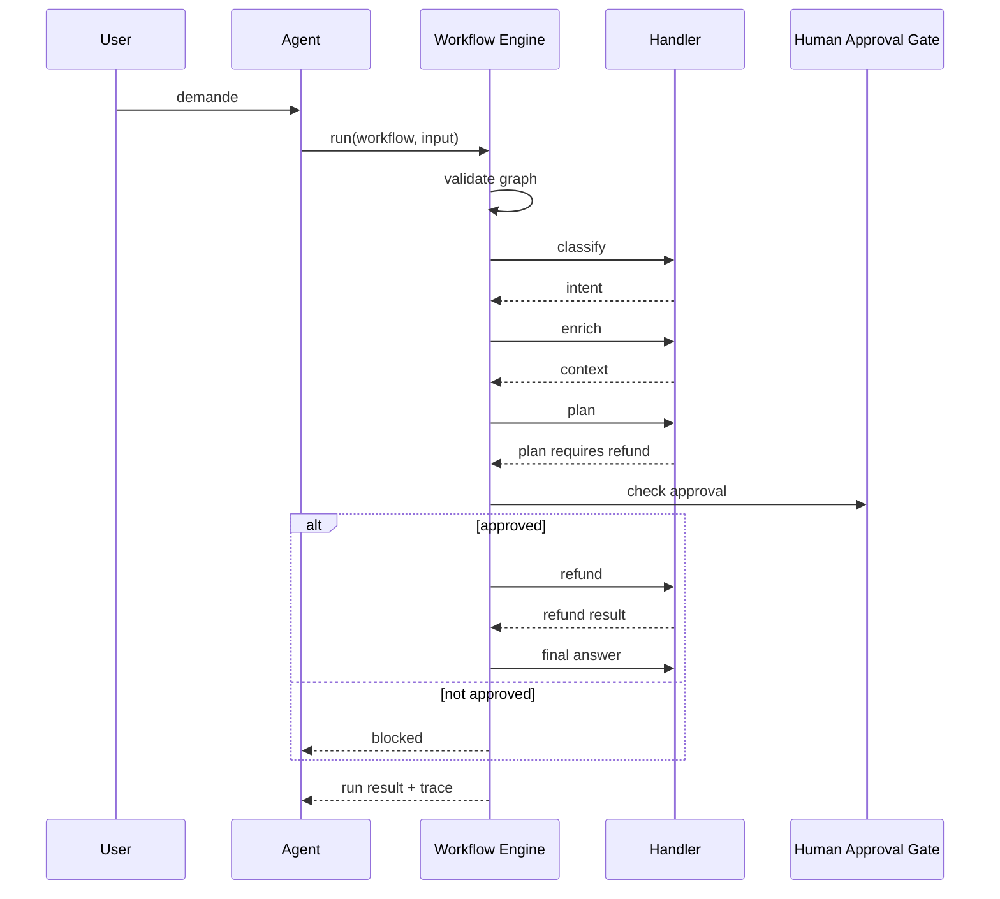

# Chapter — Workflow Engine

## 1. Pourquoi un workflow engine ?

Un agent autonome peut fonctionner avec une boucle simple :

```text
observe -> think -> act -> observe
```

Cette boucle est utile pour explorer un problème. Elle devient insuffisante quand l'application doit respecter un processus métier stable.

Exemples :

- traiter un ticket support ;
- qualifier un lead ;
- générer un rapport ;
- produire un diagnostic ;
- préparer une action sensible ;
- orchestrer plusieurs outils internes.

Dans ces cas, le système doit savoir :

- quelles étapes existent ;
- dans quel ordre elles peuvent s'exécuter ;
- quelles étapes sont optionnelles ;
- quelles étapes exigent une approbation ;
- quelles erreurs sont récupérables ;
- quelles traces doivent être conservées.

Un workflow engine rend ces règles explicites.

## 2. Différence entre agent loop et workflow engine

| Élément | Agent loop | Workflow engine |
|---|---|---|
| Nature | dynamique | contractuelle |
| Décision | souvent modèle ou planner | graphe défini |
| Testabilité | plus difficile | plus directe |
| Contrôle | souple | strict |
| Bon usage | exploration, autonomie | processus métier |
| Risque principal | dérive | rigidité excessive |

Un bon framework d'agents doit permettre les deux. La boucle agentique donne de la flexibilité. Le workflow engine donne de la fiabilité.

## 3. Contrat minimal d'un workflow

Un workflow minimal contient :

```text
WorkflowDefinition
├── name
├── version
├── description
└── steps[]
    ├── name
    ├── handler
    ├── depends_on
    ├── condition
    ├── max_retries
    └── sensitive
```

Le champ `handler` ne contient pas la fonction directement dans la définition. Il contient un nom. Ce choix sépare :

- le contrat déclaratif ;
- l'implémentation Python ;
- la possibilité d'exporter le workflow ;
- la possibilité de valider avant exécution.

## 4. Étapes et dépendances

Un workflow est un graphe orienté. Une étape peut dépendre d'une ou plusieurs étapes.

Exemple :

```text
classify -> enrich -> plan -> final_answer
```

Avec action sensible :

```text
classify -> enrich -> plan -> refund -> final_answer
```

La dépendance signifie : l'étape ne doit pas commencer avant que ses dépendances soient terminées ou explicitement ignorées.

Le moteur doit refuser :

- les dépendances inconnues ;
- les noms d'étapes dupliqués ;
- les cycles ;
- les handlers absents ;
- les conditions absentes.

## 5. Ordre topologique

L'ordre topologique est l'ordre dans lequel les étapes peuvent s'exécuter sans violer les dépendances.

Pour ce graphe :

```text
A -> B -> D
A -> C -> D
```

Les ordres valides sont par exemple :

```text
A, B, C, D
A, C, B, D
```

Le lab utilise un ordre déterministe trié alphabétiquement pour rendre les tests reproductibles.

## 6. État de workflow

L'état du workflow doit être distinct de la mémoire longue durée.

Il contient :

- l'entrée de l'exécution ;
- les sorties des étapes ;
- les approbations ;
- le statut courant ;
- l'identifiant d'exécution.

Il ne doit pas devenir une base de connaissance globale. C'est un état d'exécution.

## 7. Handlers

Un handler est une fonction métier appelée par le moteur.

```python
def classify_ticket(ctx):
    text = ctx.input["message"]
    return {"intent": "refund"}
```

Le handler reçoit un `WorkflowContext` contenant :

- le nom du workflow ;
- le nom de l'étape ;
- le numéro de tentative ;
- l'état ;
- l'input initial ;
- les données produites par les étapes précédentes.

Cette interface permet d'écrire des handlers testables sans dépendre directement du moteur.

## 8. Retries

Les erreurs temporaires sont fréquentes :

- outil indisponible ;
- timeout ;
- réponse mal formée ;
- ressource verrouillée ;
- limitation temporaire.

Le workflow engine peut réessayer une étape selon `max_retries`.

Important : un retry doit être visible dans la trace. Sinon, le système devient difficile à auditer.

## 9. Conditions

Une étape peut être conditionnelle.

Exemple :

```text
refund s'exécute seulement si plan.requires_refund == true
```

Dans le lab, la condition `is_refund_required` lit l'état produit par l'étape `plan`.

Si la condition est fausse, l'étape passe en statut `skipped`.

## 10. Actions sensibles et validation humaine

Une étape sensible ne doit pas s'exécuter simplement parce que le modèle l'a proposée.

Exemples :

- remboursement ;
- envoi d'email client ;
- suppression de données ;
- changement de droits ;
- déclenchement d'un paiement ;
- appel à une API d'administration.

Le moteur doit bloquer l'étape si l'approbation n'est pas présente.

Statut attendu :

```text
blocked
```

Ce statut est différent de `failed`. Une étape bloquée n'a pas échoué techniquement. Elle attend une décision humaine ou une politique d'autorisation.

## 11. Tracing

Le tracing rend le workflow observable.

Le lab trace notamment :

- `workflow.started` ;
- `step.started` ;
- `step.completed` ;
- `step.failed` ;
- `step.retry_scheduled` ;
- `condition.evaluated` ;
- `step.blocked` ;
- `step.skipped` ;
- `workflow.finished`.

Dans un système réel, ces événements alimenteraient :

- logs structurés ;
- métriques ;
- dashboard ;
- audit ;
- évaluation ;
- debugging.

## 12. Diagramme d'architecture



## 13. Séquence d'exécution



## 14. Anti-patterns

### Mettre tout le workflow dans un prompt

Le modèle reçoit une longue instruction et doit deviner le processus. C'est souple mais peu vérifiable.

### Cacher les erreurs

Une étape échoue, mais la réponse finale masque l'échec. En production, cela crée de faux succès.

### Mélanger état de run et mémoire longue durée

Le workflow state appartient à une exécution. La mémoire longue durée appartient à un utilisateur, une organisation ou un domaine.

### Exécuter des actions sensibles sans garde-fou

Un workflow engine doit permettre des interruptions contrôlées.

### Rendre le graphe implicite

Si l'ordre d'exécution n'existe que dans le code, il est difficile à visualiser, tester et auditer.

## 15. Design retenu dans le lab

Le lab implémente :

- `WorkflowStep` ;
- `WorkflowDefinition` ;
- `WorkflowState` ;
- `WorkflowContext` ;
- `StepResult` ;
- `TraceEvent` ;
- `WorkflowRun` ;
- `WorkflowEngine`.

Le moteur est synchrone, déterministe et sans dépendance externe. Ce choix privilégie la compréhension.

## 16. Passage à la production

Pour un système réel, il faudrait ajouter :

- persistance d'état ;
- reprise après crash ;
- files de tâches ;
- exécution parallèle ;
- timeouts réels ;
- annulation ;
- idempotence ;
- versioning de workflow ;
- métriques ;
- politique de secrets ;
- intégration avec le tracing plateforme ;
- dashboard opérationnel.

Ces améliorations ne modifient pas les spécifications du bootcamp. Elles sont des prolongements possibles.
