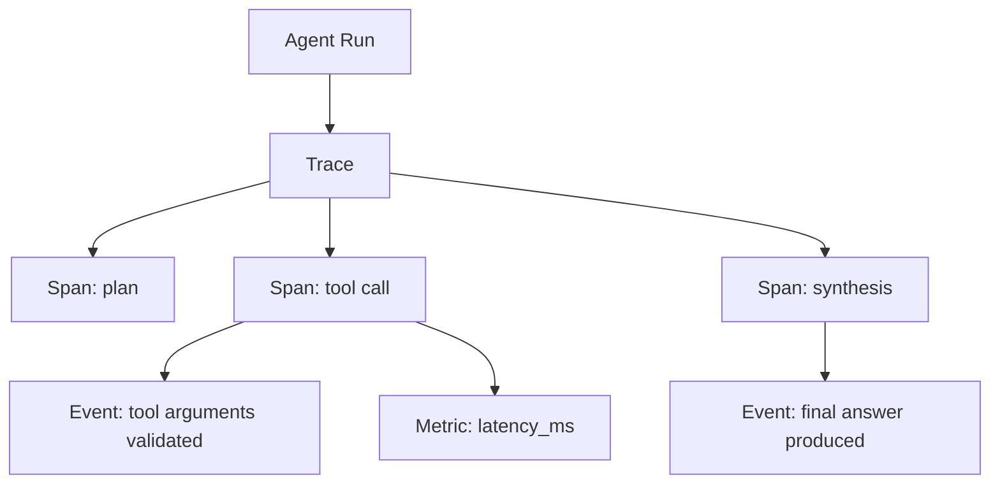

# Chapitre — Observabilité pour frameworks d'agents

## 1. Pourquoi l'observabilité change avec les agents

Une API classique reçoit une requête, appelle quelques services, puis renvoie une réponse. Un agent, lui, peut :

- interpréter une intention ;
- construire un plan ;
- appeler plusieurs outils ;
- relire le résultat ;
- décider de continuer, clarifier ou arrêter ;
- modifier son état ;
- déclencher une action sensible.

Cette dynamique rend les erreurs plus difficiles à diagnostiquer. Une réponse incorrecte peut venir :

- d'un contexte incomplet ;
- d'un outil mal sélectionné ;
- d'un schéma mal validé ;
- d'une mémoire obsolète ;
- d'un conflit entre agents ;
- d'une boucle trop longue ;
- d'une exception masquée ;
- d'une hallucination non détectée.

L'observabilité rend ces chemins visibles.

## 2. Logs, traces, spans, événements, métriques

### Log

Un log est une ligne ou un objet qui décrit ce qui s'est passé.

Exemple :

```json
{
  "level": "info",
  "message": "tool called",
  "tool_name": "search_ticket"
}
```

Un log est utile, mais il ne suffit pas à reconstruire la structure d'un run agentique.

### Trace

Une trace représente une opération complète.

Dans un agent :

```text
run utilisateur -> planification -> outil -> observation -> synthèse
```

La trace relie toutes les étapes.

### Span

Un span est une sous-opération mesurée dans une trace.

Exemples :

- `agent.plan`;
- `tool.search_ticket`;
- `memory.retrieve`;
- `workflow.step.classify`;
- `guardrail.check`.

Un span a un début, une fin, une durée, un statut et éventuellement un parent.

### Event

Un événement est une information ponctuelle attachée à une trace ou à un span.

Exemples :

- `clarification_requested`;
- `sensitive_tool_blocked`;
- `schema_validation_failed`;
- `memory_redacted`.

### Metric

Une métrique est un point numérique agrégable.

Exemples :

- `agent.run.duration_ms`;
- `tool.call.count`;
- `guardrail.blocked.count`;
- `context.tokens.estimated`;
- `workflow.retry.count`.

## 3. Modèle mental



La trace donne la structure. Les spans donnent la chronologie. Les événements expliquent les décisions. Les métriques permettent l'exploitation.

## 4. Observabilité minimale pour un framework d'agents

Un framework pédagogique doit capturer au minimum :

| Signal | Pourquoi |
|---|---|
| `trace_id` | relier toutes les opérations |
| `span_id` | identifier une étape |
| `parent_id` | reconstruire l'arbre |
| `name` | nom fonctionnel |
| `kind` | agent, tool, memory, workflow, guardrail |
| `status` | running, completed, failed |
| `duration_ms` | analyser latence |
| `attributes` | contexte contrôlé |
| `events` | décisions importantes |
| `error` | diagnostic d'échec |

## 5. Redaction des données sensibles

Les traces peuvent exposer :

- emails ;
- numéros de téléphone ;
- tokens ;
- clés API ;
- secrets ;
- fragments de prompt ;
- données client.

La redaction doit être activée par défaut. Une bonne règle de framework est :

> Les traces doivent être utiles sans devenir une copie complète des données sensibles.

Dans le lab, la redaction masque les clés dont le nom contient :

- `password`;
- `secret`;
- `token`;
- `api_key`;
- `email`;
- `phone`.

## 6. Observabilité et agent autonome

Dans une boucle agentique, l'observabilité doit montrer la décision de continuer ou d'arrêter.

Exemple :

```text
trace: support_agent_run
  span: classify_intent
  span: retrieve_customer_context
  span: call_tool.search_ticket
  span: evaluate_tool_result
  span: final_answer
```

Sans cette structure, on ne sait pas si l'agent a mal répondu parce que :

- le mauvais outil a été choisi ;
- l'outil a échoué ;
- le résultat outil était correct mais mal interprété ;
- le contexte était absent ;
- un guardrail a bloqué une action.

## 7. Patterns d'architecture

### Pattern 1 — Trace context explicite

Chaque exécution crée un contexte :

```python
with obs.start_trace("support_agent_run"):
    with obs.start_span("classify_intent", kind="agent"):
        ...
```

Avantage : lisible, testable, déterministe.

### Pattern 2 — Spans imbriqués

Un appel d'outil peut être enfant d'une étape agentique :

```text
agent.decide
└── tool.search_ticket
```

Cela permet de calculer la latence par composant.

### Pattern 3 — Exporter indépendant

Le framework ne doit pas dépendre d'un fournisseur de monitoring.

Il doit produire un format exportable :

```json
{
  "traces": [],
  "spans": [],
  "events": [],
  "metrics": []
}
```

L'intégration vers OpenTelemetry, un backend propriétaire ou un tableau de bord vient plus tard.

### Pattern 4 — Fail closed sur données sensibles

Par défaut :

```python
include_sensitive_data = False
```

La capture brute doit être une décision explicite.

## 8. Anti-patterns

### Anti-pattern 1 — Logger uniquement la réponse finale

Cela ne permet pas d'auditer le raisonnement opérationnel.

### Anti-pattern 2 — Capturer tout le prompt

C'est utile pour debug local, mais risqué en production.

### Anti-pattern 3 — Pas de parent-child

Sans relation parent/enfant, on perd l'arbre d'exécution.

### Anti-pattern 4 — Erreurs silencieuses

Une exception d'outil doit être visible dans la trace, même si l'agent parvient à répondre.

## 9. Exemple métier

Un assistant support doit traiter :

> "Peux-tu vérifier le statut de ma commande ? Mon email est client@example.com"

Trace attendue :

```text
support_agent_run
├── classify_intent
├── extract_identifiers
│   └── event: pii_redacted
├── tool.lookup_order
└── final_response
```

Dans l'export JSON, l'email doit être masqué.

## 10. Lien avec les jours précédents

| Jour | Lien |
|---|---|
| J1 Architecture | l'observabilité est transversale |
| J2 Agent | chaque run d'agent crée une trace |
| J3 Tool Registry | chaque outil devient un span |
| J4 Memory Layer | retrieval et écriture mémoire sont tracés |
| J5 Workflow Engine | chaque étape de workflow devient un span |
| J6 Observabilité | consolidation opérationnelle |
| J7 Intégration | assemblage complet du mini-framework |

## 11. Préparation production

En production, cette couche pourra être reliée à :

- OpenTelemetry ;
- Prometheus ;
- Grafana ;
- Datadog ;
- backend de tracing fournisseur ;
- stockage JSON interne ;
- outils d'évaluation.

Le point important est le contrat interne : le framework doit déjà produire des signaux propres.
