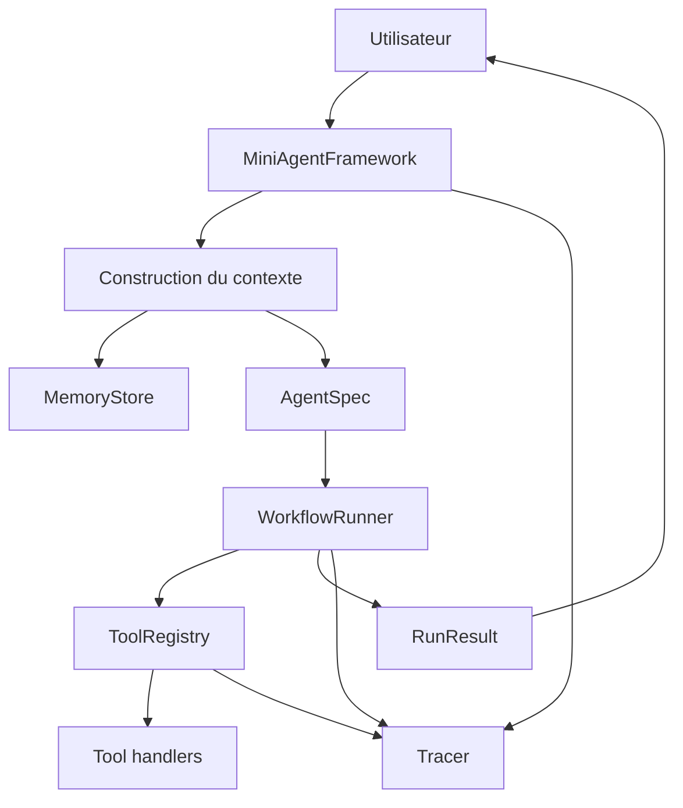

# Chapitre — Intégrer un mini-framework d'agents

## 1. Pourquoi intégrer ?

Un framework d'agents ne devient utile que lorsque ses composants coopèrent.

Un agent isolé peut produire du texte.
Un outil isolé peut exécuter une fonction.
Une mémoire isolée peut stocker des faits.
Un workflow isolé peut enchaîner des étapes.
Une trace isolée peut enregistrer un événement.

Mais un système AI Engineering a besoin d'une **unité d'exécution cohérente** :

```text
entrée utilisateur
→ contexte
→ décision agentique
→ appel d'outil
→ observation
→ mise à jour d'état
→ sortie structurée
→ trace
```

L'intégration est donc le moment où l'on vérifie que les abstractions construites précédemment sont compatibles.

## 2. Les composants intégrés

Le mini-framework du jour assemble cinq briques.

### Agent

L'agent représente une capacité métier. Il possède :

- un nom ;
- des instructions ;
- une liste d'outils autorisés ;
- éventuellement un rôle dans un workflow.

L'agent ne doit pas connaître les détails internes du registre d'outils ou de la mémoire. Il reçoit un contexte préparé.

### Tool Registry

Le registre d'outils expose des capacités exécutables.

Il doit :

- enregistrer les outils ;
- valider les arguments ;
- vérifier les permissions ;
- bloquer les outils sensibles sans approbation ;
- retourner un résultat structuré.

Un framework fiable ne laisse jamais un modèle appeler arbitrairement une fonction Python.

### Memory Layer

La mémoire conserve des informations réutilisables.

Dans cette journée, elle sert à personnaliser l'exécution :

- préférence utilisateur ;
- contrainte métier ;
- historique utile ;
- signal de risque.

La mémoire ne remplace pas l'état courant du workflow. Elle enrichit le contexte.

### Workflow Engine

Le workflow définit l'ordre d'exécution.

Il répond à plusieurs questions :

- quelle étape doit commencer ?
- quelles dépendances doivent être satisfaites ?
- quelle étape a échoué ?
- quelles actions sont bloquées ?
- quelles observations doivent être remontées ?

Le workflow rend l'exécution plus prévisible qu'une boucle libre non contrôlée.

### Observability

L'observabilité permet de comprendre ce qui s'est passé.

Elle collecte :

- des spans ;
- des événements ;
- des erreurs ;
- des décisions ;
- des appels d'outils ;
- des métriques simples.

Sans observabilité, un agent devient une boîte noire difficile à déboguer.

## 3. Architecture d'intégration

Le pattern retenu est une façade `MiniAgentFramework`.

Elle expose une API simple :

```python
framework.register_agent(...)
framework.register_tool(...)
framework.memory.remember(...)
framework.run(...)
```

À l'intérieur, elle coordonne :

```text
MiniAgentFramework
├── AgentCatalog
├── ToolRegistry
├── MemoryStore
├── WorkflowRunner
└── Tracer
```

Ce choix évite de disperser la logique d'orchestration dans les notebooks ou les scripts applicatifs.

## 4. Contrats principaux

### AgentSpec

Un `AgentSpec` décrit un agent.

Il ne contient pas de logique métier lourde. Il définit un contrat :

```python
AgentSpec(
    name="support_agent",
    instructions="Résoudre les tickets clients.",
    allowed_tools=["classify_ticket", "search_kb", "draft_answer"]
)
```

### ToolSpec

Un `ToolSpec` décrit un outil.

Il précise :

- son nom ;
- sa description ;
- son schéma d'entrée ;
- son handler Python ;
- s'il requiert une approbation humaine.

### WorkflowDefinition

Un workflow décrit une liste d'étapes.

Chaque étape indique :

- son nom ;
- l'agent responsable ;
- l'outil à appeler ;
- les dépendances ;
- les arguments à transmettre.

### RunResult

Le résultat final est structuré.

Il contient :

- le statut ;
- les sorties ;
- les étapes exécutées ;
- les erreurs ;
- la trace ;
- les éléments mémoire utilisés.

## 5. Exemple métier

Le lab utilise un scénario de support client.

Entrée :

```text
"Je veux un remboursement pour ma commande cassée."
```

Le framework doit :

1. classifier le ticket ;
2. rechercher une politique interne ;
3. rédiger une réponse ;
4. refuser l'action sensible `issue_refund` sans approbation ;
5. produire une trace.

Ce scénario est réaliste : un assistant peut rédiger, analyser et préparer une décision, mais ne doit pas effectuer une action financière sans garde-fou.

## 6. Garde-fous d'intégration

Un framework intégré doit refuser certains états.

Exemples :

- agent inconnu ;
- outil inconnu ;
- outil non autorisé pour l'agent ;
- argument obligatoire manquant ;
- outil sensible sans approbation ;
- dépendance cyclique dans un workflow ;
- workflow sans étape exécutable.

Ces refus sont aussi importants que les succès. Ils rendent le système exploitable.

## 7. De l'intégration pédagogique à la production

Le framework du jour reste volontairement simple.

En production, il faudrait ajouter :

- persistance réelle de la mémoire ;
- file de tâches ;
- exécution asynchrone ;
- supervision externe ;
- gestion d'identité ;
- quotas ;
- contrôle des coûts ;
- sandbox d'outils ;
- versioning des prompts et workflows.

Ces ajouts appartiennent aux semaines suivantes du bootcamp. Le but aujourd'hui est d'obtenir un noyau propre.

## 8. Diagramme global



## 9. Anti-patterns

### Tout mettre dans l'agent

Un agent qui connaît les outils, la mémoire, le workflow et les traces devient difficile à tester.

### Appeler les outils directement depuis le modèle

Le modèle ne doit jamais exécuter librement du code. Il propose une intention ; le framework valide.

### Ne pas tracer les décisions

Une sortie correcte sans trace est insuffisante pour un système professionnel.

### Confondre mémoire et état

La mémoire conserve des connaissances réutilisables.
L'état décrit l'exécution actuelle.

## 10. Synthèse

L'intégration transforme un ensemble d'abstractions en système cohérent.

Le critère de réussite n'est pas seulement que le code fonctionne. Le critère est que le comportement soit :

- explicite ;
- testable ;
- contrôlé ;
- observable ;
- extensible.
