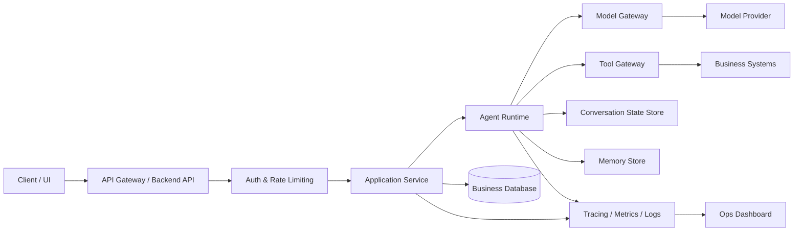

# Chapitre — Architecture production pour systèmes IA

## 1. Pourquoi une architecture production est différente d’un prototype

Un prototype IA peut ressembler à ceci :

```text
User -> Script Python -> LLM -> Réponse
```

Ce modèle est utile pour apprendre, mais il ne suffit pas pour produire un service fiable.

En production, un système IA doit gérer :

- plusieurs utilisateurs ;
- des états de conversation isolés ;
- des limites de coût ;
- des latences variables ;
- des outils externes ;
- des données sensibles ;
- des erreurs partielles ;
- des logs exploitables ;
- des déploiements progressifs ;
- des évaluations de qualité.

Une architecture production n’est donc pas seulement un moyen d’appeler un modèle. C’est un ensemble de **frontières, contrats, contrôles et observabilité**.

## 2. Vue d’ensemble d’une plateforme IA backend



Cette architecture sépare les responsabilités. L’API ne contient pas toute la logique agentique. Le runtime agentique ne contacte pas librement tous les systèmes internes. Le modèle ne devient pas propriétaire de l’état applicatif.

## 3. Composants principaux

### API Gateway / Backend API

Responsabilités :

- authentification ;
- autorisation ;
- validation d’entrée ;
- rate limiting ;
- routage vers les services applicatifs ;
- mapping HTTP vers cas d’usage métier ;
- réponse structurée au client.

L’API ne doit pas être un simple proxy vers le modèle.

### Application Service

Le service applicatif porte le cas d’usage :

```text
create_support_reply(user_id, ticket_id, message)
```

Il décide quel agent appeler, quel contexte charger, quels garde-fous appliquer, quelle réponse renvoyer et quelles données persister.

### Agent Runtime

Le runtime agentique exécute l’agent dans un cadre borné :

- instructions système ;
- outils disponibles ;
- boucle d’exécution ;
- appels modèle ;
- validation de sortie ;
- limite d’itérations ;
- garde-fous ;
- traces.

### Model Gateway

Le gateway modèle encapsule les fournisseurs de modèles :

- choix du modèle ;
- version du modèle ;
- timeout ;
- retry ;
- backoff ;
- fallback ;
- budget de coût ;
- normalisation des erreurs.

Le reste de l’application ne doit pas dépendre directement d’un SDK fournisseur.

### Tool Gateway

Le gateway outils protège les systèmes internes :

- exposer uniquement les outils autorisés ;
- valider les arguments ;
- appliquer les permissions ;
- bloquer les actions sensibles ;
- exiger une validation humaine si nécessaire ;
- tracer chaque appel ;
- limiter les effets de bord.

Un outil est une frontière de sécurité.

### State Store

Le state store contient l’état conversationnel court terme : session, étape actuelle, slots collectés, champs manquants, dernière action et statut.

### Memory Store

La mémoire stocke des informations durables : préférences, faits validés et contexte réutilisable. Elle doit être gouvernée par consentement, visibilité, TTL, suppression, audit et redaction.

### Business Database

La base métier stocke les données officielles du produit : tickets, commandes, utilisateurs, abonnements, documents et événements métier.

### Observability

L’observabilité IA couvre traces d’exécution, appels modèle, appels outils, latence, coût estimé, erreurs, refus, garde-fous, versions de prompts, versions de schémas et statut final.

## 4. Risques spécifiques aux systèmes IA

| Risque | Exemple | Mitigations |
|---|---|---|
| Sortie non déterministe | Deux réponses différentes pour une demande proche | Structured outputs, evals, prompts versionnés |
| Hallucination | Information inventée | Retrieval contrôlé, règles d’abstention, validation métier |
| Action dangereuse | Remboursement incorrect | Tool gateway, approbation humaine, idempotency key |
| Fuite de données | PII dans les logs | Redaction, minimisation du contexte, séparation des namespaces |
| Explosion des coûts | Boucle agentique non bornée | Budget, limite d’itérations, cache, monitoring |

## 5. Contrats à versionner

| Contrat | Exemple | Pourquoi |
|---|---|---|
| Prompt | `support_agent:v3` | Reproductibilité |
| Modèle | version épinglée ou upgrade évalué | Stabilité comportementale |
| Schéma de sortie | `SupportReplySchema:v2` | Validation |
| Tool schema | `refund_tool:v1` | Sécurité |
| Memory policy | `memory_policy:v1` | Gouvernance |
| Eval suite | `support_eval:v4` | Qualité |

## 6. Readiness production

Une architecture IA est prête si elle répond à ces questions :

1. Qui peut appeler le système ?
2. Quelles données entrent dans le contexte ?
3. Où l’état est-il stocké ?
4. Quelle mémoire est persistée ?
5. Quels outils peuvent avoir des effets de bord ?
6. Comment les appels modèle sont-ils tracés ?
7. Comment les erreurs sont-elles gérées ?
8. Comment les coûts sont-ils limités ?
9. Comment la qualité est-elle évaluée ?
10. Comment revenir en arrière après un déploiement ?

## 7. Transition vers le jour 2

Le jour 2 utilisera cette architecture pour exposer une API FastAPI. La règle est :

> On ne commence pas par écrire des endpoints. On commence par définir les frontières de production.
