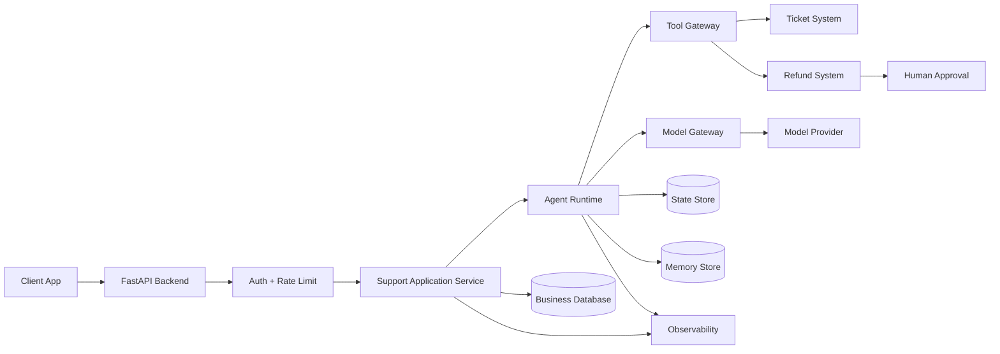

# Corrigé — Challenge

## Diagramme Mermaid proposé

## Analyse des risques

| Risque | Impact | Mitigation |
|---|---|---|
| Hallucination | Réponse support fausse | Contexte contrôlé, structured outputs, abstention |
| Tool misuse | Remboursement incorrect | Gateway outils, validation humaine |
| PII leakage | Incident sécurité | Redaction logs, minimisation contexte |
| Cost spike | Dépense incontrôlée | Budget, limite d’itérations |
| Latency spike | Mauvaise UX | Timeout, fallback |
| State corruption | Mauvaise continuité | Isolation session, snapshots |

## Checklist readiness

- API protégée par auth.
- Rate limiting actif.
- Entrées validées.
- Sorties structurées.
- Runtime borné.
- Outils sensibles protégés.
- Approbation humaine obligatoire pour remboursement.
- Logs sans PII.
- Traces exportées.
- Coûts mesurés.
- Timeouts configurés.
- Retries bornés.
- Prompts versionnés.
- Schémas versionnés.
- Rollback testé.
- Evals minimales passées.

## Stratégie de rollback

1. Revenir à la version précédente du prompt.
2. Revenir au schéma de sortie précédent.
3. Désactiver les outils sensibles.
4. Réduire le runtime en mode suggestion uniquement.
5. Revenir au modèle précédent si nécessaire.
6. Restaurer la policy de mémoire précédente.
7. Rejouer les evals critiques avant réouverture.
