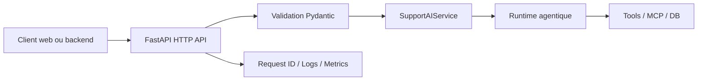

# Chapitre — Construire une API FastAPI pour une plateforme IA

## 1. Pourquoi une API dédiée pour l'IA ?

Un prototype d'agent peut être lancé depuis un notebook ou un script.  
Un système de production doit être exposé via une interface stable, testable et observable.

L'API n'est pas seulement un proxy vers un modèle. Elle est responsable de :

- valider les entrées ;
- authentifier le client ;
- appliquer des limites ;
- propager un identifiant de requête ;
- isoler les sessions ;
- transformer les erreurs internes en erreurs HTTP stables ;
- appeler le service applicatif ;
- retourner une réponse structurée.

Dans une architecture IA backend, la couche API doit rester mince.  
Elle ne doit pas contenir la logique métier profonde ni la boucle agentique complète.



## 2. Séparer transport et métier

Une erreur fréquente consiste à écrire toute la logique dans la fonction de route :

```python
@app.post("/chat")
def chat(payload):
    # validation manuelle
    # prompt building
    # appel modèle
    # appel base
    # logs
    # réponse
```

Cette approche rend l'API difficile à tester et à faire évoluer.

Le design recommandé pour le bootcamp est :

```text
HTTP route
  -> validation Pydantic
  -> dépendances FastAPI
  -> service applicatif
  -> runtime agentique
  -> réponse Pydantic
```

Le jour 2 introduit donc `ai_platform/api.py`, qui expose :

- `APISettings` ;
- `ChatRequest` ;
- `ChatResponse` ;
- `ErrorResponse` ;
- `InMemoryRateLimiter` ;
- `DeterministicSupportService` ;
- `create_app()`.

## 3. Contrats Pydantic

Les modèles Pydantic sont le premier garde-fou de production.  
Ils permettent de refuser les entrées mal formées avant toute exécution coûteuse.

Exemple de contrat d'entrée :

```python
class ChatRequest(BaseModel):
    session_id: str
    user_id: str
    message: str
    metadata: dict = {}
```

Dans le lab, le modèle est plus strict :

- taille minimale et maximale ;
- identifiants sans caractères dangereux ;
- champs supplémentaires interdits ;
- message non vide.

Cette rigueur est importante pour les systèmes IA : un LLM peut tolérer beaucoup d'ambiguïté, mais une API de production doit être explicite.

## 4. Endpoints de production

Le lab expose quatre endpoints :

| Endpoint | Rôle | Authentification |
|---|---|---|
| `GET /healthz` | Vérifie que le processus répond | Non |
| `GET /readyz` | Vérifie que le service applicatif est prêt | Non |
| `POST /v1/chat` | Exécute un tour assistant | Oui |
| `GET /v1/sessions/{session_id}` | Relit la session stockée | Oui |

La séparation `healthz` / `readyz` est volontaire :

- `healthz` répond si l'application fonctionne ;
- `readyz` répond si l'application peut traiter du trafic.

## 5. Authentification via dépendance FastAPI

FastAPI permet d'ajouter des dépendances à un routeur complet.

Dans le lab :

```python
router = APIRouter(
    prefix="/v1",
    tags=["ai"],
    dependencies=[Depends(require_api_key)],
)
```

Cela évite de répéter la vérification de clé API sur chaque endpoint protégé.

Cette clé API est volontairement simple pour le lab.  
En production, on attendrait plutôt une intégration OAuth2, JWT, mTLS, gateway API ou service mesh selon le contexte.

## 6. Request ID

Un système IA est difficile à diagnostiquer sans corrélation.

Le middleware du lab :

- lit `X-Request-ID` ou `X-Client-Request-ID` ;
- génère un UUID si absent ;
- stocke l'identifiant dans `request.state.request_id` ;
- renvoie le même identifiant dans la réponse.

Cette pratique permet de relier :

- requête HTTP ;
- appel modèle ;
- appels outils ;
- logs ;
- traces ;
- ticket support.

## 7. Erreurs stables

Un client ne doit pas parser des erreurs hétérogènes.  
Le lab transforme les `HTTPException` en enveloppe stable :

```json
{
  "error": "401",
  "message": "invalid or missing API key",
  "request_id": "req-123"
}
```

L'objectif n'est pas d'effacer le code HTTP.  
L'objectif est d'ajouter une structure exploitable côté client et côté observabilité.

## 8. Rate limiting pédagogique

Le lab inclut un rate limiter mémoire limité par `session_id`.

Ce n'est pas un composant de production distribué.  
Il sert à montrer où placer ce contrôle et comment le tester.

En production, le rate limiting serait généralement porté par :

- API gateway ;
- Redis ;
- reverse proxy ;
- service mesh ;
- quota par organisation ;
- budget par utilisateur.

## 9. Redaction PII

Le service déterministe masque les emails et numéros de carte détectés avant stockage dans la transcription.

Cette logique est simplifiée, mais elle installe un réflexe clé :  
ne pas stocker aveuglément ce que l'utilisateur envoie.

## 10. Tests

Le lab teste notamment :

- endpoints publics ;
- authentification ;
- validation ;
- limitation de taille ;
- rate limiting ;
- redaction PII ;
- action sensible ;
- OpenAPI ;
- exports cumulatifs du package.

La commande principale est :

```bash
python book/week05/day02/labs/test_api_fastapi.py
```

## À retenir

Une API IA de production ne doit pas être un simple wrapper autour d'un appel LLM.

Elle doit être :

- contractuelle ;
- testée ;
- observable ;
- sécurisée ;
- limitée ;
- claire dans ses erreurs ;
- indépendante de l'implémentation interne de l'agent.
